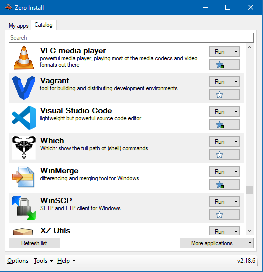

When launching a feed for the first time, 0install will download the necessary files for you and store them in [the cache](../details/cache.md). Next time, 0install will use these stored files, so you don't need to download the program again. From time to time 0install will check for updates and offer to download them.

[TOC]

## Linux example

```shell
$ 0install run http://repo.roscidus.com/games/openttd
```

1\. Click Download


The downloaded file says that **OpenTTD** requires various libraries (Freetype2, SDL, libgcc1, etc). Each library is identified by a web address (URL) in the same way that the main **OpenTTD** program was. 0install downloads information about them in the same way and selects a compatible set of versions. The window displays a dialog box showing the program and all required libraries. Click **Download**.

2\. Wait for the download to finish


0install now downloads all the required archives (supported formats include tar.gz, tar.bz2, zip, rpm and deb). It unpacks each one into its own directory and checks its contents against the _cryptographic digest_ given in the (signed) feed file. If the archive has been changed since the feed was signed, the download will be rejected. If the archive hasn't been tampered with, it is stored in a cache directory (see [sharing](../details/sharing.md) for more information) in its own subdirectory, named after the digest. This ensures that no two downloads can conflict with each other.

## Windows example

1\. Pick an application



Launch Zero Install and choose an application in the Catalog, e.g., PDF Split and Merge. Click **Run**.

2\. Wait for the download to finish


Zero Install now downloads application as well as dependencies needed to run it, e.g., PDF Split and Merge and the Java Runtime. It unpacks each into its own directory and checks its contents against the _cryptographic digest_ given in the (signed) feed file. If the archive has been changed since the feed was signed, the download will be rejected. If the archive hasn't been tampered with, it is stored in a cache directory in its own subdirectory, named after the digest. This ensures that no two downloads can conflict with each other.

You can also use the command-line to launch applications with 0install:

```shell
> 0install run https://apps.0install.net/python/python.xml
Downloading https://apps.0install.net/python/python.xml...
[====================] Complete
Downloading https://apps.0install.net/python/python.xml/upstream.xml...
[====================] Complete
Downloading https://apps.0install.net/python/python.xml-win32...
[====================] Complete
Downloading https://www.python.org/ftp/python/3.7.3/python-3.7.3-embed-amd64.zip...
[====================] Complete
Extracting archive...
[====================] Complete
Generating sha256new manifest...
[====================] Complete
Python 3.7.3 (v3.7.3:ef4ec6ed12, Mar 25 2019, 22:22:05) [MSC v.1916 64 bit (AMD64)] on win32
Type "help", "copyright", "credits" or "license" for more information.
>>>
```
