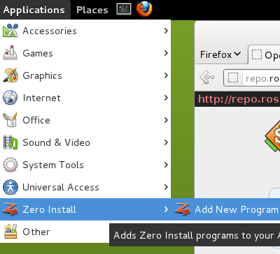

# Introduction

A 0install application is distributed using a _feed file_. A feed is an XML file that tells 0install how to run the application, and which versions are available. The feed file is normally published on the web; the URL of the feed is the unique identifier of the application.

For example, OpenTTD is available via 0install, it has [this feed file](http://repo.roscidus.com/games/openttd) and it is uniquely identified as [http://repo.roscidus.com/games/openttd](http://repo.roscidus.com/games/openttd).

To get a 0install application:

1\. Find a program you want to run on the web:
    

    
2\. Either launch it directly:
    
```shell
$ 0install run http://repo.roscidus.com/games/openttd
```
    
Or [generate a shortcut](making-shortcuts.md) to launch it later:
    

    
Upon first launch of a feed, 0install may ask you to accept keys and be allowed to download files.
