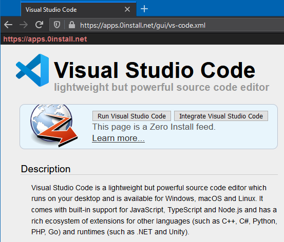

# Introduction

A 0install application is distributed using a _feed file_. A feed is an XML file that tells 0install how to run the application, and which versions are available. The feed file is normally published on the web; the URL of the feed is the unique identifier of the application.

For example, Visual Studio Code is available via 0install. It has this feed file: <https://apps.0install.net/gui/vs-code.xml>

To get a 0install application:

1.  Find a program you want to run on the web:

    [](https://apps.0install.net/gui/vs-code.xml)

2.  Either [launch it](first-launch.md) directly:
    
    ```shell
    0install run https://apps.0install.net/gui/vs-code.xml
    ```

    Or create a [menu entry](menu.md) or [command-line alias](alias.md) to launch it later.
