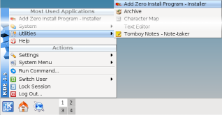
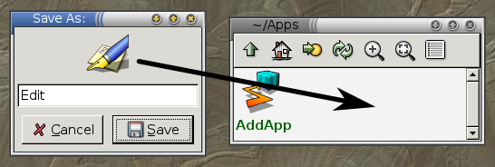
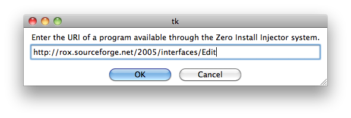

Shortcuts provide an easy way to run a program without entering the full URI, just like a bookmark in a web-browser provides an easy way to return to a web page without entering the full URL.

Different environments provide different ways to add shortcuts:

[TOC]

## GNOME

Choose **Zero Install -> Add New Program** from the **Applications** menu. Type in the URI, or drag it from the web-browser into the dialog box.


**Ubuntu users**: You need to open and then close the menu editor after adding a program before it will show up; see [Ubuntu bug #191958](https://bugs.launchpad.net/ubuntu/+source/xdg-utils/+bug/191958). You can also run programs directly by choosing **Manage Programs** from the menu.

## KDE

Choose **Add Zero Install Program** from the **Utilities** menu. Type in the URI, or drag it from the web-browser into the dialog box.



## ROX

Drag the link from your web-browser to the AddApp program, then drag the launcher from there to wherever you want it. [AddApp](http://rox.sourceforge.net/desktop/AddApp)'s page has more details.



## Finder

Copy the link from your web-browser to the AddApp program, then save the launcher from there to wherever you want it.



## Windows

See [Desktop integration](windows.md) for details.

## Shell

The [`0install add`](../details/cli.md#add) command can be used to create little shell scripts to start programs easily:

```shell
$ 0install add rox-edit http://rox.sourceforge.net/2005/interfaces/Edit
```

The command puts the script in the first writable directory in your `$PATH`. You can now run Edit like this:

```shell
$ rox-edit
```
