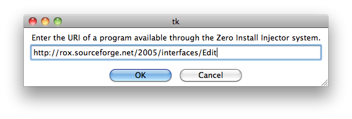

# Create a menu entry

Menu entries provide an easy way to run a program without entering the full URI, just like a bookmark in a web-browser provides an easy way to return to a web page without entering the full URL.

Different environments provide different ways to add menu entries:

=== "GNOME"
    Choose **Zero Install -> Add New Program** from the **Applications** menu. Type in the URI, or drag it from the web-browser into the dialog box.

    

    !!! bug "Ubuntu users"
        You need to open and then close the menu editor after adding a program before it will show up; see [Ubuntu bug #191958](https://bugs.launchpad.net/ubuntu/+source/xdg-utils/+bug/191958). You can also run programs directly by choosing **Manage Programs** from the menu.

=== "KDE"
    Choose **Add Zero Install Program** from the **Utilities** menu. Type in the URI, or drag it from the web-browser into the dialog box.

    

=== "ROX"
    Drag the link from your web-browser to the AddApp program, then drag the launcher from there to wherever you want it. [AddApp](http://rox.sourceforge.net/desktop/AddApp)'s page has more details.

    

=== "macOS"
    Copy the link from your web-browser to the AddApp program, then save the launcher from there to wherever you want it.

    

=== "Windows"
    Zero Install allows you to integrate applications into your desktop environment as you are accustomed to from classic setup programs: Start menu entries, file type associations, entries in context menus, etc.. All the advantages of Zero Install such as automatic updates, parallel usage of multiple application versions and easy application removal are preserved.

    Open Zero Install and search for an app in the **Catalog**. Click on the :fontawesome-regular-star: button to add it to "My Apps". Then click on **Integrate** in the pop-up box to add it to the start menu.

    

    See [Desktop integration](../details/desktop-integration.md) for details.
