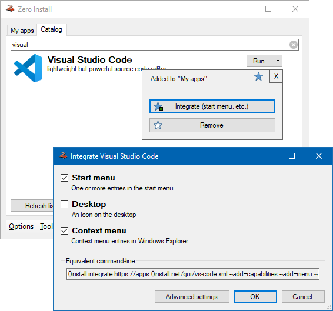
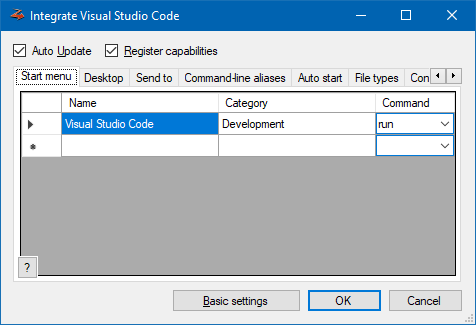

# Desktop integration

!!! note
    This is currently only supported in [Zero Install for Windows](windows.md).

Zero Install allows you to integrate applications into your desktop environment as you are accustomed to from classic setup programs: Start menu entries, file type associations, entries in context menus, etc.. All the advantages of Zero Install such as automatic updates, parallel usage of multiple application versions and easy application removal are preserved.

## Basics

Open Zero Install and search for an app in the **Catalog**. Click on the :fontawesome-regular-star: button to add it to "My Apps". Then click on **Integrate** in the pop-up box to add it to the start menu.



!!! tip
    [Zero Install Sync](sync.md) allows you to synchronize your application list and desktop integration between multiple computers.

## Advanced

By clicking on **Advanced settings**, you can control exactly how Zero Install integrates an application: which shortcuts to create, which file types to associate, etc.



You can perform desktop integration from the command-line as well. For example, to add VLC to your start menu and add register its supported file types:

```shell
0install integrate --add-standard https://apps.0install.net/gui/vlc.xml
```

See the [command-line documentation](cli.md#integrate) for details.

## Machine-wide

Zero Install's desktop integration is usually applied on a per-user basis. If you wish to "install" an application for all users on a machine you can switch to machine-wide mode. Start menu entries, desktop icons, file associations, etc. are then applied to their respective machine-wide locations.

Even though the desktop integration is then shared by all users the actual solving and downloading of implementations is still done by individual users. This allows applications to be updated without administrative intervention and enables users to specify their own version overrides for applications. To prevent unnecessary duplication of application files use the [Store Service](sharing.md#windows) to share an implementation cache between all users.

Machine-wide mode can be used by adding the `--machine` option to one of the following commands:  
[`0install add`](cli.md#add), [`0install integrate`](cli.md#integrate), [`0install remove`](cli.md#remove), [`0install sync`](cli.md#sync)

You can also run `0install central --machine` to use the normal GUI to manage machine-wide desktop integration.
