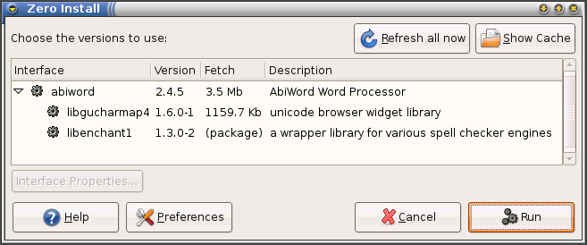
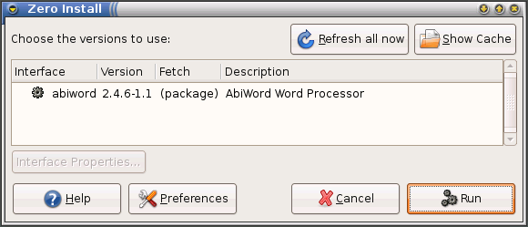

# Distribution integration

**Supported distributions:**

- `Arch`: Arch Linux - since 1.6
- `Cygwin`: Cygwin - since 1.7
- `Darwin`: (detects native Java) - since 1.11
- `Debian`: dpkg-based (Debian, Mint, Ubuntu, etc) - since 0.28
- `Gentoo`: Gentoo - since 0.45
- `MacPorts`: Mac OS X (ports) - since 1.4 (also extends "Darwin")
- `Ports`: FreeBSD - since 0.47
- `RPM`: RPM-based (Red Hat, Fedora, OpenSUSE, etc) - since 0.31
- `Slack`: Slackware - since 0.48
- `Windows`: Windows (detects native Java, .NET Framework, PowerShell and Git) - in [Windows version](windows.md)

If you have already installed a package using your distribution's installer then Zero install can use that instead of downloading a second copy using Zero Install. It can also use [PackageKit](http://www.packagekit.org/) to install them, if the user is authorised.

For example, here is what happens if you ask to run AbiWord when you already have the `libenchant1` library it requires installed using `apt-get`:

```shell
0install run http://0install.net/2006/autopackage/Abiword.xml
```



If Abiword is itself installed as a distribution package, then the dialog is even simpler, and nothing needs to be downloaded:



Of course, you are always free to change the selected version from the native package to a Zero Install version. This will also happen automatically if your native version is incompatible with the required version. For example, if you try this on a machine with a very old copy of `libenchant1` then Zero Install will download a newer version rather than using that one.

All software installed by Zero Install goes in the cache directory and does not conflict with files installed by the native package manager. If PackageKit is used instead, the user is prompted to confirm, since installing distribution packages can affect the system as a whole. Note that PackageKit can only be used to install packages from the distribution's repository.

## How it works

Two methods are available to integrate Zero Install packages with distribution ones:

-   A feed author can add a `<package-implementation package="name"/>` element to their feed. Zero Install will query your distribution's package manager to see if a package with this name is already installed. If so, that version will be considered as another candidate, with a stability rating of "packaged" (which is ranked between "stable" and "preferred").
    
    Since different distributions use different names for the same package, you can specify which distribution(s) an element applies to like this (some RPM-based distributions use `pkgconfig`, while other RPM systems use `pkg-config`, which is also the name used by Debian):

```xml
  <package-implementation distributions="RPM" package="pkgconfig"/>
  <package-implementation distributions="RPM Debian" package="pkg-config"/>
  <package-implementation distributions="Gentoo" package="dev-util/pkgconfig"/>
```

-   A distribution package can install a file named `/usr/share/0install.net/native_feeds/INTERFACE`. This is automatically used as an additional feed for `INTERFACE` (replace `/` characters in the package's interface URI with `#` characters).
    
    This is useful if the package installs the program as a self-contained directory somewhere. i.e. the installed package has the same format as the Zero Install package. If the package already contains a local feed file, you can just symlink to it directly.
