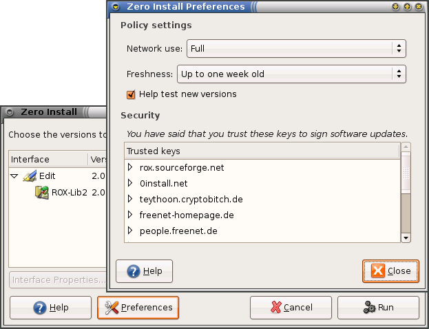
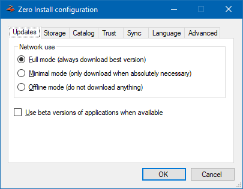
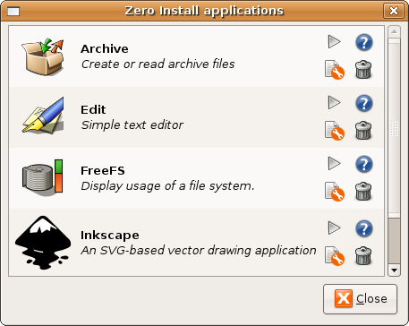
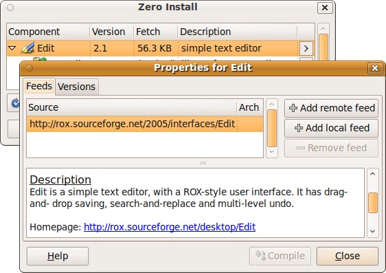
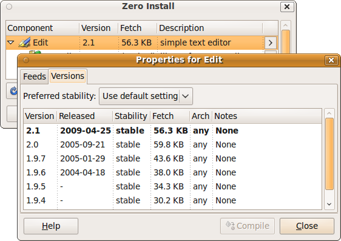
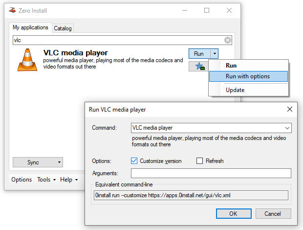
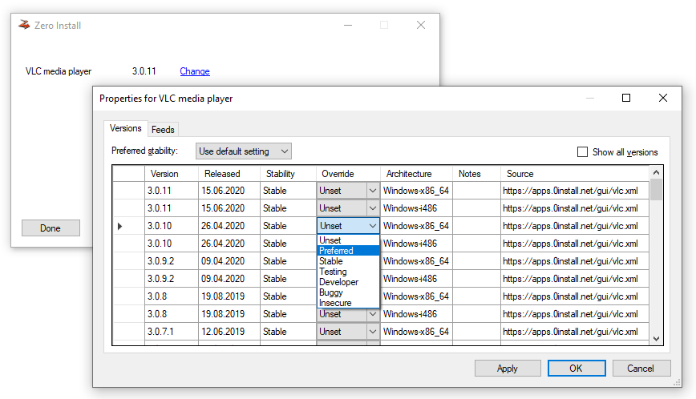

# Policy settings

You can change policy settings to affect when 0install looks for updates and which versions it prefers.

The first part shows how to set policy settings that apply to all applications of the current user. The last section shows how to change per-application settings. Policy affects which versions 0install chooses (do you want test versions, ...).

## General policy settings

=== "Linux"

    You can change the policy settings using the Preferences dialog.

    To open it run `0install config` or choose **Zero Install -> Manage Applications** from the **Applications** menu, click on the edit properties icon next to an application and click Preferences.

    

=== "Windows"

    You can change the policy settings using the Configuration dialog.

    To open it run `0install-win config` or click on the **Options** in the bottom left of the main GUI.

    

### Network use

Affects how much 0install will rely on the network. Possible values are:

| Value    | Effect                                                     |
| -------- | ---------------------------------------------------------- |
| Full     | Normal network use.                                        |
| Minimal  | 0install will prefer cached versions over non-cached ones. |
| Off-line | 0install will not use the network.                         |

### Freshness

0install caches feeds and checks for updates from time to time. The freshness indicates how old a feed may get before 0install automatically checks for updates to it. Note that 0install only checks for updates when you actually run a program; so if you never run something, it won't waste time checking for updates.

### Help test new versions

By default, 0install tries not to select new versions while they're still in the "testing" phase. If checked, 0install will instead always select the newest version, even if it's marked as "testing".

## Per-application policy settings

You can change per-application policy settings in the application information dialog. To open this dialog:

=== "Linux"

    1.  Run `0install run` with the `--gui` option and the URI of the application:
        ```shell
        0install run --gui http://rox.sourceforge.net/2005/interfaces/Edit
        ```

        -or-

        Choose **Zero Install -> Manage Applications** from the **Applications** menu, click on the edit properties icon next to the application.  
        

    2.  Double-click the application in the list. For example, double-clicking on **Edit** displays this dialog box:  
          
        

=== "Windows"

    1.  Run `0install run` with the `--customize` option and the URI of the application:
        ```shell
        0install run --customize https://apps.0install.net/gui/vlc.xml
        ```

        -or-

        In the main GUI open the dropdown menu next to an App's **Run** button, select **Run with options**, set the **Customize version** checkbox and click **OK**.  
        

    2.  Click on the **Change** link next to the application. This displays this dialog box:  
        

### Feeds

In the Feeds tab, a list of feeds shows all the places where Zero Install looks for versions of the app. By default, there is just one feed with the URL you just entered. You can register additional feeds to be considered (e.g., a [local feed](../packaging/local-feeds.md) with custom builds or an alternate remote feed). This can be done either using the GUI or with the [`0install add-feed`](cli.md#add-feed) command.

### Versions

In the Versions tab, you can use the **Preferred Stability** setting in the interface dialog to choose which versions to prefer. You can also change the stability rating of any implementation by clicking on it and choosing a new rating from the popup menu (drop-down in the **Override** column on Windows). User-set ratings are shown in capitals.

As you make changes to the policy and ratings, the selected implementation will change. The version shown in bold (or at the top of the list, in some versions) is the one that will actually be used. In addition to the ratings below, you can set the rating to **Preferred**. Such versions are always preferred above other versions, unless they're not cached and you are in Off-line mode.

The following stability ratings are allowed:

- Stable (this is the default if **Help test new versions** is unchecked)
- Testing (this is the default if **Help test new versions** is checked)
- Developer
- Buggy
- Insecure

Stability ratings are kept independently of the implementations, and are expected to change over time. When any new release is made, its stability is initially set to **Testing**. If you have selected **Help test new versions** in the Preferences dialog box then you will then start using it. Otherwise, you will continue with the previous stable release. After a while (days, weeks or months, depending on the project) with no serious problems found, the author will change the implementation's stability to **Stable** so that everyone will use it.

If problems are found, it will instead be marked as **Buggy**, or **Insecure**. Neither will be selected by default, but it is useful to see the reason (you might opt to continue using a buggy version if it works for you, but should never use an insecure one). **Developer** is like a more extreme version of **Testing**, where the program is expected to have bugs.

!!! tip
    If you want to use the second item on the list because the first is buggy, for example, then it is better to mark the first version as buggy than to mark the second as preferred. This is because when a new version is available, you will want that to become the version at the top of the list, whereas a preferred version will always be first.
