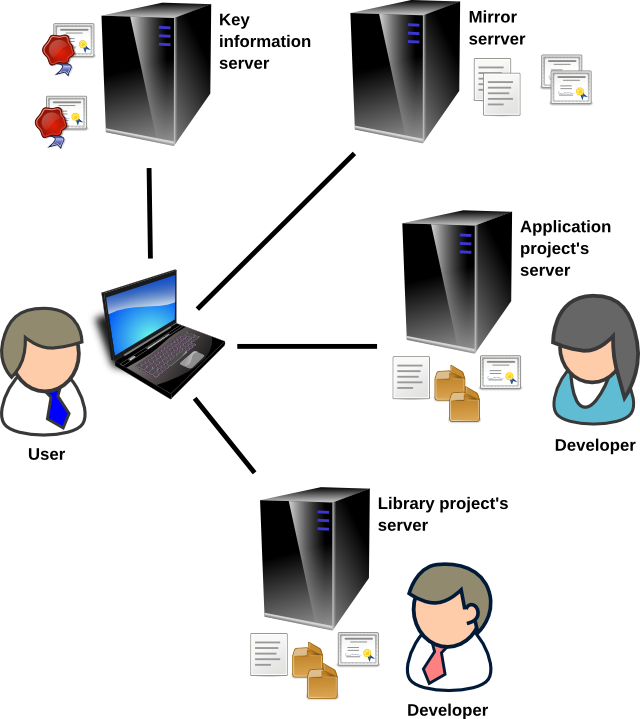

# Servers

Zero Install downloads files from several different places.

First, it downloads from the author's web-site a list of versions of the application that are available and what other libraries the application requires. Zero Install then downloads information about those libraries too, from their web-sites.

These lists are signed by the developer who published them. When you use software from a developer for the first time, Zero Install asks you to confirm that you trust this person's signature. It asks your _Key information server_ for extra information to help you decide.

Finally, it chooses an appropriate set of versions and downloads those packages.

The [Mirror server](http://roscidus.com/0mirror/) is used as a backup if the project servers don't respond or return an error.

See also: [Zero Install Sync](sync.md)
