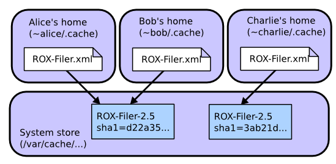
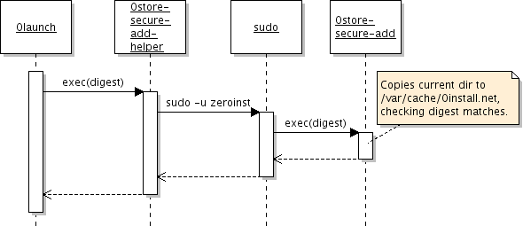
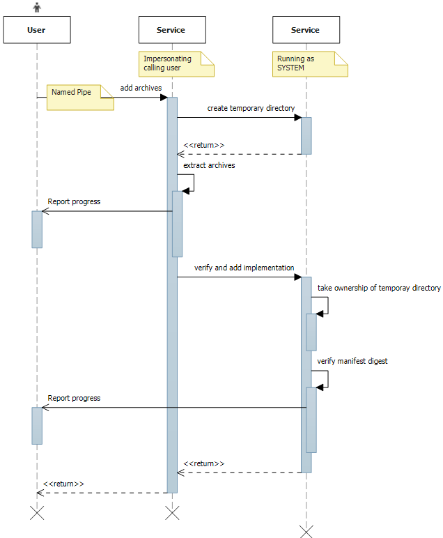

# Sharing downloads between users

On systems with multiple users, it would be very inefficient if each user had to download their own copy of each program. Most packaging systems require users to have root access in order to share software (either the root password, or admin access through sudo). However, this is a security risk. Zero Install allows software to be shared automatically and safely between mutually-untrusting users.

!!! note
    This page is about sharing between users on a single computer. If you want to do peer-to-peer sharing on a LAN, see [0share](../tools/0share.md). If you want to share between virtual machines running on a single host, see [virtual machines](virtual-machines.md).

## How it works

A digest is a short value calculated from a (usually much bigger) file. There are various different algorithms that can be used. For example, this command calculates the SHA1 digest of the `ls` binary:

```shell
$ sha1sum /bin/ls
90b703d3d29ef20f3ef711eb38625d618c70c4f6  /bin/ls
```

A _cryptographic_ digest (like SHA1) is one where it is believed to be infeasibly difficult to create a different program with the same digest. So, if someone gives you a binary with digest above, you can be sure that it's identical to the version of `ls` that I'm using.

Cryptographic digests are the basis of secure sharing in Zero Install. Here's we'll see an example of how two users (Alice and Bob) can share the ROX-Filer program, even if they don't trust each other.


First, Alice runs ROX-Filer:

1. Alice visits [rox.sourceforge.net](http://rox.sourceforge.net) and downloads the small [ROX-Filer.xml](http://rox.sourceforge.net/2005/interfaces/ROX-Filer) feed file.
2. She decides to run ROX-Filer version 2.5 from this file.
3. The Zero Install software gets the digest for this version (`sha1=d22a35871bad157e32aa169e3f4feaa8d902fdf2`) from the file. It also downloads the package and unpacks it.
4. The software passes the unpacked archive to the privileged helper, which checks the digest and copies the directory to `/var/cache/0install.net/implementations/sha1=d22a35871bad157e32aa169e3f4feaa8d902fdf2` on Linux or `C:\ProgramData\0install.net\implementations\sha1=d22a35871bad157e32aa169e3f4feaa8d902fdf2` on Windows (see [File locations](file-locations.md)).
5. ROX-Filer runs.

Later, Bob decides to run it too. The system doesn't need to download a second copy:

1. Bob visits [rox.sourceforge.net](http://rox.sourceforge.net) and downloads the small [ROX-Filer.xml](http://rox.sourceforge.net/2005/interfaces/ROX-Filer) feed file.
2. He decides to run ROX-Filer version 2.5 from this file.
3. The Zero Install software gets the digest for this version (`sha1=d22a35871bad157e32aa169e3f4feaa8d902fdf2`) from the file.
4. Zero Install sees that the directory `/var/cache/0install.net/implementations/sha1=d22a35871bad157e32aa169e3f4feaa8d902fdf2` (or `C:\ProgramData\0install.net\...`) already exists, so it doesn't download the software again.
5. ROX-Filer runs.

But what if we have a malicious user, Charlie? A new machine arrives, and Charlie decides to install a malicious version of ROX-Filer before anyone else installs a good copy:

1. Charlie visits [rox.sourceforge.net](http://rox.sourceforge.net) and downloads the small [ROX-Filer.xml](http://rox.sourceforge.net/2005/interfaces/ROX-Filer) feed file.
2. He decides to use ROX-Filer version 2.5 from this file.
3. The Zero Install software gets the digest for this version (`sha1=d22a35871bad157e32aa169e3f4feaa8d902fdf2`) from the file. It also downloads the package and unpacks it.
4. Charlie modifies the download to do something nasty (or, the download has been tampered with, or Charlie's account has been infected with a virus which modifies it, etc).
5. If Charlie tries to install the result to `/var/cache/0install.net/implementations/sha1=d22a35871bad157e32aa169e3f4feaa8d902fdf2`, the privileged helper rejects it, because the digest of the directory's contents no longer matches that name.
6. Charlie is forced to install his malicious version as `/var/cache/0install.net/implementations/sha1=3ab21d8f410e3a5a863d3a32a152edb31ba42f75` instead.

When Alice runs ROX-Filer as before, the software sees that `/var/cache/0install.net/implementations/sha1=d22a35871bad157e32aa169e3f4feaa8d902fdf2` doesn't exist and downloads a genuine copy as before. When Bob runs ROX-Filer, he will use Alice's version.



You might be worried that Charlie was able to put malicious code in the shared cache. However, it doesn't matter because other users won't try to run it, since it doesn't have the name they're looking for. Of course, it might not even be malicious: a program that deletes files is malicious if it's called `cat`, but not if it's called `rm`. As long as users don't go around running random binaries they find in the cache, they're OK.

## Setting up sharing

### Linux

These instructions require Zero Install version 0.30 or later.

The actual code for doing sharing this way is currently experimental and not enabled by default. This section shows how the system administrator (someone with root access) can enable it. It is probably best not to do this in security critical environments yet as we're still working on tightening the security. Feedback welcome.

This diagram shows the four processes involved in adding a new package to the system cache. If you have a different environment, you can use a different 'helper' script to integrate it with Zero Install.



1. [Install 0install version 0.30](https://get.0install.net/) or later.
2. Create a new system user called 'zeroinst' (the Ubuntu package will have done this for you automatically).

```shell
## useradd -d /var/cache/0install.net --system zeroinst
```

3. Create the shared directory, owned by this new user (also done automatically by the Ubuntu package):

```shell    
## mkdir -p /var/cache/0install.net/implementations
## chown zeroinst /var/cache/0install.net/implementations
```

4. Create `/usr/local/bin/0store-secure-add-helper` with:

```shell    
#!/bin/sh
exec sudo -S -u zeroinst /usr/bin/0store-secure-add "$@" < /dev/null
```

!!! note
    The path will be `/usr/local/bin/0store-secure-add` if you installed from source.

5. Make your new script readable and executable by everyone:
    
```shell
## chmod a+rx /usr/local/bin/0store-secure-add-helper
```

6. Use `visudo` to add these lines to `/etc/sudoers`:

```shell
Defaults>zeroinst env_reset,always_set_home
ALL ALL=(zeroinst) NOPASSWD: /usr/bin/0store-secure-add
```

!!! attention
    The `NOPASSWD` line **must** go at the end of the file, otherwise it is likely to be overridden by later entries. Again, use `/usr/local/bin` if you installed from source.
    
When `launch` wants to install a package, it will invoke `0store-secure-add-helper`. This script uses `sudo` to run `0store-secure-add` as the `zeroinst` user, with a clean environment. No password is required for this.

#### AppArmor policy

The following AppArmor policy can be used to confine the 0store-secure-add process somewhat. However, the process does need read access everywhere (since it could be copying from anywhere) and write access to the entire cache directory, so this doesn't restrict it much more than it already is due to running as a separate user.

```
#include <tunables/global>
/usr/bin/0store-secure-add {
  #include <abstractions/base>
  #include <abstractions/python>

  /** r,
  /usr/bin/0store-secure-add mr,
  /usr/bin/python* ixr,
  /var/cache/0install.net/implementations/** rw,
}
```

### Windows

On Windows the shared cache is managed by the *Zero Install Store Service*. It serves roughly the same role as `0store-secure-add` on Linux. This service ensures that no user can, intentionally or unintentionally, manipulate the contents of the shared cache. Every user can ask the service to add implementations to the shared cache on their behalf after validating the hash. This way other users only get cached implementations if they request the exact same version with the same hash.

The *Zero Install Store Service* is installed automatically when Zero Install is [deployed](windows.md#bootstrapper) for all users (machine-wide). Zero Install automatically uses the service when it is available (unless in [portable mode](windows.md#portable-mode)) and falls back to the user cache if the service is unavailable.

The service uses `C:\ProgramData\0install.net\implementations` (see [File locations](file-locations.md)) for storing implementations by default.
A custom location can be specified in the file `C:\ProgramData\0install.net\injector\implementation-dirs`. When using a custom location make sure it is only writeable by `SYSTEM` and `Administrators` and readable by `Everyone`.

#### Technical details

Zero Install communicates with the service using [named pipes](https://docs.microsoft.com/en-us/windows/desktop/ipc/named-pipes). The user process downloads an archive to a temporary directory and then passes its file path to the service with a request for extraction. The service extracts the archive, verifies the manifest digest and adds the implementation to the cache. During the entire process the service reports the progress back to the user process.

Named pipes allow the service to [impersonate](https://docs.microsoft.com/en-us/windows/desktop/SecAuthZ/client-impersonation) the calling user. The archive is read and extracted using the privileges of the calling user but verified and added to the cache using the privileges of the service.

The service records write access to the cache as well as any potential problems in the *Windows Event Log*.



### Questions

How do users uninstall?
: Currently, they can't. You (the admin) can delete directories from `/var/cache/0install.net/implementations` to save space (preferably not while they're being used ;-). Ideally, we should track which users have requested which programs and remove them automatically when no-one wants them anymore.

What kind of things need 'tightening'?
: Several things spring to mind:
: - What happens if the user changes the directory whilst it's being added? We need to audit `0store-secure-add`.
: - Denial of service attacks, if one user stores lots of stuff (need quotas).

Why do things still get stored in `~/.cache` after setting this up?
: Things you've already installed will remain there. Only new software is added in the system cache. Also, the old `sha1` algorithm isn't accepted by the helper, so software using that can't go in the shared cache. If you still have problems, try running `0install run -vvc URI` (to see debug output). Finally, make sure your script is executable!
