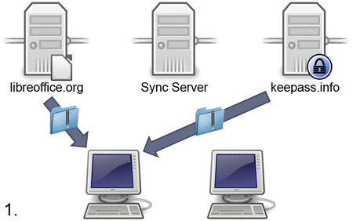
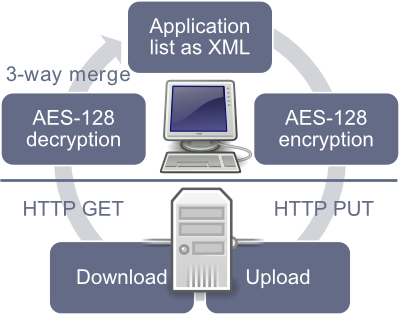

Note: This is currently only supported in [Zero Install for Windows](windows.md).

Zero Install Sync allows you to synchronize your list of applications, [desktop integrations](../basics/windows.md) and command-line aliases between multiple machines. You either need a [free 0install.de user account](https://0install.de/sync/register) or you can use your own server.

<strong>Example</strong>

- You download LibreOffice and KeePass on your first PC using Zero Install.
- Zero Install Sync tells your second computer which applications you installed.
- Your second computer downloads the same applications automatically.

## Technical details

The synchronization algorithm works as follows:

- Download existing application list from the server if present and decrypt it.
- Merge the data from the server into the local application list using a three-way merge.
- Apply any changes made to the application list to the desktop environment.
- Encrypt and upload the new application list.
- Store a copy of the application list locally for use as a baseline for the next merge.

All data is encrypted locally before transmission using AES-128. Therefore the server remains unaware of the actual data being synchronized.

The communication with the server is handled via a simple REST interface which is documented at [https://0install.de/sync/](https://0install.de/sync/).

If you want to run your own Sync server you have the following options:

- Use [our PHP script](https://0install.de/sync/template.zip) on your web server.
- Use an empty directory on a WebDAV server.
- Use a Windows file share.
