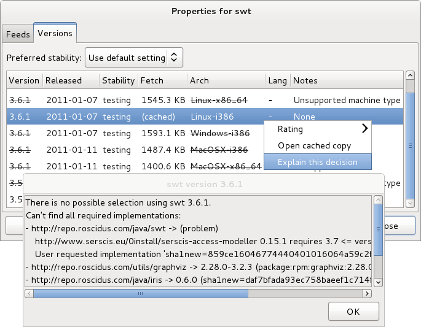

title: Trouble-shooting

[TOC]

## 0install is not running the latest version of a program

Try executing the same command again but with the `--refresh` option. For example:

```shel
$ 0install run --refresh https://apps.0install.net/gui/vlc.xml
```

## 0install doesn't select any versions / the expected versions

If 0install cannot find a compatible set of versions for a program, you may see an error like this:


Or, if not using the GUI, like this:

```shell
Can't find all required implementations:
- https://apps.0install.net/java/swt.xml -> (problem)
    http://www.serscis.eu/0install/serscis-access-modeller 0.15.1 requires 3.7 <= version
- https://apps.0install.net/utils/graphviz.xml -> 2.28.0-3.2.3 (package:rpm:graphviz:2.28.0-3.2.3:i586)
- https://apps.0install.net/java/jre.xml -> 6.18-1.8.7-2 (sha1new=6b7c9f98bd1d8bec5bbb5ddb41271c862c8e8529)
- https://apps.0install.net/java/iris.xml -> 0.6.0 (sha1new=daf7bfada93ec758baeef1c714f3239ce0a5a462)
- http://www.serscis.eu/0install/serscis-access-modeller -> 0.15.1 (sha1new=7899dbe75c1c332c4e70f272b2d76026714392a6)
    User requested 0.10 <= version
```

To find the cause, start by double-clicking on "(problem)" in the GUI to get the list of available versions for that component. Right-click over the version you think it should have chosen and choose "Explain this decision" from the menu:



In this example, the user requested serscis-access-modeller >= 0.10 and all such versions needed SWT >= 3.7 so there was no possible selection (note: this conflict was invented for the sake of this tutorial). The line "User requested implementation ..." shows the version which was selected from the list; the solver was constrained to choose this version.

There are several common causes:

There is no binary for your platform
: (e.g. you are using 32-bit Windows, but there are only binaries for 64-bit Linux). In this case, you can use 0install to compile a new binary from source (if source is provided in the feed). See [0compile](../tools/0compile/index.md) for details. If no source is provided, you will need to go to the project's web-site and compile manually.

The dependency is only provided by distribution packages, and your distribution isn't listed
: Have a look at the feed's XML (View Page Source in your browser) to see if your distribution package is listed. See [Distribution Integration](../details/distribution-integration.md) for details.

Sometimes, the failure to select a version is due to complex inter-dependencies between components. If a valid set of versions exists, 0install will always find it, but if no valid set exists then it can be hard for it to explain why. Rather that showing a proof that none of the billions of possible combinations is valid, 0install tries to find the best example of a failed selection to show you. It works like this:

1. When the solve fails, 0install switches to debug mode and runs the solve again.
2. Debug mode adds a fake implementation of each component. This fake version is fully compatible with everything, but less preferable than all the real versions (so it will only be selected if there is no other option).
3. This always results in a "solution", but whenever a fake implementation is selected it is reported as "(problem)", as shown above.

This is quite good at suggesting where the fault is, but the problem may be elsewhere. For example, if a program has versions available for Python 3 and Python 2, and you only have Python 2, then 0install should select the Python 2 version. But if it can't find any valid selections (because some other library required for the Python 2 version is missing), then it might report that the lack of Python 3 is the issue (when, in fact, that's just one possible way of fixing the problem).

To investigate further, you can use the `--version-for` option to fix the versions of multiple components. For example, to find out why you can't run 0compile 1.1 with 0publish 0.20 and 0install 2.1:

```shell
$ 0install select -c http://0install.net/2006/interfaces/0compile.xml
  --version 1.1 \
  --version-for http://0install.net/2006/interfaces/0publish 0.20 \
  --version-for http://0install.net/2007/interfaces/ZeroInstall.xml 2.1
Can't find all required implementations:
- http://0install.net/2006/interfaces/0compile.xml -> 1.1 (sha1new=5d11d6a774f261b408f3c57dce8819481d842f90)
    User requested version 1.1
- http://0install.net/2006/interfaces/0publish -> 0.20 (sha1new=3a62c59321720a1736899dec9ef7deb0b29b7b43)
    User requested version 0.20
- http://0install.net/2007/interfaces/ZeroInstall.xml -> (problem)
    http://0install.net/2006/interfaces/0compile.xml 1.1 requires 2.1 <= version
    http://0install.net/2006/interfaces/0publish 0.20 requires version < 1.11-post
    User requested version 2.1
    No usable implementations satisfy the restrictions:
      /home/tal/Projects/zero-install/0install (2.1-post): Incompatible with user-specified requirements
      sha1new=4f860b217bb94723ad6af9062d25dc7faee6a7ae (2.1): incompatible with restrictions
      sha1new=3fa607f49966f7eb00682336a4391c78d13a3d8b (2.0): Incompatible with user-specified requirements
      sha1new=cc7a0dcf44d42714bcf1efd27e8ec1f1810ce7da (1.16): Incompatible with user-specified requirements
      sha1new=ab6ca6165cd57a1bb95ddf5af9c51cdf325e1db8 (1.15): Incompatible with user-specified requirements
      ...
- https://apps.0install.net/python/python.xml -> 2.7.3-4 (package:arch:python2:2.7.3-4:x86_64)
```

Here, we can see that 0publish 0.20 requires an old version of 0install, while 0compile 1.1 requires a newer one.

## Why is this environment variable set?

When you run a program, each component (library) can ask for certain environment variables to be set (this only affects the program being run, not all programs). If variables are being set incorrectly, you'll need to track down why. e.g.

```shell
$ sam
Picked up _JAVA_OPTIONS: -XstartOnFirstThread
Unrecognized option: -XstartOnFirstThread
Could not create the Java virtual machine.
```

To debug this, ask 0install to output the selections as XML and look for the setting inside it. xmllint is useful to format the XML nicely:

```shell
$ 0install select --xml sam | xmllint --format - > selections.xml
```

(if `sam` is an old-style alias rather than an app, use `alias:sam` instead)

In this case, we find the `selections.xml` document contains:

```xml
  <selection arch="MacOSX-x86_64" version="3.6.1"
             interface="https://apps.0install.net/java/swt.xml" ...>
    ...
    <environment mode="prepend" name="_JAVA_OPTIONS"
                 separator=" " value="-XstartOnFirstThread"/>
  </selection>
```

This tells us that the OS X implementation of version 3.6.1 of the SWT library requested this setting. To test whether this is the problem, remove the `<environment>` element and try running it:

```shell
$ 0install run selections.xml
```

Having identified the problem, you can now file a bug report against the SWT feed.

## Verbose logging

If 0install isn't doing what you expect, run it with logging turned up using either `-v` (verbose) or `-vv` (very verbose!). Use `-c` to prevent it switching to GUI mode too. Eg:

```shell
$ 0install run -vvc http://rox.sourceforge.net/2005/interfaces/Edit
INFO:root:Running 0install 1.12 ['http://rox.sourceforge.net/2005/interfaces/Edit']; Python 2.7.3 (default, Aug 26 2012, 11:57:48)
[GCC 4.7.1]
INFO:0install:Loading configuration from /home/me/.config/0install.net/injector/global
DEBUG:0install:Loading cached information for http://rox.sourceforge.net/2005/interfaces/Edit from /home/me/.cache/0install.net/interfaces/http%3a%2f%2frox.sourceforge.net%2f2005%2finterfaces%2fEdit
INFO:0install:Note: @main on document element is deprecated in <Feed http://rox.sourceforge.net/2005/interfaces/Edit>
DEBUG:0install:Supported systems: '{None: 3, 'POSIX': 2, 'Linux': 1}'
DEBUG:0install:Supported processors: '{'x86_64': 0, 'i586': 2, 'i486': 3, 'i686': 1, 'i386': 4, None: 5}'
DEBUG:0install:Initialising new interface object for http://rox.sourceforge.net/2005/interfaces/Edit
DEBUG:0install:Loading cached information for http://rox.sourceforge.net/2005/interfaces/Edit from /home/me/.cache/0install.net/interfaces/http%3a%2f%2frox.sourceforge.net%2f2005%2finterfaces%2fEdit
INFO:0install:Note: @main on document element is deprecated in <Feed http://rox.sourceforge.net/2005/interfaces/Edit>
DEBUG:0install:Processing feed http://rox.sourceforge.net/2005/interfaces/Edit
DEBUG:0install:Location of 'implementation-dirs' config file being used: 'None'
DEBUG:0install:Added system store '/var/cache/0install.net/implementations'
DEBUG:0install:Initialising new interface object for http://rox.sourceforge.net/2005/interfaces/ROX-Lib
DEBUG:0install:Loading cached information for http://rox.sourceforge.net/2005/interfaces/ROX-Lib from /home/me/.cache/0install.net/interfaces/http%3a%2f%2frox.sourceforge.net%2f2005%2finterfaces%2fROX-Lib
INFO:0install:Note: @main on document element is deprecated in <Feed http://rox.sourceforge.net/2005/interfaces/ROX-Lib>
DEBUG:0install:Processing feed http://rox.sourceforge.net/2005/interfaces/ROX-Lib
DEBUG:0install:Initialising new interface object for https://apps.0install.net/python/python.xml
DEBUG:0install:Loading cached information for https://apps.0install.net/python/python.xml from /home/me/.cache/0install.net/interfaces/http%3a%2f%2frepo.roscidus.com%2fpython%2fpython
DEBUG:0install:Processing feed https://apps.0install.net/python/python.xml
DEBUG:0install:Skipping '<Feed from https://apps.0install.net/python/windows.xml>'; unsupported architecture Windows-None
DEBUG:0install:Processing feed https://apps.0install.net/python/python.xml/upstream.xml
DEBUG:0install:Loading cached information for https://apps.0install.net/python/python.xml/upstream.xml from /home/me/.cache/0install.net/interfaces/http%3a%2f%2frepo.roscidus.com%2fpython%2fpython%2fupstream.xml
DEBUG:0install:Is feed-for https://apps.0install.net/python/python.xml
DEBUG:0install:Staleness for <Feed http://rox.sourceforge.net/2005/interfaces/ROX-Lib> is 273.80 hours
DEBUG:0install:Staleness for <Feed https://apps.0install.net/python/python.xml> is 273.80 hours
DEBUG:0install:Staleness for <Feed https://apps.0install.net/python/python.xml/upstream.xml> is 273.80 hours
DEBUG:0install:Staleness for <Feed http://rox.sourceforge.net/2005/interfaces/Edit> is 273.80 hours
INFO:0install:PYTHONPATH=/var/cache/0install.net/implementations/sha256=ccefa7b1873926de15430341b912466929fbff8116b6d0ad67c4df6d0c06243e/ROX-Lib2/python
INFO:0install:Executing: [u'/usr/bin/python2.7', u'/var/cache/0install.net/implementations/sha256=ba3b495324192bb6c3fc1a2d9af3db2ced997fc8ce3177f08c926bebafcf16b9/Edit/AppRun']
```

*Windows only:*  
If you encountered an error and did not use `-v`, used the GUI or forgot to copy the console output you can still find the relevant information in log files stored in the `%TEMP%` directory. Look for files named `0install GUI USERNAME Log.txt` or `Zero Install Command WinForms GUI USERNAME Log.txt` (the specific name depends on the EXE you used to access Zero Install and your user account name).

## Download problems / proxies / HTTP errors

If you get download errors, try fetching the failing URL using wget, e.g.:

```shell
$ 0install run http://...
Error downloading 'http://osdn.dl.sourceforge.net/sourceforge/zero-install/injector-gui-0.16.tgz':
HTTP Error 403: Forbidden: header 'Content-Type' value denied
$ wget http://...
```

If wget also fails, try opening the URL in your web browser. If one of these works, but 0install doesn't, it may be that you are using an HTTP proxy. Your web browser is configured to use it, but your `http_proxy` environment variable is not set. Check your browser configuration and ensure that `http_proxy` is set correctly, e.g.:

```
$ export http_proxy=http://myproxy.server:444
$ 0install run http://...
```

## Other problems

If you still have problems, please [write to the mailing list](https://0install.net/support.html#lists), and send the output of the commands above.
