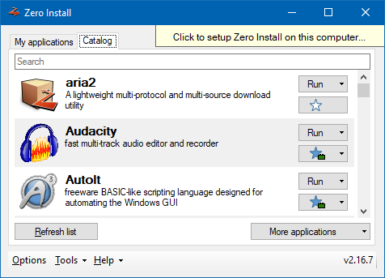

title: Zero Install for Windows

The Windows version of Zero Install extends the cross-platform core [Zero Install .NET](../developers/dotnet-api.md) with a GUI and various OS-specific integrations.

The [Linux version](linux.md) and Windows version of Zero Install share the same [feed format](../specifications/feed.md). For most common use-cases they behave identically on the command-line. There are however some [OS-specific differences](os-differences.md).

[TOC]

# Bootstrapper

When you [download Zero Install for Windows](https://0install.net/injector.html#windows-current) from the web-site you get a so called Bootstrapper. This is a stripped down version of Zero Install bundled into a single executable file. It contains just enough functionality to download and run a full version of Zero Install, which is distributed as regular feed: <https://apps.0install.net/0install/0install-win.xml>

## Deployment

When Zero Install is started by the Bootstrapper it is running from the [cache](cache.md) and is not integrated into the system. There are no start menu entries, the command-line tools are not in the `PATH`, etc.. This is by design; after all you may only need Zero Install once on that particular machine or may decide you don't like it. In that case you can simply delete the Bootstrapper EXE when you're done.

If you then decide you wish to keep using Zero Install you can "Click to setup...". This applies desktop integration for Zero Install (start menu entry, command-line tools in `PATH`). It also installs the [Store Service](sharing.md#windows) if you choose to setup Zero Install "For all users".



This is different from the [desktop integration](../basics/windows.md) Zero Install performs for other applications. For these Zero Install will create little stub executables in the appropriate locations that point to the application's feed. However, for Zero Install itself the entire binaries need to be copied to a [permanent location](file-locations.md#windows). Otherwise each of these stubs would need to bundle all the functionality of the Bootstrapper in order to locate (or potentially download) Zero Install.

Having a specific version of Zero Install copied to a fixed location would seem to undermine many of the advantages of Zero Install, such as background updates of applications and running multiple versions side-by-side. However, Zero Install can still download and run other versions of itself from the cache. When you tell your deployed instance of Zero Install to [update itself](#maintenance) it does just that: The new version is downloaded and launched from the cache and instructed to deploy itself to the same location as the existing deployment. The old files are securely replaced using the Windows Restart Manager and rollbacks in case of error.

## Command-line

The regular Bootstrapper (`zero-install.exe`) is a GUI application, but there is also a command-line version (`0install.exe`) available. If you pass command-line arguments to this executable it will first download the full version of `0install` and then pass those arguments through. This makes it great for single-use applications or scripting:

```shell
Invoke-WebRequest https://0install.de/files/0install.exe -OutFile 0install.exe
.\0install.exe run http://example.com/somefeed.xml
```

You can also use the command-line version of the Bootstrapper to integrate Zero install into the desktop environment:

```shell
.\0install.exe self deploy
```

# Maintenance

Zero Install is designed to be mostly maintenance-free (automatic update checks, etc.). You can use the following [commands](cli.md) for additional control where needed:

Deploy Zero Install for the current user
: `.\0install.exe self deploy`

Deploy Zero Install for all users
: `.\0install.exe self deploy --machine`

Remove Zero Install from the system
: `0install self remove`

Download and install updates for Zero Install itself
: `0install self update`

Download and install updates for [integrated applications](../basics/windows.md) and remove outdated files
: `0install update-all --clean`

Find and merge any duplicate files in the [cache](cache.md)
: `0install store optimise`

If you wish to run these commands in automated scripts, add the argument `--batch` to prevent interactive prompts.

# Portable mode

To set up Zero Install on a USB thumb drive:

- Connect a thumb drive to the computer and make sure there are no files you still need on it.
- Format the thumb drive with NTFS (FAT32 will not work, see [technical details](#technical-details) for explanation).
- Download and run Zero Install for Windows.
- Select "Tools" and "Portable Creator" at the bottom of the window.
- Follow the instructions on screen.

You can now use your thumb drive to run Zero Install on any computer running a recent version of Windows. Zero Install stores downloaded applications directly on the stick so you can access the same applications everywhere. Please remember to always "eject" the thumb drive in Windows before disconnecting it from the computer.

## Limitations

The applications launched by Zero Install are not automatically made portable by this. They still store their settings in the usual locations. Please make sure to move these files to the thumb drive as necessary.

Portable versions of Zero Install cannot perform desktop integration (e.g. create start menu entries). Consider using regular Zero Install on multiple computers with [Zero Install Sync](sync.md) instead.

## Technical details

FAT/FAT32-formatted drives cannot be used for Zero Install because they do not store file security settings (ACLs). They also only store time with an accuracy of two seconds while Zero Install checks the exact modification time of files.

The portable creator creates a file in the destination directory called `_portable`, which instructs Zero Install to run in portable mode. When this file is detected Zero Install stores all its files in its installation directory instead of the [usual system directories](file-locations.md#windows).
