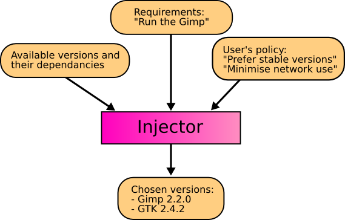
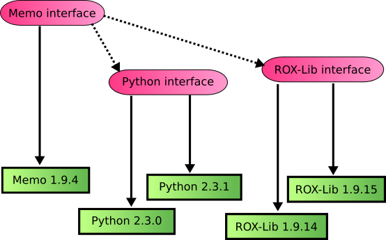
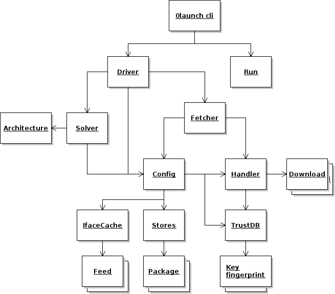

[TOC]

# Zero Install Design Details

This page describes the design of Zero Install itself.

!!! note
    Zero Install is based on the principle of [Dependency Injection](http://en.wikipedia.org/wiki/Dependency_injection), and is sometimes therefore referred to as _the injector_.

Everything 0install downloads from the net by default goes in `~/.cache/0install.net/`. Every archive it downloads unpacks into its own directory inside this. So, there's one directory for ROX-Filer, and another for ROX-Session, etc. In fact, there's one directory for every version of ROX-Filer, in case you want more than one available. Every directory is uniquely named, so you'll never get conflicts when trying to install two different programs.

The injector doesn't store anything else, except a few configuration details (such as whether you want to check for updates automatically), which go in `~/.config/0install.net/`. Installation never causes any mysterious changes with other files, as happens with some other installation systems.

The idea is that you don't need to backup `~/.cache`, because you can always download the stuff again. For example, if you delete the whole `~/.cache/0install.net/` directory and then click on ROX-Filer, it will just prompt you to download it again. The cache is just to make things faster (and work when offline), but you don't really need to worry about it. You shouldn't modify anything in there.

If [sharing](../details/sharing.md) is enabled, then Zero Install stores downloaded implementations in `/var/cache/0install.net/` instead of in `~/.cache/0install.net/`. This allows sharing between users. The use of cryptographic digests (described below) makes this safe; users don't need to trust each other not to put malicious code in the shared cache.

# Requirements

- Any user can run any program they want, without it needing to be installed first.
- Users refer to programs by globally unique names (URLs). So, a user asks to run "http://gimp.org/gimp", rather than the rather vague "The Gimp".
- Users can run whatever version of a program they want.
- Users don't need the root password.
- Users don't need to trust each other.
- The system administrator doesn't have to trust the users.
- Any developer can make software available through the system (without needing the blessing of some distribution first).

# Security and sharing

To clarify the security requirements: the injector is designed to support this situation:

- There are two users.
- The system administrator doesn't trust either with root permission.
- The users don't trust each other.
- Both users want to run (the same version of) the Gimp.
- The Gimp must only be downloaded and stored on disk once.

Current systems make you choose either:

- Inefficient (two copies downloaded and installed), or
- Insecure (second user must trust first user to get and install a good copy).

Although this situation obviously occurs in schools, libraries, etc, solving it is also useful in the home. Although you might expect family members to trust each other, remember that trust includes trusting them not to get infected with viruses, etc. If my brother gets some spyware and then installs the Gimp, I shouldn't get infected too. This also applies if you're doing sandboxing within a single user account, or using a dedicated 'sandbox' user for some tasks.

## The injector's solution

First, users need some way to specify what they want to run exactly. "Run the Gimp" is too vague (good gimp or evil gimp?), so we use URLs.

If both users say "Run gimp.org/gimp" then the system is smart enough to only get it once. If one user says "Run evil.com/gimp" and one says "Run gimp.org/gimp", the system downloads both programs.

Clearly, something has to actually download the software. It can either be one of the users, or a system daemon. The original Zero Install used a system daemon running as its own user, but the current ("injector") Zero Install has one of the users download the software. This is nicer, because they can do things like use a mirror or a CD to get the archives. The user uses a setuid (to `zeroinstall`) program to copy the downloaded (unpacked) directory into the shared cache in a location derived from a secure hash of its contents. See the [Sharing](../details/sharing.md) page for details.

# Policies

A running process is created by combining many different libraries (and other components). In the Zero Install world, we have all versions of each library available at all times. The problem then is how to choose which versions to use. Some examples of ways to choose:

- The very latest version.
- The latest version in the cache (eg, when off-line).
- The latest stable version.
- The version recommended by your distribution.
- A version not affected by a known security flaw.
- The version you've always used in the past.
- A development version you are working on yourself.

One way to organise things is to have a component link directly to particular versions of the components on which it depends. So, running Memo 2.0.0 might always use pygtk-2.0.0 and Python 2.2.0. But we often want to use the same component with different versions of its dependencies. For example, when Python 2.2.1 comes out with bug-fixes, we will want Memo to use it automatically.

The injector solves this problem by selecting components to meet a program's requirements, according to rules specified by the user:

Zero Install uses a SAT solver with conflict-driven learning to find the optimal solution quickly. See [The 0install SAT Solver](solver.md) for details.

# Interfaces and Implementations

An **interface** describes what something does (eg, "Simple text editor").

An **implementation** is something that does it (eg, Edit-1.9.6 or Edit-1.9.7).

A **feed file** is a list of implementations of an interface.

In Zero Install, interfaces are named by globally unique URIs (like web pages). Some examples of interfaces are:

- <http://rox.sourceforge.net/2005/interfaces/Edit>
- <http://rox.sourceforge.net/2005/interfaces/ROX-Lib>

Each _implementation_ of an interface is identified by a cryptographic digest, eg:

- `sha1=235cb9dd77ef78ef2a79abe98f1fcc404bba4889`
- `sha1=c86d09f1113041f5eaaa8c3d1416fcf4dad8e2e0`

When we run a program (like Edit) we need to choose an implementation of every interface on which it depends. Then, we need to tell the program where to find them all; this process is known as _Dependency Injection_ (or _Inversion of Control_).

Both tasks are handled by the injector. This takes as input an interface and chooses an implementation based on the policy.

By default, the list of implementations of an interface is found by using the interface's name as a URL and downloading the XML feed file it names (click on one of the interfaces above to see what a feed file looks like). Additional feeds (local or remote) can be added manually by the user.

# Versions

An implementation (in the Zero Install sense) is always some particular version. We identify implementations with a cryptographic hash of their contents. Therefore, two releases with the same version number are still considered as separate implementations if they differ in any way.

A version is a sequence of dot-separated lists of integers, each followed by an optional modifier. e.g. "1.2.3-pre4". It can be just a single number ("1") or a sequence of any number of components ("1.4-rc3.4-post"). The modifiers are "-pre", "-rc", "-" and "-post". Versions are ordered like this:

- 1
- 1.1-pre7
- 1.1-rc3
- 1.1
- 1.1-1
- 1.1-post
- 1.1.1
- 1.2
- 1.2.1
- 1.2.1.4
- 1.2.2
- 3

The injector doesn't care about anything other than the sort order (i.e., whether one version comes before or after another). This is a little different to some other systems, where numbers in different places have different meanings.

Incompatible changes (where a newer version cannot be used in place of an older version) to an interface should be handled by creating a new interface. Eg:

- http://gtk.org/gtk-1.2.xml (contains 1.2.0, 1.2.1, 1.2.2, ...)
- http://gtk.org/gtk-2.0.xml (contains 2.0.0, 2.0.1, 2.2.0, 2.4.0, 2.4.1, ...)

# Stability

The feed file should also give a stability rating for each implementation. The following levels are allowed:

- Stable
- Testing
- Developer
- Buggy
- Insecure

Stability ratings are kept independently of the implementations, and are expected to change over time. When any new release is made, its stability should be set to **Testing**. Users who have selected **Help test new versions** will then start using it. Other users will continue with the previous stable release. After a while (days, weeks or months, depending on the project) with no serious problems found, the implementation's stability can be changed to **Stable** so that everyone will use it.

If problems are found, it can instead be marked as **Buggy**, or **Insecure**. The injector won't select either by default, but it is useful to users to see the reason (users may opt to continue using a buggy version if it seems to work for them, but they should never use an insecure one). **Developer** is like a more extreme version of **Testing**, where the program is expected to have bugs.

You can use the **Preferred Stability** setting in the interface dialog to choose which versions to use. You can also change the stability rating of any implementation by clicking on it and choosing a new rating from the popup menu. User-set ratings are shown in capitals.

As you make changes to the policy and ratings, the order of the implementations in the list will change. The version in bold is the one that 0install will actually use. In addition to the ratings about, you can set the rating to **Preferred**. Such versions always come first, unless they're not cached and you are in Off-line mode.

!!! note
    If you want to use the second item on the list because the first is buggy, for example, then it is better to mark the first version as buggy than to mark the second as preferred. This is because when a new version is available, you will want that to become the version at the top of the list, whereas a preferred version will always be first.

# Dependencies

The feed file also lists the dependencies of each implementation; the injector locates an implementation of each dependency, recursively. All information about dependencies is handled at the interface level; this is because the same implementation may be used in different ways. Also, for software not specially designed for use with the injector, it allows us to keep the implementation in its original form.

This diagram shows some dependencies for Memo (the dotted lines):

The injector will also examine the dependencies of ROX-Lib and Python recursively.

# Object diagram

This diagram shows some of the main objects in the Zero Install software:

