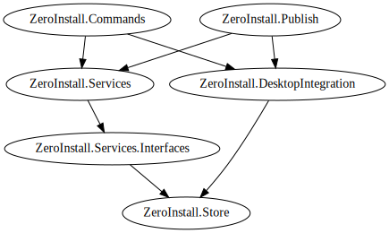

title: .NET API

The Zero Install .NET API implements the core features of Zero Install. Zero Install for Windows is built upon this API. It also allow developers to embed Zero Install functionality in their own applications.

[TOC]

# Links

- [Zero Install .NET GitHub repository](https://github.com/0install/0install-dotnet)
- [Zero Install for Windows GitHub repository](https://github.com/0install/0install-win)
- [Zero Install Transifex project page](https://www.transifex.com/projects/p/0install-win/)

# NuGet packages

You can use the following NuGet packages to integrate Zero Install features into your own application:

[ZeroInstall.Store](https://www.nuget.org/packages/ZeroInstall.Store/)
: Data model for the [feed format](../specifications/feed.md), signature verification, management of [on-disk caches](../details/cache.md).  
This provides a common basis for the packages `ZeroInstall.Services` and `ZeroInstall.Publish`. You will usually get this package indirectly as a dependency from there.

[ZeroInstall.Services](https://www.nuget.org/packages/ZeroInstall.Services/)
: Core services like [solving dependencies](../developers/solver.md), downloading implementations and execution selections.  
Zero Install itself is built upon this API. You can use the API to integrate Zero Install features into your own application, e.g. for a plugin management system.

[ZeroInstall.Services.Interfaces](https://www.nuget.org/packages/ZeroInstall.Services.Interface)
: Interfaces/abstractions for Zero Install services (contains no actual implementations).  
You will usually get this package indirectly as a dependency of `ZeroInstall.Services`.

[ZeroInstall.DesktopIntegration](https://www.nuget.org/packages/ZeroInstall.DesktopIntegration/)
: Methods for integrating applications with desktop environments (creating menu entries, etc.).

[ZeroInstall.Commands](https://www.nuget.org/packages/ZeroInstall.Commands/)
: Command-line interface for Zero Install.  
The binary in this package serves both as an actual CLI and a library for building other clients.

[ZeroInstall.Publish](https://www.nuget.org/packages/ZeroInstall.Publish/)
: Utilities for creating and modifying feed files.  
The [Zero Install Publishing Tools](../tools/0publish-win.md) (including the Feed Editor) are built upon this library. You can use this to automate complex feed creation/update tasks.

The following graph shows the dependencies between the NuGet packages:

# Documentation and samples

See the [API documentation](http://dotnet.0install.de/) for information how to use the Zero Install .NET API.

You can also take a look at minimal sample projects in various languages:

- [C# sample](https://github.com/0install/dotnet-backend/blob/master/samples/MinimalZeroInstall.cs)
- [Visual Basic .NET sample](https://github.com/0install/dotnet-backend/blob/master/samples/MinimalZeroInstall.vb)
- [F# sample](https://github.com/0install/dotnet-backend/blob/master/samples/MinimalZeroInstall.fs)
- [IronPython sample](https://github.com/0install/dotnet-backend/blob/master/samples/MinimalZeroInstall.py)
