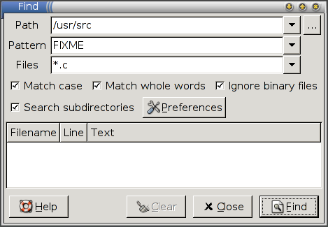

title: Find

In the [main packaging guide](../guide-gui.md) (which should be read before this one) we saw how to make a simple Python program available. When the user asked to run the program, the injector downloaded it for them and cached it. However, most programs depend on other programs, libraries and resources and these can also be fetched using the injector. Our example package will be [Find](http://www.hayber.us/rox/Find), a little utility for searching for files which depends on the ROX-Lib Python library.

[TOC]

# Running Find directly

Start by downloading [Find-006](http://www.hayber.us/rox/find/Find-006.tgz). This is just a normal application, not specially designed for the injector. If you try to run it, you should get an error:

```shell
$ wget http://www.hayber.us/rox/find/Find-006.tgz
$ tar xzf Find-006.tgz
$ cd Find
$ ./AppRun
*** This program needs ROX-Lib2 (version 2.0.0) to run.
```

Note: If it runs without an error, then either you've installed ROX-Lib manually (not using the injector) or your `PYTHONPATH` already points to it.

# Creating the interface file

Start by creating an XML interface file (`Find.xml`) as we did before:

```shell
$ 0publish Find.xml
```

Fill in the fields as before. The only difference is the addition of the `requires` element, which states that this program requires **ROX-Lib**, and the `main` attribute which is now `AppRun`. The final result should look something like this:

```xml
<?xml version="1.0" ?>
<?xml-stylesheet type='text/xsl'
     href='http://0install.net/2006/stylesheets/interface.xsl'?>
 
<interface xmlns="http://zero-install.sourceforge.net/2004/injector/interface">
  <name>Find</name>
  <summary>a find-in-files utility</summary>
  <description>
Searches files for specific text, displaying the results in a window. Double click
on the result line(s) to open the file at that point.
 
Configuration options are available to customize the search command and the editor with which to
open the files.
  </description>
  <homepage>http://www.hayber.us/rox/Find</homepage>
  <icon type='image/png' href='http://www.hayber.us/0install/Find.png'/>
 
  <group main='AppRun'>
    <requires interface="http://rox.sourceforge.net/2005/interfaces/ROX-Lib">
      <environment insert="ROX-Lib2/python" name="PYTHONPATH"/>
    </requires>
    <implementation id='.' version='6'/>
  </group>
```

Let's go over the group part in detail:

- The `<group>` element contains a set of implementations of the interface (versions of **Find**) and their requirements. The group saves us having to repeat the requirements for each implementation (since they often don't change). We have also given the `main` attribute here, since all versions of **Find** are run using a script with this name.
- We have a single requirement, ROX-Lib, which is identified by the URI of its interface. The URI is chosen by the publisher of the ROX-Lib interface, just as we chose the URI for our SCons interface in the previous tutorial.
- The `<environment>` element inside tells the injector how to make its choice known to **Find**. In this case, it is by inserting `/path/of/cache/DIGEST/ROX-Lib2/python` to the beginning of the `PYTHONPATH` environment variable. When Find (a Python program) does `import rox`, it will then get the chosen version of **ROX-Lib**.
- Also inside the group we have a single (local) implementation, as before. The **id** gives the location of the implementation directory relative to the interface file. In this case, we are assuming that the `Find.xml` file is in the same directory as the `AppRun` script.

Save the interface using the default file name (a temporary file chosen by `0publish`) and try running it:

```shell
$ 0launch ./Find.xml
```

If you don't already have ROX-Lib, you will be prompted to download it as usual. Once ROX-Lib is available, Find runs:



As usual, you can run `0launch -g ./Find.xml` to force the 0launch GUI to appear. You will see that there is a single version of Find available, but that you can choose any version of ROX-Lib to use with it.

# Adding the archive

We will now change the implementation as we did before so that the injector will download **Find** for us instead of requiring it to be on the machine already:

```shell
$ 0publish Find.xml \
  --set-version=6 \
  --set-released=today \
  --archive-url=http://www.hayber.us/rox/find/Find-006.tgz \
  --archive-file=../Find-006.tgz \
  --archive-extract=Find
```

As the archive file isn't in the current directory, we give its location with `--archive-file`. `0publish` needs this to get the digest, but it doesn't download the archive from the network because it wouldn't be able to check that it hasn't been tampered with (although if the program's author doesn't provide a signature then there may be no way to check anyway).

We also use the `--archive-extract` attribute. This is because each **Find** archive contains a single top-level directory, which we don't need (and the name might change in different versions, e.g. if the author decides to include the version number). Extracting just the contents means the every version will have the same structure, which makes it easier for other programs to depend on it. This is mostly useful for libraries like ROX-Lib, where we need to know that the path will always be `lib`, not `libfoo-1.1/lib` with version 1.1 and `libfoo-1.2/lib` with version 1.2, since a fixed path has to go in the `environment` element above.

The resulting file will contain this:

```xml
    <implementation id='sha1=ff9d9e11fde0a146c7e1781511fd9afb17752e34' released="2006-05-19" version='6'>
      <archive href="http://www.hayber.us/rox/find/Find-006.tgz" size="23161" extract='Find'/>
    </implementation>
```

The attributes of `<archive>` are:

`href`
: a URL from which the archive can be downloaded (in escaped form, so a space is written as %20, etc).

`size`
: the size of the archive (for progress bars).

`extract`
: (optional) a subdirectory of the archive to use. We could have omitted this and changed the implementation's `main` to `Find/AppRun` instead, but it's better to keep the main attribute the same, if possible.

If you run the new `Find.xml`, the injector should download and unpack the archive into the cache, and run Find from it.

## Note on weaknesses in SHA-1

Some weaknesses in the SHA-1 algorithm have been discovered. At present, it is still strong enough for our use, but you may wish to use some other algorithm, with the `--manifest-algorithm` option. See the [specification](../../specifications/manifest.md#algorithms) for a list of available secure hashing algorithms and which versions of the injector support them.

See the [HASH COLLISION Q&A](http://www.cryptography.com/cnews/hash.html) for more details.

# Publishing the interface

The `Find.xml` interface file can now be signed and published as described before:

```shell
$ 0publish Find.xml --set-interface-uri=http://www.hayber.us/0install/Find
$ 0publish Find.xml --xmlsign
```

# Registering the local feed

We have already seen how to use a local `Find.xml` file inside the **Find** directory to run the local version with a chosen version of **ROX-Lib** (i.e., by setting the `id` attribute to `.`). It is quite useful to add this file to your CVS (or similar system) to let developers test new versions easily, since it will get the libraries for them.

In fact, we'd often like to see both downloadable implementations (e.g., official releases) and local versions (e.g., developer CVS checkouts) of Find together. To do this, all we need is to add a `feed-for` line in the local `Find/Find.xml` file (the one where the implementation `id` is `.`):

```xml
<?xml version="1.0" ?>
<interface xmlns="http://zero-install.sourceforge.net/2004/injector/interface">
  <feed-for interface='http://www.hayber.us/0install/Find'/>
```

You can now register the local feed in the normal way:

```shell
$ 0launch --feed Find.xml
```

When another program runs **Find** using its official URI, this local version will be included in the list of available versions that can be selected. It is traditional to add `.0` to the end of the version number for CVS versions, so that the CVS version will be preferred to the previous release.

# Problems with manifest digests

There is one possible problem with the digests, where the 'actual' manifest changes each time the archive is extracted! This happens when you include only some deep subdirectories in the archive, but not the top-level directory. Eg:

```shell
$ tar czf archive.tgz deeply/nested/path
```

When tar extracts the archive, it restores the original mtime of 'path', but creates 'deeply' and 'nested' with the current time. This is what causes the digest to change. There are two possible solutions:

- Always list all top-level directories when creating archives.
- Use any algorithm except `sha1`, as this is the only one that includes directory mtimes in the digest (for backwards compatibility).
