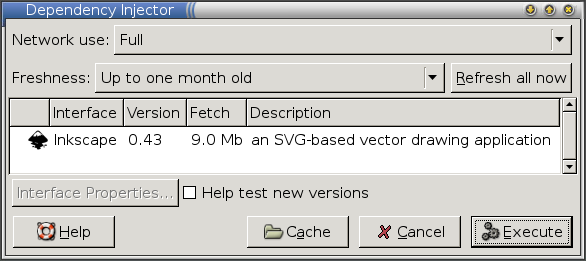

title: Inkscape

[The Inkscape project](http://inkscape.org/) makes available a binary RPM which works on various platforms. However, using this RPM directly has a few limitations for users:

- They must be root to install it.
- It doesn't work on all distributions (e.g., Debian).
- The system won't periodically check for updates.

These limitations can be avoided by creating a Zero Install interface file for it. This guide goes over the steps quite quickly. For more details see [the packaging main guide](../guide-gui.md).

!!! note
    The original Inkscape binary RPM was compiled with binreloc support disabled, which prevented it from finding its icons (it used hard-coded paths). Jean-François Lemaire, the creator of the RPM, has kindly recompiled it for us with relocation support turned on.

[TOC]

# Creating the interface

We'll be using the `0publish` command to create the interface file. If you don't have it already, create an alias for `0publish` in the usual way:

```shell
$ 0install add 0publish http://0install.net/2006/interfaces/0publish
```

To create the interface file:

1\. Download the static binary RPM:

```shell
$ wget http://users.skynet.be/jflemaire/files/inkscape-0.43-0.i386.rpm
```

2\. Create the interface:

```shell    
$ 0publish Inkscape.xml
```

    Fill in the `name`, `summary`, `description`, `icon` and `homepage` fields. Set `main='usr/bin/inkscape'` on the `group` element. Save and quit (using the default filename).
    
3\. Add version 0.43 with the location of the static RPM:

```shell    
$ 0publish Inkscape.xml \
    --set-version=0.43 \
    --archive-url=http://users.skynet.be/jflemaire/files/inkscape-0.43-0.i386.rpm \
    --set-released=today \
    --set-arch=Linux-i486
```

# Testing it

You can run the new XML file with `0launch` to download and run Inkscape:

```shell
$ 0launch ./Inkscape.xml
```



# Signing and publishing

Now we need to sign the XML file using our GPG key. If you don't already have a GPG key, create one now:

```shell
$ gpg --gen-key
```

We also need to decide where the Inkscape XML file will be made available. This URL should not change, since other programs will link to it. We'll assume `http://inkscape.org/2006/ZeroInstall/Inkscape.xml` here.

To set the URI and sign the interface:

```shell
$ 0publish Inkscape.xml \
  --set-interface-uri=http://inkscape.org/2006/ZeroInstall/Inkscape.xml \
  --xmlsign
Exported public key as 'AE07828059A53CC1.gpg'
```

Upload the resulting `Inkscape.xml` and GPG files to the same directory on the web-server. The XML file should look something like [the Inkscape.xml test interface](http://0install.net/2006/3rd-party/Inkscape.xml).

# Using the published interface

You can now run Inkscape like this:

```shell
$ 0launch http://inkscape.org/2006/ZeroInstall/Inkscape.xml
```

Users can now install Inkscape using this URL, either using some graphical installer (like ROX's [AddApp](http://rox.sourceforge.net/desktop/AddApp) or [Xfce 4.4's panel](http://rox.sourceforge.net/desktop/node/269)). Command-line users can get it like this:

```shell
$ 0install add inkscape http://inkscape.org/2006/ZeroInstall/Inkscape.xml
```

They can then run it by typing `inkscape`. To choose a different version:

```shell
$ 0install update --gui inkscape
```

# Marking as stable

After the release has been out for a while, mark it as stable:

```shell
$ 0publish Inkscape.xml --stable
```

Users can configure the injector either to prefer stable versions or to select testing versions by default. This gives your more advanced users the chance to provide feedback before you roll a new release out to all users.

# Making a new release

When a new static binary RPM is released, add the new version to the XML as follows:

1.  Download the new RPM (if you're not the person who made it).
2.  Add it to the XML (note use of `add-version` rather than `set-version` here):

```shell
$ 0publish Inkscape.xml \
    --add-version=0.44 \
    --archive-url=http://users.skynet.be/jflemaire/files/inkscape-0.44-0.i386.rpm \
    --set-released=today \
    --set-arch=Linux-i486
```
