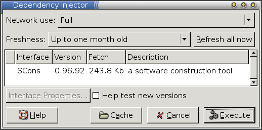

title: Packaging guide (command-line)

This guide shows how to make software available through [Zero Install](http://0install.net/injector.html), using the command-line [0publish](../tools/0publish.md) program. New users will probably prefer to start with the [graphical interface](guide-gui.md) instead, but this version is useful when writing scripts to automatically publish new versions, or if you can't run the graphical version for some reason.

We will start by packaging SCons, a build system (a little like Make).

You should already be familiar with the general operation of 0install. In not, start by reading the [Introduction tutorial](../basics/index.md).

[TOC]

# Introduction

SCons is particularly easy to package, because it is designed to be bundled with other applications and used in their build process, and can therefore be executed in place right after unpacking. To try it out, download the `scons-local` archive from their web-site, unpack it, and run it:

```shell
$ mkdir scons
$ cd scons
$ wget http://heanet.dl.sourceforge.net/sourceforge/scons/scons-local-0.96.92.tar.gz
$ tar xzf scons-local-0.96.92.tar.gz
$ ./scons.py --version
SCons by Steven Knight et al.:
        script: v0.96.92.D002, 2006/04/11 07:39:43, by knight on roxbury
        engine: v0.96.92.D002, 2006/04/11 07:39:43, by knight on roxbury
Copyright (c) 2001, 2002, 2003, 2004 The SCons Foundation
```

Programs that can be run in this way are the easiest to make available through Zero Install. To do this we need to create a small XML file stating:

- Which versions are available.
- Where each one can be downloaded from.
- How each version can be run.
- Any dependencies each version has on other packages.

You can write this _interface file_ with a text editor just by reading the [file format specification](../specifications/feed.md), but it's easier to use the `0publish` command. `0publish` will create an initial template for you, check that the file is valid, and makes many operations easier. The command is, of course, available through Zero Install. To save typing it's full URI each time you run it, create an alias now:

```shell
$ 0install add 0publish http://0install.net/2006/interfaces/0publish
$ 0publish --version
0publish (zero-install) 0.5
```

See also:

- [0publish](../tools/0publish.md)
- [SCons homepage](http://www.scons.org)

# Creating the interface file

`0publish` works by reading in an XML interface file, modifying it in some way, checking that it is still valid, and then writing it back out. If the file doesn't already exist it will offer to create it for you. Run `0publish` now to create a new file called `SCons.xml`:

```shell
$ 0publish SCons.xml
Interface file 'SCons.xml' does not exist. Create it? [Y/N] Y
```

`0publish` will create a new template and fire up an editor to let you change it. If you don't like the default, set your `EDITOR` environment variable to something better, or create an alias called `sensible-editor`. E.g., to edit interfaces using Edit:

```shell
$ 0install add sensible-editor http://rox.sourceforge.net/2005/interfaces/Edit
```

Fill in the fields in the XML template. The comments should guide you, but these are the exact changes we will make now:

- Set the `summary` to a short description. Start with a lower-case letter (except for proper nouns) and don't include the name of the program. The summary is normally shown after a dash, e.g. _SCons - a software construction tool_.
- The `description` fields can be longer. Copying some text from the web page or from freshmeat often works well.
- Set the `homepage` to the program's main web-site (or to your own site if you have a page for it). This is where users will go if they want more information than is in the description. Don't forget to uncomment it by removing the `<!--` and `-->` markers around it.
- Set the `icon` to the URL of a small PNG format icon if you want.
- The main program (which we ran above) is called `scons.py`, so change the `main` attribute to that.

You can leave the other elements alone for now. Save your file using the default name (it will be to a temporary file) and `0publish` will write it as `SCons.py` if it's valid. If you made a mistake, `0publish` will prompt you to fix it first.

Your final version should look something like this:

```xml
<?xml version="1.0" ?>
<?xml-stylesheet type='text/xsl'
     href='http://0install.net/2006/stylesheets/interface.xsl'?>

<interface xmlns="http://zero-install.sourceforge.net/2004/injector/interface">
  <name>SCons</name>
  <summary>a software construction tool</summary>
  <description>
SCons is a software construction tool (build tool substitute for Make)
implemented in Python. It features a modular build engine that can be
embedded in other software. SCons configuration files are Python scripts
that call the build engine API.

It can scan files to detect dependencies automatically and maintain a global
view of all dependencies in a build tree, and uses MD5 signatures to detect
changed file contents reliably. Timestamps can be used if you prefer. SCons
also supports parallel builds and is easily extensible through user-defined
builder and scanner objects.
  </description>

  <homepage>http://www.scons.org/</homepage>

  <group main="scons.py">
    <implementation id="." version="0.1" released='Snapshot'/>
  </group>
</interface>
```

If you created the `SCons.xml` file in the same directory as you ran `./scons.py` above, then you can now execute it already, like this:

```xml
$ 0launch ./SCons.xml --version
SCons by Steven Knight et al.: ...
```

This type of XML file is known as a _local interface_ because its name is a simple filename (normally, interfaces start with `http://` and need to be downloaded). Also, the single version (_implementation_) is a _local implementation_, because it is also identified by a pathname (the directory containing the XML file, `.`). In this case, the local interface isn't very useful on its own because we could have just run `./scons.py` directly. However, if we had listed any dependencies in the XML file then running it this way would have fetched them through Zero Install, so local interfaces can still be useful (especially for CVS checkouts of software, for example).

See also:

- [Feed file format specification](../specifications/feed.md)

# Adding the archive

The next step is to change the implementation so that Zero Install will download the archive from the SCons web-site instead of requiring the user to have it locally. We should also change the version number and release date to their correct values. Adding the archive is a little tricky to do manually because we need to calculate the _secure hash_ of the contents of the archive. This is needed when downloading from the web to check that the archive hasn't been tampered with.

Luckily, `0publish` can make the necessary changes and add the required hash at the same time. Use this command (split on to multiple lines for clarity):

```shell
$ 0publish SCons.xml \
  --set-version=0.96.92 \
  --set-released=today \
  --archive-url=http://heanet.dl.sourceforge.net/sourceforge/scons/scons-local-0.96.92.tar.gz
```

If you now run the program using `0launch` again, it will offer to download SCons for you:

```shell
$ 0launch ./SCons.xml --version
```



If you look in the `SCons.xml` file, you'll see that `0publish` changed the old `implementation` element to this:

```xml
<implementation
    id="sha1=4a12f3ecc173b779cda1ece201e08616d2c11758"
    released="2006-05-18"
    version="0.96.92">
  <archive
      href="http://heanet.dl.sourceforge.net/sourceforge/scons/scons-local-0.96.92.tar.gz"
      size="249688"/>
</implementation>
```

The `id` gives the secure hash of the contents of the package. If the archive is changed (e.g., by someone breaking into SCons's web-server) then the hash won't match and Zero Install will refuse the download. Inside the `implementation` element is a list of ways of getting it. In this case, we state that a directory with the given hash can be created by downloading the named archive and extracting it.

See also:

- [Archives](../specifications/feed.md#retrieval-methods)

# Publishing the interface

You'll probably want to put your new interface up on the web, so that other people can get it easily. However, we can't just stick it up as it is because someone might be able to break into the web-server tamper with it, or intercept a user's network connection and insert their own version. We need to put our _digital signature_ on it, using the **GnuPG** program, so that people can check that it's really from us.

If you do not already have a GPG key-pair, create one now. You can accept the defaults for most fields; just enter your name and email address:

```shell
$ gpg --gen-key
```

We also need to decide on the URL people will use to download it. Since other programs that depend on this one will use the URL to find it, try to pick a URL that won't change. Here, we'll use `http://0install.net/tests/SCons.xml`, which isn't a very good URL, to discourage people from relying on this test example! Once you've picked a URL you need to add it to the XML file:

```shell
$ 0publish SCons.xml --set-interface-uri=http://0install.net/tests/SCons.xml
```

The interface file now starts like this:

```xml
<interface uri="http://0install.net/tests/SCons.xml" ...
```

Finally, we'll add the GPG signature (if you have more than one key, use `-k` to specify which one to use). You'll need to enter the passphrase you set when you created the key above:

```shell
$ 0publish SCons.xml --xmlsign
Enter passphrase:
Exported public key as 'AE07828059A53CC1.gpg'
```

This command adds a digital signature to the XML file. It also exports a copy of your GPG public key, which people will need in order to check the signature. Upload both files to the same directory on your web-server. You should now be able to run your interface with its full URI:

```shell
$ 0launch http://0install.net/tests/SCons.xml --version
SCons by Steven Knight et al.:
```

If this is your first interface, the injector should now ask you to confirm that you trust the new key for signing software.

# Marking as stable

Each implementation in an XML file has a _stability_ setting. Typically, this is `testing` for a new release and `stable` for versions that have been around for a while. Normally, the injector will select the highest-numbered stable version by default. However, users who selected **Help test new versions** will get any newer testing version selected by default instead.

By default, new releases are considered to have a stability rating of `testing`. After a week or so without major problems, set the stability of the testing version to `stable`:

```shell
$ 0publish SCons.xml --stable
```

If the version turns out to have _serious_ problems, set it to `buggy` or `insecure` instead. There's no automatic option for this, so use `-e` to edit the file (`0publish` will automatically resign it when you save):

```shell
$ 0publish SCons.xml --edit
```

# Adding more versions

You can add more versions of SCons to your interface using `0publish`. The process is very similar to before, except that you use `--add-version` instead of `--set-version`. So, when version 1.0 is released, do this:

```shell
$ 0publish SCons.xml \
  --add-version=1.0 \
  --set-released=today \
  --archive-url=http://heanet.dl.sourceforge.net/sourceforge/scons/scons-local-1.0.tar.gz
```

You can also add earlier versions, which may be useful if some programs aren't compatible with the newest version.

# Notes

## Archives with top-level directories

The SCons archive is a little unusual because it unpacks the files directly into the current directory when you extract it. Most archives would have just a single top-level directory named after the archive (e.g. `scons-local-0.96.92`) and put all the files in that. While you could cope with that by setting the `main` attribute to be `scons-local-VVV/scons.py` for each version, it's better to use the [extract](../specifications/feed.md#retrieval-methods) attribute on the `archive` element so that all versions have the same structure. This is especially important for libraries, where the `main` attribute isn't used. Use the `--archive-extract=DIR` argument to `0publish` for this.

## Supported Archive formats

Archive formats are recognised by their file extensions. Supported formats are:

- `.zip`
- `.tar`
- `.tar.gz` or `.tgz`
- `.tar.bz2`
- `.tar.lzma`
- `.tar.xz` (since version 0.43, not supported by Windows version)
- `.7z` (Windows version only)
- `.msi` (Windows version only)
- `.cab`
- `.deb` (not supported by Windows version)
- `.rpm` (not supported by Windows version)
- `.gem` (since version 1.0-rc1, not supported by Windows version)

## Dependencies

You can specify that your program depends on other programs using the `requires` element. See the [feed file format](../specifications/feed.md) document for details. See [Easy GTK binary compatibility](http://rox.sourceforge.net/desktop/node/289) for an example (building an application requires SCons and the GTK headers).

The [Packaging Find case study](examples/find.md) gives an example of this.

## Why do we need to put the URL in the XML?

This is a security feature to let `0launch` check that it downloaded the XML the user asked for. Without it, this could happen:

1. I may trust the author of the _SecureDelete_ program to supply software.
2. I tell `0launch` to invoke a text editor on a precious document.
3. `0launch` tries to download the XML for the text editor from the web.
4. An attacker returns the XML file for _SecureDelete_, correctly signed by the author of _SecureDelete_ (possibly the same person who wrote the text editor).
5. My file gets securely deleted!

## XML signature format

There are two ways to sign interface files. The `--gpgsign` option creates signatures in a format that all versions of the injector can read but they don't look great if you view the interface using a web-browser. The `--xmlsign` option still uses `gpg` to sign it, but the result is still XML and can therefore be styled nicely. However, such interfaces require users to have version `0.18` or later of the injector.

## When to use the 'buggy' rating

Only mark versions as `buggy` if there's a serious problem that means people really shouldn't use it (not just a few minor annoyances; all software has _some_ bugs). Normally, just releasing a newer (fixed) version is sufficient, since the injector will offer to upgrade the version anyway.

# Further reading

[Example: Find](examples/find.md)
: Find is a Python program with a dependency on a Python library. This example shows how to depend on other components.

[Example: Inkscape](examples/inkscape.md)
: Inkscape is distributed as a binary RPM (among other formats). This guide shows how to publish these RPMs so that they can be run using Zero Install (by users without root access or on Debian systems, for example).

[Example: ROX-Filer](examples/rox.md)
: ROX-Filer is a C program, which requires different binaries for different platforms. These binaries are built and published in interface files maintained by different people. Using the injector's feed mechanism, users only need to use the main ROX-Filer interface and will automatically get a binary for their platform, from the maintainer of that binary.

[0publish](../tools/0publish.md)
: A command reference for the `0publish` command.

[Compiling with SCons and GTK](http://rox.sourceforge.net/desktop/node/300)
: Now that we've made SCons available through Zero Install, we can use it in our build scripts. This example shows how to build a GTK application written in C using Zero Install to get the build tool and the header files automatically.
