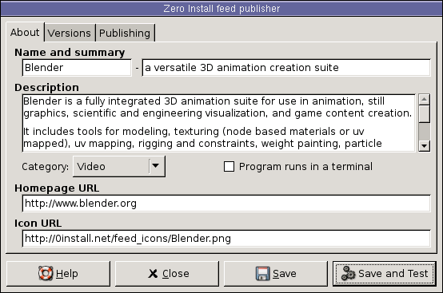
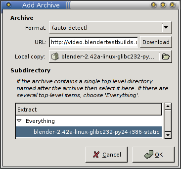
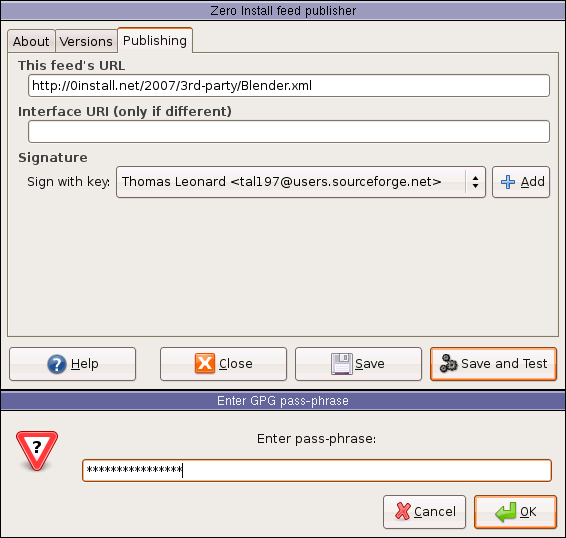

title: Packaging guide (graphical)

This guide shows how to make software available through [Zero Install](https://0install.net/injector.html). We will start by packaging [Blender](http://www.blender.org), an open source 3D modelling and animation program.

You should already be familiar with the general operation of Zero Install. If not, start by reading the [Introduction tutorial](../basics/index.md).

We assume here that a binary release already exists (perhaps published by someone else) and you want to make it available through 0install. If you want to publish your own programs, you might also be interested in [0release](../tools/0release/index.md), which generates a release from a Git repository.

[TOC]

**Tip**: To check whether someone has already packaged a program, use the search feature at the top of the <https://0install.net> page to search all known existing feeds.

# Tutorial

To make a program available via Zero Install you need to create an XML 'feed' file, describing which versions are available, where they can be downloaded, and what other software they require. In this tutorial, we'll use the graphical **0publish-gui** application to create this file. If you don't want to use a graphical interface (for example, because you want to publish new versions using a script) then you should read the [command-line tutorial](guide-cli.md) instead.

Start by getting **0publish-gui** in the usual way:

```shell
$ 0install add 0publish-gui http://0install.net/2007/interfaces/0publish-gui.xml
```

This program requires GTK >= 2.6 and Python >= 2.4 (these are not fetched using Zero Install at present).

Windows users: the [Zero Install Publishing tools](https://apps.0install.net/0install/0publish-win.xml) is a .NET equivalent of 0publish-GUI.

Run the program, giving it the name of the feed file you want to create, which should be named after the program:

```shell
$ 0publish-gui Blender.xml
```

A window appears prompting you to enter some details about the program. Here, I've copied the details from the project's [freshmeat.net](http://freshmeat.net) page. The **Icon** field is optional, but I've added one anyway:



The next step is to add one or move versions of Blender to the feed, which we can do from the **Versions** tab using the **Add Archive** button:


Enter the URL of the archive for the new version (copy the link from the Blender site). This URL tells other people where to get it, so it must be present. If you've already downloaded the archive then choose it in the **Local copy** section. Otherwise, click on **Download** to download it now:


The top-level items in the archive are displayed in the **Extract** area. The reason for this is that there are two common ways of laying out archives. Some people put the files in the archive directly, while others create an extra top-level directory. In blender's case, the archive contains a single top-level directory called `blender-2.42a-linux-glibc232-py24-i386-static`.

The reason this matters is because we need each version to have a similar structure. We don't want a directory name that's going to be different each time, so we select to extract just the contents of this directory. 0publish-gui is pretty smart about guessing whether to extract everything or just a sub-directory, so just go with the default.



Now we are prompted to enter some extra information about this version. The most important field to set is **Main**, which is the executable program inside the archive that is run when someone tries to use your feed. The drop-down menu shows the available executables.

The **License** and **Released** fields are just for information. **Released** is the date you added this version to the feed, so the default of today's date is correct. The **OS** and **CPU** fields prevent people from trying to use this version on incompatible machines. The **Docs** field can be used to say which directory contains the documentation, if any.

I've left **Stability** set to **(inherit)**, which means that the rating will be inherited from any containing group. Since we don't have a group, it will get the default value of **Testing**. You can also inherit the other fields (by leaving them blank), although **OS** and **CPU** are inherited together (you can't inherit one and not the other). Groups are useful when you have lots of versions, so you don't have to keep specifying the same information for each one.

Finally, the shaded **ID** field displays a cryptographic digest of the archive's contents. When other people use this feed to get Blender 2.42, this is how they know that they've downloaded exactly the same files as you have (in case an attacker replaces the download with a modified version).


You'll now see your new version shown in the list of versions, along with the single archive, which says where to get it. The names in parenthesis show which attributes we set. We can try out the interface by clicking on the **Save and Test** button:


This runs `0install run` on our XML file, in the usual way. Note that version 2.42 is already cached; it was added when we clicked **OK** in the **Add Archive** box. Click on **Execute** and check that it runs.


It all works perfectly, so we'll publish this feed on the web for other people to use. To do this, we need to sign the feed so people can check that it's really from us. Go to the **Publishing** tab and choose your GPG key from the menu. If you don't have a key, click on the **Add** button to create one now.

When generating a key, you'll be asked a few difficult-looking questions; if unsure, just accept the defaults offered. Enter your name and e-mail address when prompted, and choose a good passphrase to protect the key:


There's one final thing left to do: we need to decide where on the web we'll publish the XML file. Enter the URL that people will use to download your feed in the section titled **This feed's URL**. Try to pick a location that won't change, as people will keep coming back here for updates.

Click on **Save** to save it again. This time, you'll be prompted to enter your key passphrase (the one you chose when creating the key above):



The final result of all this is three files: the signed XML feed file itself, listing our single version, your GPG public key, which lets people check the signature, and an XSLT stylesheet, in case anyone wants to view the feed in their browser.


Upload all three files to your web-server. I put mine in <http://0install.net/2007/3rd-party/>. Now anyone can run Blender with the command:

```shell
$ 0install run http://0install.net/2007/3rd-party/Blender.xml
```

# Check your feed!

It's surprising how easy it is to forget to set the right permissions, etc, so check your new feed! [FeedLint](../tools/feedlint.md) is an easy first step:

```shell
$ 0install add feedlint http://0install.net/2007/interfaces/FeedLint.xml
$ feedlint http://0install.net/2007/3rd-party/Blender.xml
```

# Groups and dependencies

If the software depends on something else (e.g. a library) then use the **Add Requires** button to specify this. For example, **0publish-gui** depends on **ROX-Lib**, which I specified like this:


This ensures that `.../ROX-Lib2/python` is in `PYTHONPATH`. When **0publish-gui** does `import rox`, the import thus uses the directory `.../ROX-Lib2/python/rox`.

When you want to add more versions, you should use the **Add Group** button to create a group. Make sure both versions are inside the new group (use drag-and-drop to move them). Then you only need to set the license, main, OS and CPU settings in one place. You can also share dependencies using groups.

# Trouble-shooting

I can't find a generic binary for the program I want to package!

: Popular projects usually provide a "generic" binary tarball, which works on most Linux distributions. This is the best archive to put in the feed. If there isn't one, it might mean that the developers couldn't get a single binary to work on multiple distributions, or it might just mean they haven't tried.

: Often, a Red Hat RPM will work just fine on Debian (e.g. [the LyX feed](http://0install.net/2007/3rd-party/LyX.xml)), or a .deb will work on Red Hat, etc. If there are several options, pick the one for the distribution which is furthest behind (e.g. Red Hat rather than Fedora). Packages for old systems often still work with newer ones, but not the other way around.

My program assumes it's running from `/usr/games`

: Games have an annoying habit of trying to `cd` to a hard-coded directory in their start-up script. You could try asking the author to fix it (`cd "$(dirname $0)"` would work just as well). It's also possible to patch the download using a `<recipe>` element, but the GUI doesn't provide an interface for this. The trick here is getting the ID right; you need the digest of the directory structure _after_ the patch has been applied. `0install digest` can help here.

# Further reading

[Example: Find](examples/find.md)
: Find is a Python program with a dependency on a Python library. This example shows how to depend on other components.

[Example: Inkscape](examples/inkscape.md)
: Inkscape is distributed as a binary RPM (among other formats). This guide shows how to publish these RPMs so that they can be run using Zero Install (by users without root access or on Debian systems, for example).

[Example: ROX-Filer](examples/rox.md)
: ROX-Filer is a C program, which requires different binaries for different platforms. These binaries are built and published in interface files maintained by different people. Using the injector's feed mechanism, users only need to use the main ROX-Filer interface and will automatically get a binary for their platform, from the maintainer of that binary.

[0publish](../tools/0publish.md)
: A command reference for the `0publish` command.

[Compiling with SCons and GTK](http://rox.sourceforge.net/desktop/node/300)
: Now that we've made SCons available through Zero Install, we can use it in our build scripts. This example shows how to build a GTK application written in C using Zero Install to get the build tool and the header files automatically.
