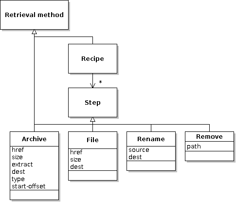
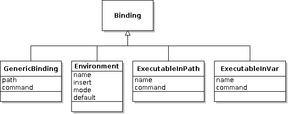

# Feed files

This document is a formal description of the XML feed file format. An interface describes a program, library or other component. A feed provides a list of known implementations of the interface (versions of the program) and details about how to get them, how to check that they are authentic, how to run them and what other components they depend on.

[:fontawesome-regular-file-code: XML Schema Definition](feed.xsd)

This class diagram shows how the different concepts are related. Each feed file contributes information to this model:


Each *Feed* lists a number of *Implementations* (versions). An *Identity* is a way to recognise an *Implementation* (e.g. a cryptographic digest). A *Retrieval* method is a way to get an *Implementation* (e.g. by downloading from a web site). A *Command* says how to run an *Implementation* as a program. A *Dependency* indicates that one component depends on another (e.g. Gimp requires the GTK library). A *Binding* says how to let the program locate the *Implementations* when run. A *Constraint* limits the choice of a dependency (e.g. Gimp requires a version of GTK >= 2.6).

!!! abstract "Terminology"
    Originally the word 'interface' was used to mean both 'interface' and 'feed', so don't be confused if you see it used this way.

## Introduction

Feed files are introduced in the [Packager's Documentation](../packaging/index.md). They have the following syntax (`?` follows optional items, `*` means zero-or-more, order of elements is not important, and extension elements can appear anywhere as long as they use a different namespace):

```xml
<?xml version='1.0'?>
<interface xmlns='http://zero-install.sourceforge.net/2004/injector/interface'
           min-injector-version='...' ?
           uri='...' ? >
  <name>...</name>
  <summary xml:lang='...' ?>...</summary> +
  <description xml:lang='...' ?>...</description> *
  <homepage>...</homepage> ?
  <category type='...' ? >...</category> *
  <needs-terminal/> ?

  <icon type='...' href='...'/> *
  <splash-screen type='...' href='...'/> *

  <feed src='...' langs='...' ? arch='...' ?/> *
  <feed-for interface='...'/> *
  <replaced-by interface='...'/> ?

  [group] *
  [implementation] *
  [entry-point] *
</interface>
```

`min-injector-version`
: This attribute gives the oldest version of 0install that can read this file. Older versions will tell the user to upgrade if they are asked to read the file. Versions prior to 0.20 do not perform this check, however. If the attribute is not present, the file can be read by all versions.

`uri`
: This attribute is only needed for remote feeds (fetched via HTTP). The value must exactly match the expected URL, to prevent an attacker replacing one correctly-signed feed with another (e.g., returning a feed for the `shred` program when the user asked for the `backup` program).

`<name>`
: a short name to identify the feed or program (e.g. "Foo")

`<summary>`
: a short one-line description; the first word should not be upper-case unless it is a proper noun (e.g. "cures all ills"). Supports [localization](#localization).

`<description>`
: a full description, which can be several paragraphs long (optional since 0.32, but recommended). Supports [localization](#localization).

`<homepage>`
: the URL of a web-page describing feed or program in more detail.

`<category>`
: a classification for the interface. If no type is given, then the category is one of the 'Main' categories defined by the [freedesktop.org menu specification](http://standards.freedesktop.org/menu-spec/latest/apa.html). Otherwise, it is a URI giving the namespace for the category.

`<needs-terminal>`
: if present, this element indicates that the program requires a terminal in order to run. Graphical launchers should therefore run this program in a suitable terminal emulator.

`<icon>`
: an icon to use for the program; this is used by programs such as [AddApp](http://rox.sourceforge.net/desktop/AddApp) and [desktop integration](../details/desktop-integration.md). You should provide an icon of the type `image/png` (`.png`) for display in browsers and launchers on Linux. For Windows apps you should additionally provide an icon of the type `image/vnd.microsoft.icon` (`.ico`). For macOS apps you should additionally provide an icon of the type `image/x-icns` (`.icns`).

`<splash-screen>`
: a splash screen Zero Install can display during downloads, etc. for better branding. On Windows splash screens of the type `image/png` (`.png`) are supported. This is currently only used by [Zero Install for Windows](../details/windows.md) and when [desktop integration](../details/desktop-integration.md) is applied.

`<feed>`
: the linked feed contains more implementations of this feed's interface. The `langs` and `arch` attributes, if present, indicate that all implementations will fall within these limits (e.g. `arch='*-src'` means that there is no point fetching this feed unless you are looking for source code). See the `<implementation>` element for a description of the values of these attributes.

`<feed-for>`
: the implementations in this feed are implementations of the given interface. This is used when adding an optional extra feed to an interface with `0install add-feed` (e.g. a [local feed](../packaging/local-feeds.md) for a development version).

`<replaced-by>`
: this feed's interface (the one in the root element's `uri` attribute) has been replaced by the given interface. Any references to the old URI should be updated to use the new one.

## Groups

A group has this syntax:

```xml
<group version='...' ?
       released='...' ?
       main='...' ?
       self-test='...' ?
       doc-dir='...' ?
       license='...' ?
       released='...' ?
       stability='...' ?
       rollout-percentage='...' ?
       langs='...' ?
       arch='...' ? >
  [requires] *
  [group] *
  [command] *
  [binding] *
  [implementation] *
  [package-implementation] *
</group>
```

All attributes of the group are inherited by any child groups and implementations as defaults, but can be overridden there. All dependencies (`requires`), bindings and commands are inherited (sub-groups may add more dependencies and bindings to the list, but cannot remove anything).

## Implementations

An implementation has this syntax (an unspecified argument is inherited from the closest ancestor `<group>` which defines it):

```xml
<implementation id='...'
                local-path='...' ? 
                [all <group> attributes] >
  <manifest-digest [digest] * /> *
  [command] *
  [retrieval-method] *
  [binding] *
  [requires] *
</implementation>
```


`id`
: A unique identifier for this implementation. For example, when the user marks a particular version as buggy this identifier is used to keep track of it, and saving and restoring selections uses it. However, see the [important historical note below](#historical-note-about-id).

`local-path`
: If the feed file is a local file (the interface `uri` starts with `/`) then the `local-path` attribute _may_ contain the pathname of a local directory (either an absolute path or a path relative to the directory containing the feed file). See the historical note below.

`version`
: The version number. See the version numbers section below for more details.

`main` (deprecated)
: The relative path of an executable inside the implementation that should be executed by default when the interface is run. If an implementation has no `main` setting, then it cannot be executed without specifying one manually (with `0install run --main=MAIN`). This typically means that the interface is for a library. Note: `main` is being replaced by the `<command>` element.

`self-test` (deprecated)
: The relative path of an executable inside the implementation that can be executed to test the program. The program must be non-interactive (e.g. it can't open any windows or prompt for input). It should return with an exit status of zero if the tests pass. Any other status indicates failure. Note: `self-test` is being replaced by the `<command>` element.

`doc-dir`
: The relative path of a directory inside the implementation that contains the package's documentation. This is the directory that would end up inside `/usr/share/doc` on a traditional Linux system.

`released`
: The date this implementation was made available, in the format `YYYY-MM-DD`. For development versions checked out from version control this attribute should not be present.

`stability`
: The default stability rating for this implementation. If not present, `testing` is used. See [Stability](#stability) for more details.

`rollout-percentage` - since version 2.21, Windows only
: The percentage (0-100) of users that should treat this as `stability="stable"`. May only be set if `stability` is unset or `testing`. This can be used to perform [staged rollouts](#staged-rollouts).

`langs`
: The natural language(s) which this package supports, as a space-separated list of languages codes (in the same format as used by the `$LANG` environment variable). For example, the value `en_GB fr` would be used for a package supporting British English and French. Supported since 0.48. Note that versions before 0.54 require the region separator to be `_` (underscore), while later versions also allow the use of `-` for consistency with the `xml:lang` format.

`arch`
: For platform-specific binaries, the platform for which this implementation was compiled, in the form `os-cpu`. 0install knows that certain platforms are backwards-compatible with others, so binaries with `arch="Linux-i486"` will still be available on `Linux-i686` machines, for example. Either the `os` or `cpu` part may be `*`, which will make it available on any OS or CPU. If missing, the default is `*-*`. See also: [Valid architecture names](#valid-architecture-names).

`license`
: License terms. This is typically a [Trove](http://catb.org/~esr/trove/) category. See [the PyPI list](http://pypi.python.org/pypi?%3Aaction=list_classifiers) for some examples (the leading `License :: ` is not included).

The `manifest-digest` element is used to give digests of the .manifest file using various hashing algorithms (but see the historical note below). Having multiple algorithms allows a smooth upgrade to newer digest algorithms without breaking old clients. Each non-namespaced attribute gives a digest, with the attribute name being the algorithm.

!!! example
    ```xml
    <manifest-digest sha256="4f078f9080bd9b3b87e8360f014268886ec653ed077bb3cb6725185c0a07473a"/>
    ```

For non-local implementations (those without a `local-path` attribute), the `<implementation>` element contains a set of _retrieval methods_, each of which gives a different way of getting the implementation (i.e. of getting a directory structure whose digest matches the ones given).

Currently, 0install always chooses the first of the methods it understands, but in future it may use other strategies (such as choosing the closest mirror, or letting the user select one manually). It may also use other methods which aren't listed, such as searching for the implementation on a peer-to-peer network.

Unrecognised elements inside an implementation are ignored.

### Historical note about id

0install >= 0.45 generally treats the ID as a simple identifier, and gets the local path (if any) from the `local-path` attribute and the digests from the `<manifest-digest>`.

0install < 0.45 ignores the `local-path` attribute and the `<manifest-digest>` element. If the ID starts with `.` or `/` then the ID is also the local path; otherwise, it is the single manifest digest.

For backwards compatibility, 0install >= 0.45 will treat an ID starting with `.` or `/` as a local path if no `local-path` attribute is present, and it will treat it as an additional digest if it contains an `=` character.

Therefore, if you want to generate feeds compatible with past and future versions:

- If you have a digest, set the ID to `sha1new=...` and put the sha256 digest in the `<manifest-digest>`.
- If you have a local implementation then set both `id` and `local-path` to the pathname.

## Commands

The `main` attribute above provides a simple way to say how to run this implementation. The `<command>` element (supported since 0.51, released Dec 2010) provides a more flexible alternative.

```xml
<command name='...'
         path='...' ? >
  <arg> ... </arg> *
  <for-each item-from='...' separator='...'? > ... </for-each> *
  <working-dir src='...'? /> ?
  [requires] *
  [binding] *
  [runner] ?
</command>
```

`name`
: By default, 0install executes the `run` command, but the `--command` option can be used to specify a different one. [0test](../tools/0test.md) runs the `test` command (replacing the old `self-test` attribute) and [0compile](../tools/0compile/index.md) runs the `compile` command (replacing the `compile:command` attribute).

`path`
: The relative path of the executable within the implementation (optional if `<runner>` is used).

Additional arguments can be passed using the `<arg>` element. Within an argument, `${name}` is expanded to the value of the corresponding environment variable. These arguments are passed to the program before any arguments specified by the user.

If an environment variable should be expanded to multiple arguments, use `<for-each>`. The variable in the `item-from` attribute is split using the given separator (which defaults to the OS path separator, `:` on POSIX and `;` on Windows) and the arguments inside the element are added for each item. The current item is available as `${item}`. If the variable given in `item-from` is not set or is empty, no arguments are added. See below for an example. Versions of 0install before 1.15 ignore `<for-each>` elements and their contents.

The `<working-dir>` element (Windows only) switches the working directory of the process to a relative path within the implementation specified by `src` (defaults to `.`).  
This is useful for supporting legacy Windows applications which do not properly locate their installation directory.

Command-specific dependencies can be specified for a command by nesting `<requires>` elements. For example, an interpreter might only depend on libreadline when used interactively, but not when used as a library, or the `test` command might depend on a test framework.

Command-specific bindings (0install >= 1.3) create a binding from the implementation to itself. For example, the `test` command may want to make the `run` command available in `$PATH` using `<executable-in-path>`.

The `<runner>` element introduces a special kind of dependency: the program that is used to run this one. For example, a Python program might specify Python as its runner. `<runner>` is a subclass of `<requires>` and accepts the same attributes and child elements. In addition, you can specify arguments to pass to the runner by nesting them inside the `<runner>` element. These arguments are passed before the path of the executable given by the `path` attribute.

!!! example
    ```xml
    <command name='run' path="causeway.e-swt">
      <runner interface='http://repo.roscidus.com/e/e-core'>
        <arg>-cpa</arg>
        <arg>$SWT_JAR</arg>
        <for-each item-from="EXTRA_E_OPTIONS" separator=" ">
          <arg>${item}</arg>
        </for-each>
      </runner>
    </command>
    ```

    In this case, 0install will run the equivalent of `/path/to/e-interpreter -cpa /path/to/swt.jar $EXTRA_E_OPTIONS /path/to/causeway.e-swt`.

## Package implementations

This element names a distribution-provided package which, if present, is a valid implementation of this interface. The syntax is:

```xml
<package-implementation package='...'
                        distributions='...' ?
                        main='...' ? 
                        version='...' ? >
  [command] *
  [requires] *
</package-implementation>
```

Support for distribution packages was added in version 0.28 of 0install. Earlier versions ignore this element.

If the named package is available then it will be considered as a possible implementation of the interface. If `main` is given then it must be an absolute path.

If the `distributions` attribute is present then it is a space-separated list of distribution names where this element applies. 0install >= 0.45 ranks the `<package-implementation>` elements according to how well they match the host distribution and then only uses the best match (or matches, if several get the same score). See [Distribution integration](../details/distribution-integration.md) for a list of supported distributions.

Earlier versions of 0install ignore the `distributions` attribute and process all of the elements.

Note that, unlike a normal implementation, a distribution package does not resolve to a directory. Any bindings inside `<requires>` elements for the interface will be ignored; it is assumed that the requiring component knows how to use the packaged version without further help. Therefore, adding distribution packages to your interface considerably weakens the guarantees you are making about what the requester may get.

Package implementations still inherit attributes and dependencies from their parent group. The `doc-dir` and `license` attributes may be given, but `version` and `released` are read from the native packaging system.

If `version` is given then only implmentations matching this pattern are used (0install >= 2.14). This allows multiple `<packages-implmentation>` elements for a single distribution package, which is useful if different versions have different requirements. See [Constraints](#constraints) for the syntax.

## Retrieval methods

A retrieval method is a way of getting an implementation.



The most common retrieval method is the `<archive>` element:

```xml
<archive href='...'
         size='...'
         extract='...' ?
         dest='...' ?
         type='...' ?
         start-offset='...' ? />
```

This states that an archive may be downloaded from the address given in the `href` attribute. The archive must have the given `size` or it will be rejected. When unpacked (either the subdirectory named in the `extract` attribute, or the whole archive if it is not present), the resulting tree will generate a manifest with the secure hash value given as the implementation's `id`. If `dest` is given (0install >= 2.1), then the archive is unpacked to the specified subdirectory. It is an error to specify a target outside of the implementation directory (e.g. `../foo` or attempting to follow a symlink that points out of the implementation).

Note that the `extract` attribute cannot contain `/` or `\` characters, so it can only be used to extract a top-level directory. It is intended for archives that contain their own name as the single top-level entry.

The type of the archive is given as a MIME type in the `type` attribute (since 0install version 0.21). If missing, the type is guessed from the extension on the `href` attribute (all versions). Known types and extensions (case insensitive) are:

- `application/zip` (`.zip`)
- `application/x-tar` (`.tar`)
- `application/x-compressed-tar` (`.tar.gz` or `.tgz`)
- `application/x-bzip-compressed-tar` (`.tar.bz2` or `.tbz2`)
- `application/x-xz-compressed-tar` (`.tar.xz` or `.txz`) - since version 0.43, since version 2.11 on Windows
- `application/x-lzma-compressed-tar` (`.tar.lzma` or `.tlzma`)
- `application/x-lzip-compressed-tar` (`.tar.lz` or `.tlz`) - since version 2.18, Windows only
- `application/x-zstd-compressed-tar` (`.tar.zst`) - since version 2.18, Windows only
- `application/x-ruby-gem` (`.gem`) - since version 1.0-rc1
- `application/x-7z-compressed` (`.7z`) - Windows only
- `application/vnd.rar` (`.rar`) - since version 2.18, Windows only
- `application/vnd.ms-cab-compressed` (`.cab`)
- `application/x-msi` (`.msi`) - Windows only
- `application/x-deb` (`.deb`) - Linux only
- `application/x-rpm` (`.rpm`) - Linux only
- `application/x-apple-diskimage` (`.dmg`) - macOS only

The `start-offset` attribute (since version 0.21) gives the number of bytes at the beginning of the file which should be ignored. This is useful for some self-extracting archives which are made up of a shell script followed by a normal archive in a single file. If missing, it defaults to 0. The value in the `size` attribute does not include the skipped bytes.

You can also fetch individual files (0install >= 2.1). This is useful for e.g. jar files, which are typically not unpacked:

```xml
<file href='...'
      size='...'
      dest='...'
      executable='true|false' ? />
```

The file is downloaded from `href`, must be of the given `size`, and is placed within the implementation directory as `dest`.  
If `executable` is set to `true` (0install >= 2.14.2) the file is marked as executable after download.

### Recipes

An implementation can also be created by following a `<recipe>`:

```xml
<recipe>
  ( <archive ...> | <file ...> | <rename ...> | <remove ...> | <copy-from ...> ) +
</recipe>
```

In this case, each child element of the recipe represents a step. To get an implementation by following a recipe, a new empty directory is created and then all of the steps are performed in sequence. The resulting directory must have the digest given in the implementation's `<manifest-digest>`. A recipe containing only a single archive is equivalent to just specifying the archive on its own. If a recipe contains an unrecognised element then the whole recipe must be ignored.

`<archive ...>`
: Causes the named archive to be fetched and unpacked over the top of whatever is currently in the temporary directory. It supports the same attributes as when used outside of a recipe.

`<file ...>`
: Causes the named file to be fetched and saved over the top of whatever is currently in the temporary directory (0install >= 2.1). It supports the same attributes as when used outside of a recipe.

`<rename source='...' dest='...'>`
: Renames or moves a file or directory (0install >= 1.10). It is an error if the source or destination are outside the implementation.

`<remove path='...'>`
: Delete the file or directory from the implementation (0install >= 2.1). It is an error if the path is outside the implementation.

`<copy-from id='...' source='...' ? dest='...' ?>`
: Copies files or directories from another implementation, e.g., for applying an update to a previous version (0install >= 2.13). The specified id must exactly match the id attribute of another implementation specified elsewhere in the same feed. You can specify the source and destination file or directory to be copied relative to the implementation root. Leave them unset to copy the entire implementation.

!!! tip
    A recipe is generally only useful for patching existing archives without having to host the complete result yourself. Normally, if your program requires files from several different packages then it is better to use the `<requires>` element instead. This allows libraries to be shared between different programs, and lets the user choose the versions and upgrade them individually.

## Dependencies

A `<requires>` element means that every implementation within the same group (including nested sub-groups) requires an implementation of the specified interface when run. 0install will choose a suitable implementation, downloading one if required.

```xml
<requires interface='...'
          importance='...' ?
          version='...' ?
          os='...' ?
          distribution='...' ?
          source='true|false' ?
          use='...' ? >
  [ constraints ] *
  [ bindings ] *
</requires>
```

The constraint elements (if any) limit the set of acceptable versions. The bindings specify how 0install should make its choice known (typically, by setting environment variables).

The `use` attribute can be used to indicate that this dependency is only needed in some cases. By default, 0install >= 0.43 will skip any `<requires>` element with this attribute set. Earlier versions process all `<requires>` elements whether this attribute is present or not. [0test](../tools/0test.md) >= 0.2 will process dependencies where `use="testing"`, in addition to the program's normal dependencies. This attribute is deprecated - it's usually better to use a `<command>` for this.

The `importance` attribute (0install >= 1.1) can be either `essential` (the default; a version of this dependency must be selected) or `recommended` (no version is also an option, although selecting a version is preferable to not selecting one).

The `version` attribute (0install >= 1.13) provides a quick way to specify the permitted versions. See the [Constraints](#constraints) section below.

The `distribution` attribute (0install >= 1.15) can be used to require the selected implementation to be from the given distribution. For example, a Python library available through MacPorts can only be used with a version of Python which is also from MacPorts. The value of this attribute is a space-separated list of distribution names. In addition to the [official list of distribution names](../details/distribution-integration.md), the special value `0install` may be used to require an implementation provided by 0instal (i.e. one not provided by a `<package-implementation>`).

The `os` attribute (0install >= 1.12) can be used to indicate that the dependency only applies to the given OS (e.g. `os="Windows"` for dependencies only needed on Windows systems).

The `source` attribute (0install >= 2.8) can be used to indicate that a source implementation is needed rather than a binary. This may be useful if you want to get e.g. header files from a source package. Note that if you select both source and binary implementations of an interface, 0install does not automatically force them to be the same version.

A `<restricts>` element (0install >= 1.10) can be used to apply constraints without creating a dependency:

```xml
<restricts interface='...'
           version='...' ?
           os='...' ?
           distribution='...' ? >
  [ constraints ] *
</restricts>
```

Internally, `<restricts>` behaves much like `<requires importance='recommended'>`, except that it doesn't try to cause the interface to be selected at all.

## Constraints

Constraints appear on `<requires>`, `<restricts>`, `<package-implementation>` and `<runner>` elements. They restrict the set of versions from which 0install may choose an implementation.

Since 0install 1.13, you can use the `version` attribute on the dependency element. The attribute's value is a list of ranges, separated by `|`, any of which may match.

!!! example
    ```xml
    <restricts interface='https://apps.0install.net/python/python.xml'
               version='2.6..!3 | 3.2.2..'/>
    ```

    This allows Python versions 2.6, 2.7 and 3.3, but not 2.5 or 3.

Each range is in the form `START..!END`. The range matches versions where `START` <= `VERSION` < `END`. The start or end may be omitted. A single version number may be used instead of a range to match only that version, or `!VERSION` to match everything except that version.

There is also an older syntax which also works with 0install &lt; 1.13, where a child node is used instead:

```xml
<version not-before='...' ?
         before='...' ? >
```

`not-before`
: This is the lowest-numbered version that can be chosen.

`before`
: This version and all later versions are unsuitable.

!!! example
    ```xml
    <version not-before='2.4' before='2.6'>
    ```

    allows any of these versions: 2.4, 2.4.0, and 2.4.8. It will not select 2.3.9 or 2.6.

This older syntax is not supported with `<packager-implementation>`.

## Bindings

Bindings specify how the chosen implementation is made known to the running program. Bindings can appear in a `<requires>` element, in which case they tell a component how to find its dependency, or in an `<implementation>` (or group), where they tell a component how to find itself.



### Environment bindings

```xml
<environment name='...'
             (insert='...' | value='...')
             mode='prepend|append|replace' ?
             separator='...' ?
             default='...' ? /> *
```

Details of the chosen implementation are passed to the program by setting environment variables, as specified by the `<environment>` elements (typically, there will be exactly one of these in each `<requires>` element). Each environment element gives the name of the variable and the relative path of the item within the implementation to insert into the variable's value.

Usually, the (badly-named) `insert` attribute is used, which adds a path to a file or directory inside the implementation to the environment variable. For example, `<environment name='PATH' insert='bin'/>` would perform something similar to the bash shell statement `export PATH=/path/to/impl/bin:$PATH`.

Alternatively, you can use the `value` attribute to use a literal string. For example, `<environment name='GRAPHICAL_MODE' value='TRUE' mode='replace'/>`. This requires 0install >= 0.52.

If `mode` is `prepend` (or not set), then the absolute path of the item is prepended to the current value of the variable. The default separator character is the colon character on POSIX systems, and semi-colon on Windows. This can be overridden using `separator` (0install >= 1.1). If the environment variable is not currently set then the path is prepended to the value of the default attribute. If no default value is given either then the default for that environment variable is used, or the environment variable's value is set to the absolute path directly if there is no default.

If `mode` is `append` then the same thing happens, except that the new value is added at the end instead of the beginning. If the mode is `replace` then the old value is overwritten, and the `default` attribute is ignored.

The following environment variables have known defaults and therefore the `default` attribute is not needed with them:

| Name              | Default                       |
|-------------------|-------------------------------|
| `PATH`            | `/bin:/usr/bin`               |
| `XDG_CONFIG_DIRS` | `/etc/xdg`                    |
| `XDG_DATA_DIRS`   | `/usr/local/share:/usr/share` |

### Executable bindings

These both require 0install >= 1.2.

```xml
<executable-in-var name='...'
                   command='...' ? />

<executable-in-path name='...'
                    command='...' ? />
```

These are used when the program needs to run another program. `command` says which of the program's commands to use; the default is `run`.

`<executable-in-var>` stores the path of the selected executable in the named environment variable.

!!! example
    If a program uses `$MAKE` to run make, you can provide the required command like this:
    ```xml
    <requires interface="https://apps.0install.net/devel/make.xml">
      <executable-in-var name='MAKE'/>
    </requires>
    ```

`<executable-in-path>` works in a similar way, except that it adds a directory containing the executable to `$PATH`.

!!! example
    If the program instead just runs the `make` command, you would use:
    ```xml
    <requires interface="https://apps.0install.net/devel/make.xml">
      <executable-in-path name='make'/>
    </requires>
    ```

It is preferable to use `<executable-in-var>` where possible, to avoid making `$PATH` very long.

!!! note "Implementation note"
    On POSIX systems, 0install will create a shell script under `~/.cache/0install.net/injector/executables` and pass the path of this script.

### Generic bindings

Custom bindings can be specified using the `<binding>` element (0install >= 2.1). 0install will not know how to run a program using custom bindings itself, but it will include them in any selections documents it creates, which can then be executed by your custom code. The syntax is:

```xml
<binding path='...' ?
         command='...' ?
         ... >
  ...
</binding>
```

If `command` is given, then 0install will select the given `<command>` within the implementation (which may cause additional dependencies and bindings to be selected). Otherwise, no command is selected.

Any additional attributes and child elements are not processed, but are just passed through. If your binding needs a path within the selected implementation, it is suggested that the `path` attribute be used for this. Other attributes and child elements should be namespaced to avoid collisions.

!!! example
    The [EBox](../tools/ebox.md) application launcher allows each code module to specify its dependencies, which are then available in the module's scope as _getters_. The ebox-edit application depends on the help library like this:

    ```xml
    <requires interface="http://0install.net/tests/ebox-help.xml">
      <binding e:getter='help'/>
    </requires>
    ```

## Versions

A version number string has the following form:

```plain
Version := DottedList ("-" Modifier? DottedList?)*
DottedList := (Integer ("." Integer)*)
Modifier := "pre" | "rc" | "post"
```

Numerically, the modifiers come in the order `-pre` (pre-release), `-rc` (release candidate), `-` (no modifier name), `-post` (post-release or patch level). Versions are ordered like this:

- 0.1
- 1
- 1.0
- 1.1
- 1.2-pre
- 1.2-pre1
- 1.2-rc1
- 1.2
- 1.2-0
- 1.2-post
- 1.2-post1-pre
- 1.2-post1
- 1.2.1-pre
- 1.2.1.4
- 1.2.2
- 1.2.10
- 3

0install doesn't care about anything other than the sort order (i.e., whether one version comes before or after another). It is expected that an implementation can be safely replaced by one with a later version number, but not necessarily with an earlier one. So, if an application works with version `1.2.1` of a library then it should also work with version `1.2.2` or `1.3` or even `5.7`, but not `1.2.0`. This is a little different to some other systems, where numbers in different places have different meanings.

For example, if the latest version of a library you use is version 5.1, then you shouldn't add the restriction `before='5.2'`, because when 5.2 comes out it should still work with your program. Of course, this might not always work, and hopefully the problem will be reported while the new library version is marked as testing (before most users hit the problem). Once you know that 5.2 is a problem, you can add the `before='5.2'` restriction to the implementation then.

Incompatible changes (where a newer version cannot be used in place of an older version) to an interface should be handled by creating a new interface URI. Eg:

- `http://gtk.org/2005/interfaces/GTK-1.2.x` (contains 1.2.0, 1.2.1, 1.2.2, ...)
- `http://gtk.org/2005/interfaces/GTK-2.x` (contains 2.0.0, 2.0.1, 2.2.0, 2.4.0, 2.4.1, ...)

The integers in version numbers must be representable as 64-bit signed integers.

!!! note
    Version numbers containing dash characters were not supported before version 0.24 of 0install and so a `version-modifier` attribute was added to allow new-style versions to be added without breaking older versions. This should no longer be used.

## Stability

The feed file also gives a stability rating for each implementation. The following levels are allowed (must be lowercase in the feed files):

- `stable`
- `testing`
- `developer`
- `buggy`
- `insecure`

Stability ratings are expected to change over time. When any new release is made, its stability should be set to `testing`. Users who have selected **Help test new versions** will then start using it. Other users will continue with the previous stable release. After a while (days, weeks or months, depending on the project) with no serious problems found, the implementation's stability can be changed to `stable` so that everyone will use it.

If problems are found, it can instead be marked as `buggy`, or `insecure`. 0install won't select either by default, but it is useful to users to see the reason (users may opt to continue using a buggy version if it seems to work for them, but they should never use an insecure one). `developer` is like a more extreme version of `testing`, where the program is expected to have bugs.

### When to use 'buggy'

Don't mark old releases as `buggy` every time you do a new release, just because a few bugs have been fixed. People who have selected `Network use: Full` will automatically upgrade to the new version anyway, so marking an older version as buggy only affects people who have explicitly stated that they **don't** want to use the latest version, but would prefer to use an older release to save network use.

## Staged rollouts

!!! note
    This is currently only supported by [Zero Install for Windows](../details/windows.md).

Staged rollouts allow you to distribute new versions of a program to a subset of users that you can increase over time. Set the `rollout-percentage` attribute on an `<implementation>` to control the percentage of users that should treat it as if `stability="stable"`.

The rollout probability is applied locally by randomly choosing and persisting a number between `1` and `100` per feed and implementation.

## Entry points

!!! note
    This is currently only used by [Zero Install for Windows](../details/windows.md).

Entry points allow you to associate additional information with `<command>` names, such as user-friendly names and descriptions. Entry points are used by the Zero Install GUI to help the user choose a command and by the [desktop integration](../details/desktop-integration.md) system to generate appropriate menu entries for commands. An entry point is not necessary for a command to work but it makes it more discoverable to end-users.

Entry points are top-level elements and, unlike commands, are not associated with any specific implementation or group. One entry point represents all commands in all implementations that carry the same name. An entry point has this syntax:

```xml
  <entry-point command='...'
               binary-name='...' ?
               app-id='...' ? >
    <needs-terminal/> ?
    <suggest-auto-start/> ?
    <suggest-send-to/> ?
    <name xml:lang='...' ?>...</name> *
    <summary xml:lang='...' ?>...</summary> *
    <description xml:lang='...' ?>...</description> *
    <icon type='...' href='...'/> *
  </group>
```

`command`
: the name of the command this entry point represents

`binary-name`
: the canonical name of the binary supplying the command (without file extensions); this is used to suggest suitable alias names.

`app-id`
: the [Application User Model ID](https://docs.microsoft.com/en-us/windows/win32/shell/appids); used by Windows to associate shortcuts and pinned taskbar entries with running processes. May not be longer than 128 characters and may not contain whitespace.

`<needs-terminal>`
: if present, this element indicates that the command represented by this entry point requires a terminal in order to run.

`<suggest-auto-start>`
: if present, this element indicates that this entry point should be offered as an auto-start candidate to the user.

`<suggest-send-to>`
: if present, this element indicates that this entry point should be offered as a candidate for the "Send To" context menu to the user.

`<name>`
: user-friendly name for the command. If not present, the value of the `command` attribute is used instead. Supports [localization](#localization).

`<summary>`
: a short one-line description; the first word should not be upper-case unless it is a proper noun (e.g. "cures all ills"). Supports [localization](#localization).

`<description>`
: a full description, which can be several paragraphs long. Supports [localization](#localization).

`<icon>`
: an icon to represent the command; this is used when creating menu entries. You should provide an icon of the type `image/png` (`.png`) for Linux apps and `image/vnd.microsoft.icon` (`.ico`) for Windows apps.

## Localization

Some elements can be localized using the `xml:lang` attribute.

!!! example
    ```xml
    <summary xml:lang="en">cures all ills</summary>
    <summary xml:lang="de">heilt alle Krankheiten</summary>
    ```

When choosing a localized element Zero Install will prefer `xml:lang` values in the following order:

- Exactly matching the users language (e.g., `de-DE`)
- Matching the users with a neutral culture (e.g., `de`)
- `en`
- `en-US`

## Metadata

All elements can contain extension elements, provided they are not in the Zero Install namespace used by the elements defined here. 0install does not currently make use of these elements itself, but other programs may find them useful. In future, some of these may be used (for example, the GUI may display the license terms).

The use of [Dublin Core](http://dublincore.org) is suggested for the following concepts, which have the following meanings when found as a direct child of a `<group>` or `<implementation>` element:

`dc:creator`
: The primary author of the program.

`dc:publisher`
: The person who created this implementation. For a binary, this is the person who compiled it.

Other Dublin Core terms that may be useful include `contributor`, `dateCopyrighted`, `language`, `rights` and `rightsHolder`.

These terms are not required as they are duplicated by the core Zero Install terms: `identifier` (`id`), `available` (`released`) and `requires` (`requires`).

The source element may be used in future to record the source used to build this implementation.

## Digital signatures

When a feed is downloaded from the web, it must contain a digital signature. A feed is signed by appending an XML comment block of the form:

```xml
<!-- Base64 Signature
iD8DBQBEXM/qrgeCgFmlPMERArNSAKDBuNz5SQMZ8rwJmW2fhNHJwor6KwCgwx7XEfY+6gUC90rJ
b5eCY+I8HNA=

-->
```

This block **must** go at the end of the file, and contains a Base64-encoded version of the file that would be created by using `gpg --detach-sign` on the original feed. The signature block must start on a new line, may not contain anything except valid base64 characters, and nothing may follow the signature block. XML signature blocks are supported from version 0.18 of 0install and may be generated easily using the [0publish](../tools/0publish.md) command.

Local interfaces are plain XML, although having an XML signature block is no problem as it will be ignored as a normal XML comment.

## Valid architecture names

The `arch` attribute is a value in the form `OS-CPU`. The values come from the `uname` system call, but there is some normalisation (e.g. because Windows doesn't report the same CPU names as Linux). Valid values for OS include:

- `*`
- `Cygwin` (a Unix-compatibility layer for Windows)
- `Darwin` (MacOSX, without the proprietary bits)
- `FreeBSD`
- `Linux`
- `MacOSX`
- `Windows`

Valid values for CPU include:

- `*`
- `src`
- `i386`
- `i486`
- `i586`
- `i686`
- `ppc`
- `ppc64`
- `x86_64`
- `armv6l`
- `armv7l`
- `aarch64`

## The `if-0install-version` attribute

To make it possible to use newer features in a feed without breaking older versions of 0install, the `if-0install-version` attribute may be placed on any element to indicate that the element should only be processed by the specified versions of 0install.

!!! example
    ```xml
    <group>
      <new-element if-0install-version='1.14..'/>
      <fallback if-0install-version='..!1.14'/>
    </group>
    ```

In this example, 0install 1.14 and later will see `<new-element>`, while older versions see `<fallback>`. The syntax is as described in [Constraints](#constraints).

!!! attention
    0install versions before 1.13 ignore this attribute and process all elements.

## Well-known extensions

The following are well-known extensions to the Zero Install format:

- [Capabilities](capabilities.md) (provides information for desktop integration of applications)

## Future plans

- The extra meta-data elements need to be better specified.
- As well as before and not-before, we should support after and not-after.
- It should be possible to give a delta (binary patch) against a previous version, to make upgrading quicker.
- It should be possible to scope bindings. For example, when a DTP package requires a clipart package, the clipart package should not be allowed to affect the DTP package's environment.
