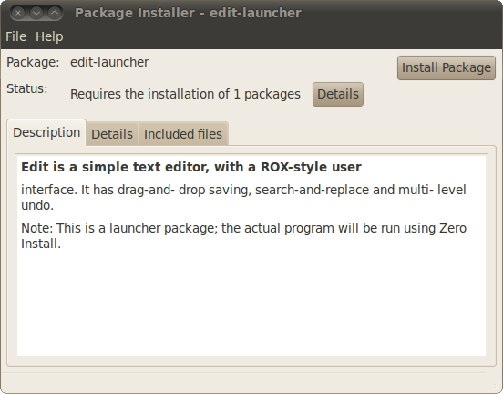

# 0bootstrap

**Maintainer:** Thomas Leonard  
**License:** GNU General Public License  
**Source:** [Git repository](https://github.com/0install/0bootstrap)  
**Zero Install feed:** <http://0install.net/tools/0bootstrap.xml>

**0bootstrap** generates a native package that installs a 0install launcher.

**This program is not ready for use yet.**

Normally, a launcher is created by passing its name (a URI) to the 0desktop command (or "Add New Program"). This downloads the appropriate feeds, their icons - if available, and makes a shortcut (creates a launcher, a .desktop file).

However, it is sometimes useful to bundle such a launcher and its icon together in a .deb package (for example), so that it can be installed on machines that don't have Zero Install available initially - by using the standard native package installation procedure.

0bootstrap takes the URI of a program and creates a native package; currently the .deb and .rpm package formats are supported by the tool.

Programs launched using these packages are added to the Zero Install cache and are therefore still [shared between users](../details/sharing.md), and will get updates over the web where possible.

## Using a 0bootstrap package

Open the file with your file manager, or run `gdebi-gtk edit.deb` in a terminal:



The package will require Zero Install in order to install, as seen in the Details view:


Installing native packages requires authentication.


The installation will add the program to your menus.


## Current status

This program is not yet released.

## Installing 0bootstrap

You can download `0bootstrap` and create a short-cut to it in the usual way:

```shell
$ 0install add 0bootstrap http://0install.net/tools/0bootstrap.xml
```

Before the program is released, you need to run it from the source repository:

```shell
$ git clone git://zero-install.git.sourceforge.net/gitroot/zero-install/bootstrap
$ cd bootstrap
$ 0install add-feed 0bootstrap.xml
$ 0install add 0bootstrap 0bootstrap.xml
```

## Creating a package for your program

Run 0bootstrap, passing in the package format and the name (URI) of the main program. For example, to create an Ubuntu package for Edit:

```shell
$ 0bootstrap --format=deb http://rox.sourceforge.net/2005/interfaces/Edit
```

The resulting edit.deb package can now be installed on a Ubuntu machine.

## FAQ

What about security?
: Installing a package isn't a great way to make a shortcut. The normal Zero Install process of dragging a feed link to a trusted installation program is much better. However, distributions have been very slow to support this. 0bootstrap is an attempt to boot-strap the adoption process. The native package is required to work with the operating system's package installation tools, and can be automatically created by a web service given the feed's URI.
