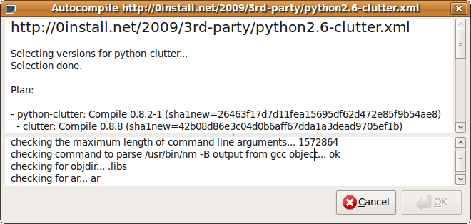

**Name:** 0compile  
**Maintainer:** Thomas Leonard  
**License:** GNU Lesser General Public License  
**Source:** [Git repository](https://github.com/0install/0compile)  
**Zero Install feed:** [http://0install.net/2006/interfaces/0compile.xml](http://0install.net/2006/interfaces/0compile.xml)

Normally, Zero Install will select a pre-built binary for your system. However, it can also be used to compile a new binary from a source package. This is useful if:

- no binary is available for your platform;
- you wish to build using different library versions; or
- you wish to make changes to a program or library.

This tutorial shows how to use `0compile` for these purposes. It is assumed that you have already installed [Zero Install](http://0install.net/injector.html) and know how to run programs using it. To get `0compile` itself, use:

```shell
$ 0install add 0compile http://0install.net/2006/interfaces/0compile.xml
```

Note: this page describes the command-line interface to `0compile`. There is also a graphical interface, which is used when you click on the **Compile** button in the 0install GUI. The graphical interface provides similar options, but is slightly more limited.

**Contents:**

[TOC]

# Autocompile

If you just want to compile some existing source code (without changing it), then the `autocompile` sub-command does the job. Given the URI of a program, it will download and compile the source in a temporary directory, add the resulting binary to the Zero Install cache, and register the new binary. If the source depends on other programs, it will also download and compile them in the same way if no binary is currently available for the preferred version.

For example (GNU-Hello is a simple test program which depends only on `make`):

```shell
$ 0compile autocompile http://0install.net/tests/GNU-Hello.xml
================= http://0install.net/tests/GNU-Hello.xml ==================

Selecting versions for GNU Hello...
Selection done.

Plan:

- GNU Hello: Compile 1.3 (sha1=2aae32fd27d194167eac7eb611d7ce0983f83dd7)
  - make: Use existing binary 3.81-5 (Linux-x86_64)

No dependencies need compiling... compile GNU Hello itself...
Waiting for selected implementations to be downloaded...

...
```

Note that GNU-Hello does not get the C-compiler through Zero Install, so you will need that already (hint: `apt-get install build-essential`). Once compiled, you can run it like this:

```shell
$ 0launch http://0install.net/tests/GNU-Hello.xml
Hello, world!
```

You can also use `autocompile --gui` for a graphical version. This makes it easier to see the overall progress, because the verbose build output is shown separately in the lower pane:



# Manual compilation

If you want to modify the source before building, keep the object files around for rebuilding, or choose the versions used, you'll want to use the manual commands, described in the following sections.

## Creating the build environment

To get started, run `0compile setup` with the URL of the program you want to build. In this example, we'll use [GNU-Hello](http://www.gnu.org/software/hello/), a simple program written by the FSF to demonstrate use of the popular GNU build tools:

```shell
$ 0compile setup http://0install.net/tests/GNU-Hello.xml GNU-Hello
Created directory GNU-Hello
```

`0compile` will run `0install select --source` to select a suitable version of the source code and download it. It will also locate and download any dependencies (e.g. build tools or header files) the source may have. It will download the `make` utility in this case, or use your distribution's package.

The final argument names a directory for the build environment. If omitted, it defaults to the last component of the URI, without the `.xml` extension (so we could have just left it off in this case). `0compile` will create this directory in the current directory.

All further `0compile` commands are run from inside this new directory, which is currently empty except for a `0compile.properties` file recording the URI of the program. If you want to change the selected version(s) later, do:

```shell
$ cd GNU-Hello
$ 0compile setup
```

## Building

To compile the program, use the `build` command (from inside the `GNU-Hello` directory):

```shell
$ 0compile build
TMPDIR=/tmp/0compile-T5GJBj
BUILDDIR=/home/me/GNU-Hello/build
DISTDIR=/home/me/GNU-Hello/gnu-hello-linux-x86_64-1.3
SRCDIR=/home/me/.cache/0install.net/implementations/...
cd /tmp/GNU-Hello/build
Executing: "$SRCDIR/configure" --prefix="$DISTDIR" && make install
...
```

Note: GNU-Hello does not use Zero Install to get the C compiler (`gcc`) or the standard library header files (`libc-dev`), so you should install these yourself. They come with most distributions.

`0compile` starts by creating two sub-directories: `gnu-hello-linux-x86_64` for the final result (the exact name will depend on your system) and `build` for any temporary files. It then executes a command specified in the source feed, which actually builds the software (using the standard GNU build system in this case).

Note that the command installs to the `gnu-hello-linux-x86_64` directory rather than to the usual `/usr/local`.

Assuming the build is successful, `gnu-hello-linux-x86_64` will contain the final result, including a handy `gnu-hello-linux-x86_64/0install/feed.xml` local feed file, which you can use to run the new binary (note: this used to be `gnu-hello-linux-x86_64/0install/GNU-Hello.xml` on older versions of 0compile):

```shell
$ 0launch gnu-hello-linux-x86_64/0install/feed.xml
Hello, world!
```

In fact, since `GNU-Hello` doesn't list any run-time dependencies, we could have just run the `gnu-hello-linux-x86_64/bin/hello` binary directly in this case. For more complex programs, the feed file will be useful. You can also pass it to `0install add-feed` to register the new binary under the program's normal URI:

```shell
$ 0launch -c http://0install.net/tests/GNU-Hello.xml
Interface 'http://0install.net/tests/GNU-Hello.xml' has no usable implementations

$ 0install add-feed gnu-hello-linux-x86_64/0install/feed.xml
1) Add as feed for 'http://0install.net/tests/GNU-Hello.xml'

$ 0launch -c http://0install.net/tests/GNU-Hello.xml
Hello, world!
```

If everything worked, you can now delete the `build` directory to save space. However, if you're planning to modify the source and rebuild (described in the next section) then you'll want to leave it there, as it will make rebuilding faster.

For future reference, there is also a `gnu-hello-linux-x86_64/0install/build-environment.xml` file. This is a selections file, as produced by `0install select --source --xml`, but with a few extra details of the build added, including the hostname of the machine used for the build, a timestamp and your username. You can use this to rebuild later with the same environment (e.g. using this exact version of `make`). The file is written before the build starts, so the build process may add to it.

## Modifying the source

By default, `0compile` keeps the source code in the (read-only) Zero Install cache, so if you want to make changes, the first step is to make a copy of it:

```shell
$ 0compile copy-src
Copied as '/home/me/GNU-Hello/src'
```

Edit the source as needed with the text editor of your choice. For example, we can change the message (here we're using [ed, the standard text editor](http://www.gnu.org/fun/jokes/ed.msg.html)):

```shell
$ ed src/hello.c
5207
%s/Hello, world!/Goodbye, world!/
wq
5209
```

Recompile with `0compile build` as before:

```shell
$ 0compile build
$ 0launch gnu-hello-linux-x86_64/0install/feed.xml
Goodbye, world!
```

If you compare the new `gnu-hello-linux-x86_64/0install` directory with the old one, you'll discover a couple of differences:

- A new file is present, `gnu-hello-linux-x86_64/0install/from-1.3.patch`, containing a diff between the original sources and your modified ones (to display this without rebuilding, use `0compile diff`).
- The version number in the local feed has `-1` appended, to indicate that this version has been modified.

These two features make it very easy to keep track of what you changed, which may well come in handy later! However, if you are making larger changes to the code then you will want to use a proper version control system (such as [Git](http://git.or.cz/)).

## Publishing the binary

Use `0compile publish` to create the archive and feed:

```shell
$ 0compile publish
Generated archive 'gnu-hello-linux-x86_64-1.3.tar.bz2' and feed 'GNU-Hello-1.3.xml'.
Upload it to a repository with:
0repo add GNU-Hello-1.3.xml
```

You can test it with:

```shell
$ 0launch GNU-Hello-1.3.xml
```

To publish the feed and archive, use [0repo](0repo.md) (see that page for configuration details):

```shell
$ 0repo add GNU-Hello-1.3.xml
```

## Bundling dependencies

You might want to build on a machine without network access, or to archive everything needed to build a particular program. To do that, use this command:

```shell
$ 0compile include-deps
```

The source code and all dependencies will be copied into a new `dependencies` sub-directory. When building, this directory is added to [the implementation cache](../details/cache.md) search path (using `0launch --with-store`).

# Legacy helper features

0compile has some special code to detect and handle some common cases in legacy code:

## Generated `pkgconfig` files with absolute paths

If `$DISTDIR` ends up containing a directory called `pkgconfig`, it checks each `.pc` file inside for an absolute prefix. If found, it is changed to a relative path.

Note: for "pure" Zero Install libraries, just use a relative path (e.g. `prefix=${pcfiledir}/..`) in the `.pc` file in the source, and copy it unchanged to `$DISTDIR`.

## Build dependencies containing `/usr/lib/lib*.so` broken symlinks

RPM unpacks all packages over the root, so one package can have a symlink to a file provided by a different package. This is often used to set the default version of a library in RPM packages. e.g.

- `-devel` package: `libSDL.so` -> `libSDL-1.2.so.0.11.2` (broken link)
- runtime package: provides `libSDL-1.2.so.0.11.2`

Since Zero Install keeps every package in its own directory, this doesn't work. Therefore, 0compile searches for such broken links, searches for a matching target, and creates a fixed link in a temporary directory, added to `LD_LIBRARY_PATH`. This makes it easy to depend on unmodified `-devel` packages which were designed for non-Zero Install systems.

Note: a "pure" Zero Install library wouldn't need to include the version number in the library filename, so no symlink would be needed. If you did want to include the number in the filename, the symlink to it would go in the runtime package, not the `-dev`el package.

## Build dependencies with lib64 directories

If the feed tries to add a directory under `lib` or `usr/lib` to `$PKG_CONFIG_PATH`, and the directory doesn't exist, 0compile uses the corresponding `lib64` directory instead, if present. This is for existing RPMs which use a different directory structure for different architectures.

## Libtool archive (.la) files

0compile searches for `lib/*.la` files in `$DISTDIR` and automatically deletes them for you (there is a safely check that it really is a `libtool` file first). These files were only needed on very old systems that don't support dynamic linking. These days they just cause trouble by using absolute paths which were only valid during the build.

# Recreating a build environment

If you want to rebuild a binary package, see if it includes the `0install/build-environment.xml` file that 0compile generates automatically. If so, you can re-create the build like this:

```shell
$ 0compile setup .../someprog-binary/0install/build-environment.xml some-prog
$ cd some-prog
$ 0compile build
```

For example, in the GNU-Hello case this would allow you to build using the same source code and the exact same version of `make` used in the original compile.

# Making source available

If you want to publish source code so that other people can compile it using 0compile, see [0compile: Developers](0compile/developers.md).

# Building in a clean chroot

If you want to build the source package in a clean `chroot` sandbox environment, see [0compile: Chroot Build](0compile/chroot-build.md).
