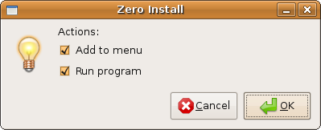

**Name:** 0export  
**Maintainer:** Thomas Leonard  
**License:** GNU General Public License  
**Source:** [Git repository](http://repo.or.cz/w/0export.git)  
**Zero Install feed:** <http://0install.net/tools/0export.xml>

**0export** creates self-installing bundles for distribution on CD, etc

Normally, a program is run by passing its name (a URI) to the `0install run` command. This downloads the appropriate feeds, chooses a set of implementations (a version of the program, along with any libraries it needs) and downloads them too.

However, it is sometimes useful to bundle a program and its libraries together on a CD (for example) so that it can be used on machines without a network connection, or where the network is very slow. It is also useful for archival purposes, in case the original web-sites supplying required libraries become unavailable.

0export takes the URI of a program and creates a `setup.sh` file; a self-extracting archive containing everything needed to run the program. This file can be executed on a machine without a network connection to install or run the program.

Programs installed using `setup.sh` are added to the 0install cache and are therefore still [shared between users](../details/sharing.md), and will get updates over the web where possible.

0export does not work on Windows. However Zero Install for Windows has roughly equivalent functionality built in. See [Export](../details/export.md) for details.

If the target machine has network access, and you just want to provide a launcher script, consider instead using [0bootstrap-php](https://github.com/0install/0bootstrap-php), a PHP script that creates bootstrapping EXEs or bash scripts for installing 0install and then running a feed.

**Contents:**

[TOC]

# Using a 0export package

Open the file with your file manager, or run `sh setup.sh` in a terminal:


The archive will unpack and run:


You can add the program to your menus or run it directly.



# Current status

This program is not yet complete. In particular, adding the program to the user's menus only works if the user already has 0install itself installed.

# Installing 0export

You can download `0export` and create a short-cut to it in the usual way:

```shell
$ 0install add 0export http://0install.net/tools/0export.xml
```

# Creating a setup.sh for your program

Run 0export, passing in the name of the installer file to create and the name (URI) of the main program. For example, to create an installer for Edit:

```shell
$ 0export setup.sh http://rox.sourceforge.net/2005/interfaces/Edit
```

The resulting `setup.sh` file can be copied to a CD and run on another machine. This machine does not need a network connection. It also does not need to have 0install installed on it before-hand.

However, if the machine does have a network connection then the user will be notified of updates in the usual way.

# Format of the setup.sh

The bulk of the `setup.sh` file is an archive containing:

- All feeds needed to run the program.
- All GPG keys signing the feeds.
- All selected implementations (versions).
- A copy of 0install, in case the target system doesn't have it.
- An installation script.

To make the archive self-extracting, a short shell script is prepended to the archive which unpacks it to a temporary directory and then runs the installer. If you want to extract the files without executing anything, you can get the information you need from the first four lines of the script, which look like this:

```shell
#!/bin/sh
# 0export 0.1
archive_offset=00831
archive_format=application/x-bzip-compressed-tar
```

# Testing

To test the installer:

```shell
$ sh setup.sh
```

The script currently (0export 0.1) does the following:

1. Runs `gpg --import` on each GPG key in the archive, adding the keys that signed the feeds to your key-ring.
2. Runs `0install import` on each feed in the archive. Every signing GPG key is added to the trusted list for the feed's domain. This allows checking for updates in future without confirming the keys. If the user already has a newer version of the feed, the import has no effect.
3. Chooses a set of implementations (`0install select --xml URI`) in minimal network use mode and with the implementations in the `setup.sh` available.
4. Copies any selected implementations into the system or user's cache (`~/.cache/0install.net/implementations`).
5. Runs the program (`0install run --offline URI`).

All steps use the bundled version of 0install.

# Support for multiple architectures or multiple applications in one bundle

You can use the `--arch` option to set the target architecture(s). For example, this command will select two binaries for each component, one that will run on an `i586` machine and one that will run on an `x86_64` machine:

```shell
$ 0export --arch Linux-i586 --arch Linux-x86_64 setup.sh http://...
```

If a single binary is the best option for both then it will only be included in the bundle once. When the bundle is installed, only the required versions will be copied into the machine's cache.

You can include multiple applications by listing multiple URIs. All applications will be added to the user's menu, but only the first will be run if the user selects the run option in the dialog. Note that dependencies are included automatically and should not be listed.

# FAQ

What about security?
: Running an executable isn't a great way to install a program. The normal 0install process of dragging a feed link to a trusted installation program is much better. However, distributions have been very slow to support this. 0export is an attempt to boot-strap the adoption process. The `setup.sh` script is designed to be easy to parse, so that in future it can be used as a simple archive.

Why doesn't it confirm before trusting the keys?
: If the `setup.sh` is genuine then this is what you want. If it isn't, it's already too late. Even if the normal install script asked for confirmation, a malicious version could be modified to skip the check. One of many reasons why install scripts are a bad idea.
