# 0publish-gui

Publishing a program using Zero Install requires you to create an XML file listing the available versions, where to get them, and what other software they depend on. This program provides a simple graphical interface for creating and editing these feeds.

=== "Linux / macOS"
    !!! info ""
        **Maintainer:** Thomas Leonard  
        **License:** GNU Lesser General Public License  
        **Source:** <https://github.com/0install/0publish-gui>  
        **Zero Install feed:** <https://apps.0install.net/0install/0publish-gui.xml>

    ## Usage

    Install 0publish-gui in the usual way:

    ```shell
    0install add 0publish-gui https://apps.0install.net/0install/0publish-gui.xml
    ```

    Run the program, giving it the name of the feed file you want to create, which should be named after the program:

    ```shell
    0publish-gui Blender.xml
    ```

    A window appears prompting you to enter some details about the program. The **Icon** field is optional, but it's worth adding one:

    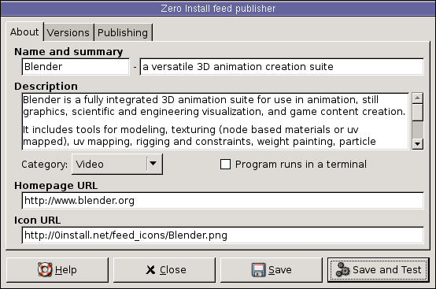

    ### Adding a version

    The next step is to add one or more versions to the feed, which you do from the **Versions** tab using the **Add Archive** button:

    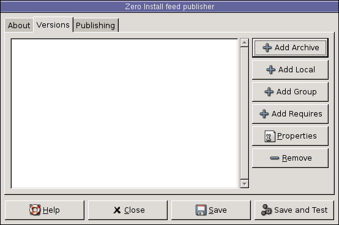

    Enter the URL of the archive for the new version. This URL tells other people where to get it, so it must be present. If you've already downloaded the archive, choose it in the **Local copy** section. Otherwise, click on **Download** to download it now:

    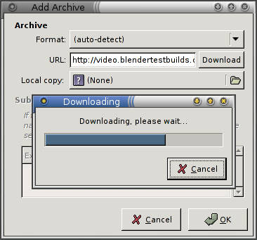

    The top-level items in the archive are displayed in the **Extract** area. The reason for this is that there are two common ways of laying out archives: some people put the files in the archive directly, while others create an extra top-level directory. Since we need each version to have a similar structure, we don't want a directory name that's going to be different each time, so select to extract just the contents of that directory. 0publish-gui is pretty smart about guessing whether to extract everything or just a sub-directory, so the default is usually right:

    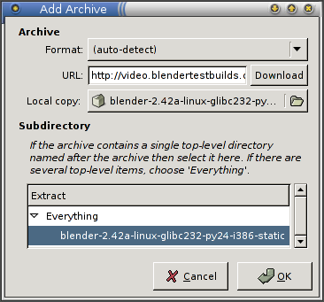

    You are then prompted to enter some extra information about this version. The most important field to set is **Main**, which is the executable program inside the archive that is run when someone tries to use your feed. The drop-down menu shows the available executables.

    The **License** and **Released** fields are just for information. **Released** is the date you added this version to the feed, so the default of today's date is correct. The **OS** and **CPU** fields prevent people from trying to use this version on incompatible machines. The **Docs** field can be used to say which directory contains the documentation, if any.

    Leaving **Stability** set to **(inherit)** means the rating will be inherited from any containing group. If there's no group, it gets the default value of **Testing**. You can also inherit the other fields by leaving them blank, although **OS** and **CPU** are inherited together — you can't inherit one and not the other. Groups are useful when you have lots of versions, so you don't have to keep specifying the same information for each one.

    Finally, the shaded **ID** field displays a cryptographic digest of the archive's contents. When other people use this feed, this is how they know they've downloaded exactly the same files as you have (in case an attacker replaces the download with a modified version):

    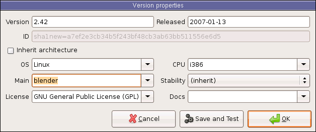

    You'll now see your new version shown in the list of versions, along with the single archive, which says where to get it. The names in parentheses show which attributes were set. You can try out the interface by clicking on the **Save and Test** button:

    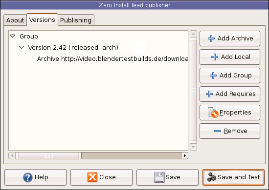

    This runs `0install run` on the XML file in the usual way. The archive is already cached. It was added when you clicked **OK** in the **Add Archive** box. Click on **Execute** and check that it runs:

    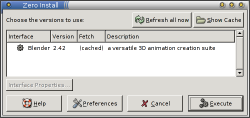

    ### Signing and publishing

    To publish the feed on the web for other people to use, sign it so people can check that it's really from you. Go to the **Publishing** tab and choose your GPG key from the menu. If you don't have a key, click on the **Add** button to create one now.

    When generating a key, you'll be asked a few difficult-looking questions; if unsure, just accept the defaults offered. Enter your name and e-mail address when prompted, and choose a good passphrase to protect the key:

    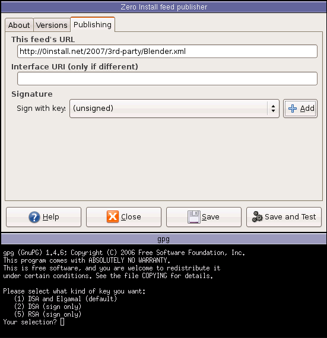

    There's one final thing left to do: decide where on the web you'll publish the XML file. Enter the URL that people will use to download your feed in the section titled **This feed's URL**. Try to pick a location that won't change, as people will keep coming back here for updates.

    Click on **Save** to save it again. This time, you'll be prompted to enter your key passphrase (the one you chose when creating the key above):

    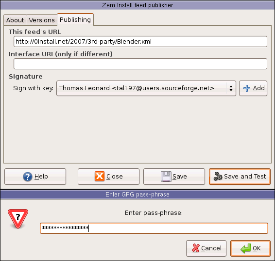

    The final result is three files: the signed XML feed file itself, listing your version(s); your GPG public key, which lets people check the signature; and an XSLT stylesheet, in case anyone wants to view the feed in their browser:

    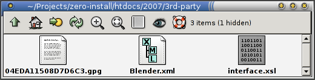

    Upload all three files to the same directory on your web-server. Anyone can then run the program with the command:

    ```shell
    0install run https://example.com/path/Blender.xml
    ```

    ### Groups and dependencies

    If the software depends on something else (e.g. a library) then use the **Add Requires** button to specify this. For example, for a Python program depending on **ROX-Lib**, ensure that `.../ROX-Lib2/python` is on `PYTHONPATH`, so that `import rox` resolves to `.../ROX-Lib2/python/rox`:

    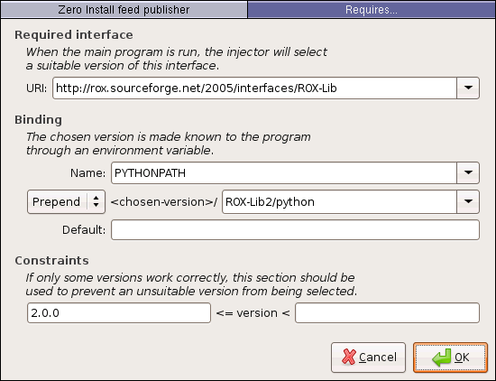

    When you want to add more versions, use the **Add Group** button to create a group. Make sure all versions are inside the new group (use drag-and-drop to move them). Then you only need to set the license, main, OS and CPU settings in one place. You can also share dependencies using groups.

=== "Windows"
    !!! info ""
        **Maintainer:** Bastian Eicher  
        **License:** GNU Lesser General Public License  
        **Source:** <https://github.com/0install/0publish-gui-dotnet>  
        **Zero Install feed:** <https://apps.0install.net/0install/0publish-gui.xml>

    0publish-gui for Windows (previously known as Zero Install Publishing Tools) provides [a graphical feed editor](#feed-editor) and a [new feed wizard](#new-feed-wizard).

    You can add 0publish-gui to your start menu like this:

    ```shell
    0install integrate https://apps.0install.net/0install/0publish-gui.xml
    ```

    ## Feed Editor

    - split with screen graphical and XML view
    - changes in the graphical view are reflected in the XML view immediately and vice-versa
    - syntax-highlighting and error-underlining in the XML view

    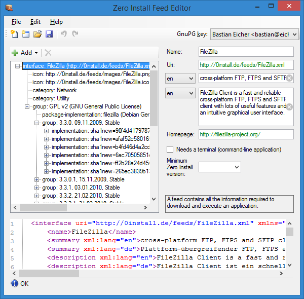

    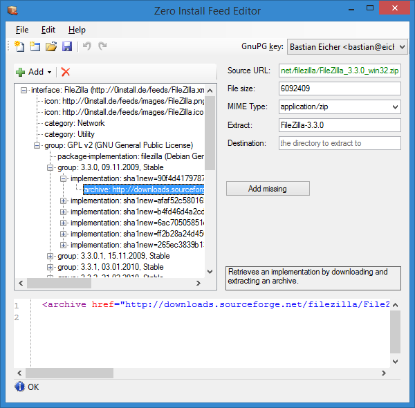

    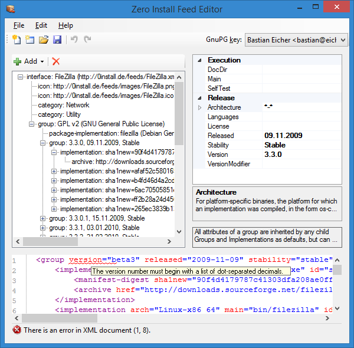

    ## New Feed Wizard

    - walks you through the entire feed creation process
    - detects entry points (executables) in archives
    - automatically creates appropriate `<runner>`s for Java, .NET and Python executables
    - extracts metadata (name, version number, etc.) where possible

    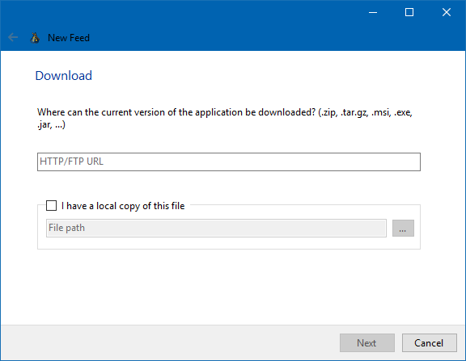
