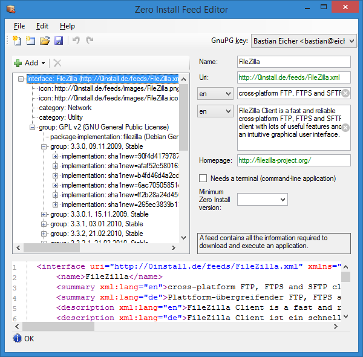
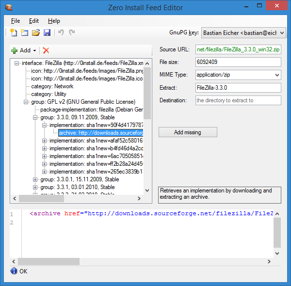

# 0publish-gui

Publishing a program using Zero Install requires you to create an XML file listing the available versions, where to get them, and what other software they depend on.
  
This program provides a simple graphical interface for creating and editing these feeds.

=== "Linux / macOS"
    !!! info ""
        **Maintainer:** Thomas Leonard  
        **License:** GNU Lesser General Public License  
        **Source:** <https://github.com/0install/0publish-gui>  
        **Zero Install feed:** <https://apps.0install.net/0install/0publish-gui.xml>

    See [the packaging guide](../packaging/guide-gui.md).

=== "Windows"
    !!! info ""
        **Maintainer:** Bastian Eicher  
        **License:** GNU Lesser General Public License  
        **Source:** <https://github.com/0install/0publish-gui-dotnet>  
        **Zero Install feed:** <https://apps.0install.net/0install/0publish-gui.xml>

    0publish-gui (formerly known as Zero Install Publishing Tools) allow you to create your own feeds on Windows.

    You need Zero Install to run 0publish-gui. You can either search for 0publish-gui in the Catalog or type this on the command-line:

    ```shell
    0install run https://apps.0install.net/0install/0publish-gui.xml
    ```

    0publish-gui provides [a graphical feed editor](#feed-editor) and a [new feed wizard](#new-feed-wizard).

    ## Feed Editor

    - split with screen graphical and XML view
    - changes in the graphical view are reflected in the XML view immediately and vice-versa
    - syntax-highlighting and error-underlining in the XML view

    

    

    

    ## New Feed Wizard

    - walks you through the entire feed creation process
    - detects entry points (executables) in archives
    - automatically creates appropriate `<runner>`s for Java, .NET and Python executables
    - extracts metadata (name, version number, etc.) where possible

    
