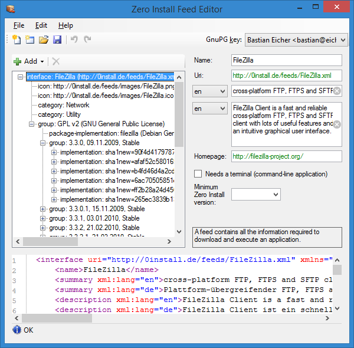
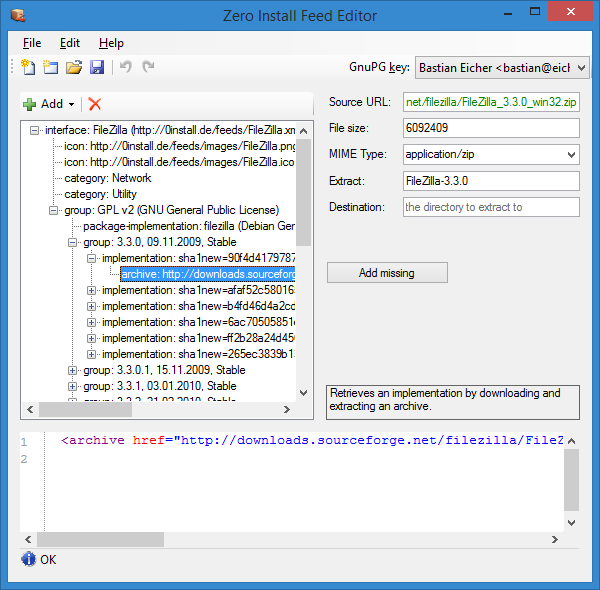
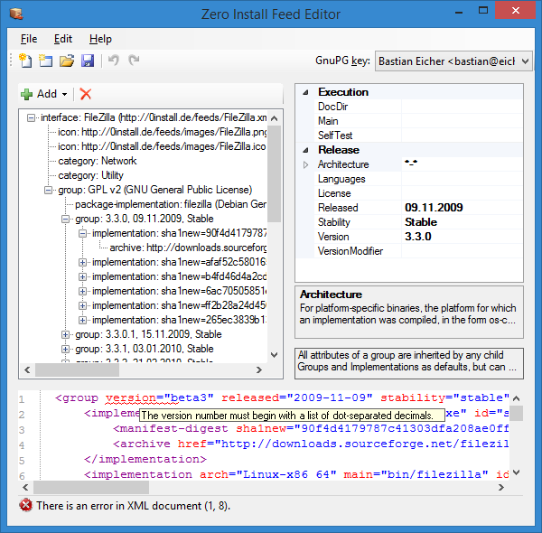

title: 0publish-win

**Name:** 0publish-win / Zero Install Publishing Tools  
**Maintainer:** Bastian Eicher  
**License:** GNU Lesser General Public License  
**Source:** [Git repository](https://github.com/0install/0publish-win)  
**Zero Install feed:** <http://0install.de/feeds/ZeroInstall_Tools.xml>

The Zero Install Publishing Tools allow you to create your own feeds on Windows.

You need Zero Install to run the Publishing Tools. You can either search for "Zero Install Publishing Tools" in the Catalog or type this on the command-line:

```shell
$ 0install run http://0install.de/feeds/ZeroInstall_Tools.xml
```

The Zero Install Publishing Tools consist of the following components:

[TOC]

## Feed Editor

- split with screen graphical and XML view
- changes in the graphical view are reflected in the XML view immediately and vice-versa
- syntax-highlighting and error-underlining in the XML view

### Screenshots








## New Feed Wizard

- walks you through the entire feed creation process
- detects entry points (executables) in archives
- automatically creates appropriate `<runner>`s for Java, .NET and Python executables
- extracts metadata (name, version number, etc.) where possible
