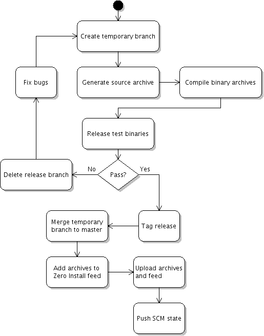

title: Compiled binaries

# Releases with source and binary packages

[0release](../0release/index.md) can be used to create releases of your software from a version control system. The main page described how to make releases of programs which are architecture-independent (e.g. programs written in Python) where a single package is produced. This page explains what happens for programs which must be compiled for different architectures (e.g. C programs).

The extended release process looks like this:



TODO: 0release doesn't currently unit-test the binaries it produces

After generating an archive and a feed for the source code release candidate (where `arch='*-src'`), 0release also compiles a binary for the host system (using [0compile](../0compile/index.md)). It uploads both the source and binary archive and publishes both in the Zero Install feed.

For an example of a simple binary package that works this way, have a look at the [c-prog.tgz](http://repo.or.cz/w/0release.git?a=blob;f=tests/c-prog.tgz;h=ae1f06864c70f65fdef5a00065fb82eec809d6dc;hb=a7bce06b6494407b2d80124c65f13493e3b44378) package in 0release's tests directory:

```shell
$ tar xzf c-prog.tgz
$ mkdir release-c-prog
$ cd release-c-prog
$ 0launch http://0install.net/2007/interfaces/0release.xml ../c-prog/c-prog.xml
```

# Compiling on multiple systems

To build binaries for multiple architectures, you'll need to create a configuration file listing the available _builders_. 0release uses the [Base Directory Specification](http://www.freedesktop.org/wiki/Specifications/basedir-spec) to find its configuration files; with the default settings, you need to create the file `~/.config/0install.net/0release/builders.conf`.

The `builders.conf` file has a `[global]` section listing the builders to use, followed by one section for each builder. Each builder can have three commands specified: one to start the builder (optional), one the actually do the build, and one to shutdown the builder (optional). Here is an example configuration:

```ini
[global]
builders = host, precise32

[builder-host]
build = 0launch http://0install.net/2007/interfaces/0release.xml --build-slave "$@"

[builder-precise32]
build = build-on-vm precise32-build-slave
```

This defines two builders named `host` and `precise32`. `host` simply runs 0release in build-slave mode on the local machine (in fact, you don't need to specify this section because it exists by default). The `precise32` builder run a script (see [below](#setting-up-a-vagrant-build-slave)) to bring up a VirtualBox virtual machine, submit the build to it, and then shut it down again.

## The build command

The build command is called with four arguments:

1.  The name of the generated XML feed file for the source release candidate.
2.  The name of the generated source archive.
3.  The URL of the directory where the release will be hosted eventually.
4.  The name of the binary feed to be generated.

The three names are of files in the current directory without the directory part; this simplifies the copying. The build command must do three things:

1.  Copy the input files (the source feed and archive) to the build system.
2.  Invoke `0release --build-slave` to do the build.
3.  Copy the results (the binary feed and archive) back to the local system.

# Setting up a Vagrant build slave

First, we'll need to create a "box" with the build system. [Create a Vagrantfile](http://docs.vagrantup.com/) for the new box, e.g.

```vagrant
Vagrant::Config.run do |config|
  config.vm.box = "precise32"
  config.vm.box_url = "http://files.vagrantup.com/precise32.box"
end
```

The bring the machine up and install the basic build environment. The only package required by 0release is 0install itself, but you must also install any system packages that are needed by the software to be built (i.e. those which can't be installed by 0install automatically):

```shell
$ vagrant up
$ vagrant ssh -c 'sudo apt-get update && 
    sudo apt-get install -y zeroinstall-injector build-essential &&
    mkdir -p ~vagrant/.cache/0install.net'
```

Now package the VM into a new box and add it. You might wish to create a `Vagrantfile.pkg` to enable a shared 0install cache (see [Virtual Machines / Vagrant](../../details/virtual-machines.md#vagrant)).

```shell
$ vagrant package --vagrantfile Vagrantfile.pkg
$ vagrant box add precise32-build-slave package.box
```

Create the `build-on-vm` script, make it executable, and place it in your `$PATH` (on the host):

```shell
#!/bin/bash
set -eux

if `[ -f Vagrantfile \]; then
  vagrant destroy -f && rm Vagrantfile
fi

vagrant init "$1"
shift
vagrant up
vagrant ssh-config > .ssh-config
ssh -F .ssh-config default \
  'cd /vagrant && 0launch --not-before 0.10 \
     http://0install.net/2007/interfaces/0release.xml \
     --build-slave "$@"' "$@" && \
  vagrant destroy -f && rm Vagrantfile
```

You can then use it in your `builders.conf`, as above.
