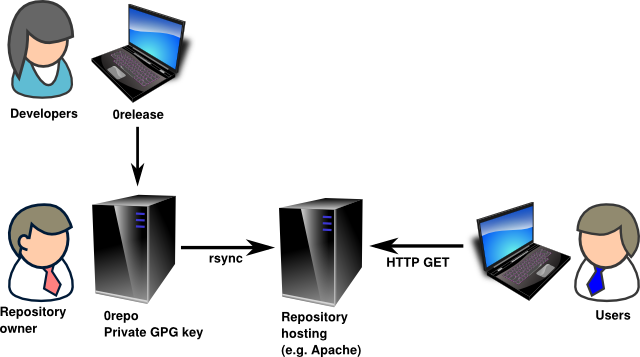

**Name:** 0repo  
**Maintainer:** Thomas Leonard  
**License:** GNU Lesser General Public License  
**Source:** [Git repository](https://github.com/0install/0repo)  
**Zero Install feed:** <http://0install.net/tools/0repo.xml>

**0repo** provides an easy and reliable way to maintain a repository of 0install software for others to use.

Figure 1 shows a simple deployment where a single developer provides a set of packages using 0install. The developer runs 0repo to create a repository on their local machine and `rsync`s the generated files to their static web hosting. To make a new release, the developer uses [tools](index.md) such as [0template](0template.md) or [0release](0release/index.md) to create a new release, which 0repo then adds to the repository.


_Figure 1: Typical single-developer deployment of 0repo_

0repo is new and a little experimental, but [feedback](https://0install.net/support.html) is welcome! We hope soon to support multi-developer deployments, where 0repo runs on a server and accepts contributions from a set of developers (as shown in figure 2).



_Figure 2: Multi-developer deployment_

To get it:

```shell
$ 0install add 0repo http://0install.net/tools/0repo.xml
```

Full instructions can be found in [0repo's README](https://github.com/0install/0repo/blob/master/README.md).

The [packaging guide](../packaging/guide-cli.md) includes a short tutorial.
