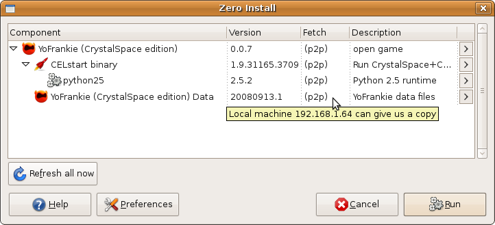

**Name:** 0share  
**Maintainer:** Thomas Leonard  
**License:** GNU General Public License  
**Source:** [Git repository](http://repo.or.cz/w/0share.git)  
**Zero Install feed:** <http://0install.net/2008/interfaces/0share.xml>

**0share** provides for local peer-to-peer distribution of Zero Install implementations (versions of programs). This means that once one machine on your local network has downloaded something, other machines can get it directly from the first one.

**This program is an experimental proof-of-concept.** It currently requires a modified version of 0install, which can be found in the [peer2peer](https://github.com/0install/0install/tree/peer2peer) branch. This branch is now very out-of-date. If you'd like to take over this project, please [get in touch](https://0install.net/support.html)!



## Testing

To try it out, run this command on one machine:

```shell
machine1 $ 0install run http://0install.net/2008/interfaces/0share.xml
INFO:root:0share started and listening for requests...
INFO:root:Serving implementations from Store '/home/me/.cache/0install.net/implementations'
INFO:root:Serving implementations from Store '/var/cache/0install.net/implementations'
```

On another machine on the same network, run this command, replacing `DIGEST` with the digest of a program installed on the first machine (e.g. the name of a subdirectory of `/var/cache/0install.net/implementations/`). The digest will be in the program's feed file.

```shell
machine2 $ 0install run http://0install.net/2008/interfaces/0share.xml -f DIGEST
```

The second machine will broadcast a request (to UDP port 38339) to see if anyone has the given implementation. The first machine should respond. The second machine will then fetch it from the first:

```shell
machine2 $ ./0share -f sha1new=84e37424bbb87a077e25cec87d3c668f12726817
INFO:root:Broadcasting query for ['sha1new=84e37424bbb87a077e25cec87d3c668f12726817'] on local network...
192.168.2.1 has sha1new=84e37424bbb87a077e25cec87d3c668f12726817
INFO:root:Connecting to 192.168.2.1 to request sha1new=84e37424bbb87a077e25cec87d3c668f12726817
INFO:root:Caching new implementation (digest sha1new=84e37424bbb87a077e25cec87d3c668f12726817)
Success
```

The requested version should now be in machine2's cache. On the source machine, you should see something like:

```shell
INFO:root:Request from ('192.168.2.2', 53182): '0share\nsha1new=84e37424bbb87a077e25cec87d3c668f12726817'
INFO:root:Yes, we have sha1new=84e37424bbb87a077e25cec87d3c668f12726817
INFO:root:Sending reply...
INFO:root:GET /implementation/sha1new=84e37424bbb87a077e25cec87d3c668f12726817
machine2 - - [13/Dec/2008 21:52:49] "GET /implementation/sha1new=84e37424bbb87a077e25cec87d3c668f12726817 HTTP/1.1" 200 -
```

## Debugging

If it doesn't work:

- Check that your firewall allows TCP and UDP connections to port 38339 on the first machine.
- Try using `-H` on the second machine to give the hostname of the first machine explicitly.
- If you get "Network is unreachable", you may be missing a default route (see `ip route`).

## Realistic configuration

Before you start, you should [enable sharing](../details/sharing.md) on all machines. This ensures that implementations all go in the single machine-wide shared cache (`/var/cache/0install.net/implementations/`).

You'll probably want to run 0share without write access anywhere (for security), so create a new user for that and try running it:

```shell
$ sudo adduser --system zeroshare
$ sudo su zeroshare -s /usr/bin/env -- 0launch -vc http://0install.net/2008/interfaces/0share.xml
```

You can then add a line to your crontab file to make it start on boot:

```shell
@reboot zeroshare 0launch -vc http://0install.net/2008/interfaces/0share.xml 2>&1 >/dev/null
```

## Using with 0launch

As this is experimental, you'll need to use the [peer2peer branch](https://github.com/0install/0install/tree/peer2peer) of 0install. In that branch, P2P support is turned on when using the GUI for downloads.
