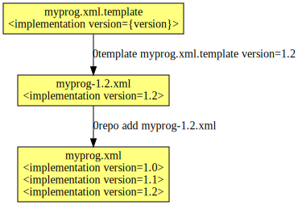

**Name:** 0template  
**Maintainer:** Thomas Leonard  
**License:** GNU Lesser General Public License  
**Source:** [Git repository](https://github.com/0install/0template)  
**Zero Install feed:** <http://0install.net/tools/0template.xml>

**0template** creates the XML for one version of a program from a template. The diagram below shows how it fits into the overall publishing process:



That is, each time you want to add a new release of a program to your master XML feed, you first use 0template to generate the XML for the new release. Once you're happy with it, merge it into the master feed with [0repo](0repo.md).

0template is mostly useful for publishing existing binary or source archives. If you are making releases of your own software from Git, consider using [0release](0release/index.md) instead.

**Contents:**

[TOC]

# Installation

To get it:

```shell
$ 0install add 0template http://0install.net/tools/0template.xml
```

# Creating the template

To start, run it with a non-existent file and it will offer to create it:

```shell
$ 0template myprog.xml.template
'myprog.xml.template' does not exist; creating new template.

Does your program need to be compiled before it can be used?

1) Generate a source template (e.g. for compiling C source code)
2) Generate a binary template (e.g. for a pre-compiled binary or script)

> 2

Writing myprog.xml.template
```

Then edit the generated `myprog.xml.template` to taste. A minimal example would be:

```xml
<?xml version="1.0"?>
<interface xmlns="http://zero-install.sourceforge.net/2004/injector/interface">
  <name>myprog</name>
  <summary>does useful stuff</summary>

  <group>
    <command name="run" path="myprog"/>

    <implementation version="{version}">
      <manifest-digest/>
      <archive href="http://example.com/downloads/myprog-{version}.zip"/>
    </implementation>
  </group>
</interface>
```

You would typically want to add any dependencies here too. See the [feed specification](../specifications/feed.md) for details.

!!! note
    You can also use 0template to create a [local feed](../packaging/local-feeds.md) to run a Git checkout, rather than an archive on the web. In that case, just don't use the `.template` extension, and it will generate a feed rather than a template.

# Using the template

To generate the XML for a particular version, run 0template on it and provide the template parameters (`version` in this example), e.g.

```shell
$ 0template myprog.xml.template version=1.0
Downloading http://example.com/downloads/myprog-1.0.zip to ./myprog-1.0.zip
Writing myprog-1.0.xml
```

You now have a feed with the appropriate details filled in:

```xml
<?xml version="1.0"?>
<interface xmlns="http://zero-install.sourceforge.net/2004/injector/interface">
  <name>myprog</name>
  <summary>does useful stuff</summary>

  <group>
    <command name="run" path="myprog"/>

    <implementation id="sha1new=67ba178ed33b292efa5ab364d01a8fc13fe9eba3" version="1.0">
      <manifest-digest sha256new="FBXDJXLMHAPCRNZ5XOQTVYQHD6VP7CZAZ2UKCCV5UYE27C752GIQ"/>
      <archive extract="myprog-1.0" href="http://example.com/downloads/myprog-1.0.zip" size="352"/>
    </implementation>
  </group>
</interface>
```

Specifically, 0template fills in these values:

- All `{...}` text is expanded with the values you provided on the command-line.
- The archive is downloaded to the directory containing the feed, if it's not already there.
- The `size` attribute is set to the size of the archive.
- The `extract` attribute is set to the single top-level directory in the archive, if it has one.
- The `id` is set to the sha1new digest of the archive.
- Any empty attributes of `manifest-digest` are filled in with the calculated digests. If there are no attributes, a `sha256new` digest is added.

You can now test this feed using e.g.

```shell
$ 0install run myprog-1.0.xml
```

Or, for source feeds:

```shell
$ 0compile autocompile myprog-1.0.xml
```

Once you are happy with it, you can add it to the master feed (which contains all versions) using [0repo](0repo.md). e.g.

```shell
$ 0repo add myprog-1.2.xml
```

The [packaging guide](../packaging/guide-cli.md) includes a tutorial showing how to use 0template.
