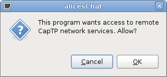
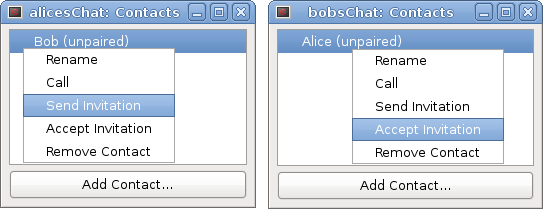

# ebox

!!! info ""
    **Maintainer:** Thomas Leonard  
    **License:** GNU Lesser General Public License  
    **Source:** <https://github.com/0install/ebox>  
    **Zero Install feed:** <http://0install.net/tests/ebox.xml>

EBox is a proof-of-concept that integrates Zero Install's safe installation with E's sandboxing features. It allows you to install programs and run them in a restricted environment. Despite this, the programs still benefit from Zero Install's dependency handling, automatic updates, sharing, etc.

## Overview

A secure system should allow the user to install and run software with limited privileges, so that the damage that can be caused by malicious software is limited. The sandboxing should be simple enough that it can be used by all users as a matter of course.

Zero Install is designed to solve the installation part of this problem, and is intended to integrate with existing sandboxing tools to provide the rest. The purposes of this page are:

- To make it clear what we hope to achieve with Zero Install.
- To demonstrate that such integration is possible, and provide an example of how to do it.
- To find bugs or weaknesses in Zero Install's implementation or design.

Different sandboxes provide different features. Ideally we would use an OS-level tool that could sandbox any application (e.g. Plash). However, these are not yet widely available, difficult to deploy, or only available on certain systems. Therefore, this example uses application-level sandboxing instead (relying on security features of the programming language rather than those of the operating system). The advantage is that it should work everywhere. The disadvantage is that it only works with programs written in that language.

We start with a tutorial showing how to install and run a couple of sample applications. Then we present a challenge: modify the sample applications to escape from the sandbox! If you find a security flaw, please report it to [the mailing list](https://0install.net/support.html#lists), and I'll add you to the high-score table:

| Date | Finder            | Flaw |
|------|-------------------|------|
| -    | (your name here!) | -    |

(challenge open since Aug 2010)

## Tutorial

You can create a short-cut to ebox with `0install add`, like this:

```shell
$ 0install add ebox http://0install.net/tests/ebox.xml
```

You can then install a program like this:

```shell
$ ebox ~/edit http://0install.net/tests/ebox-edit.xml
Created instance directory. To run:
~/edit/AppRun
```

This creates a directory at the path you specified (`~/edit`). This directory contains all the program's configuration, and a script to start it (AppRun).

\[ Technically, it's a [ROX application directory](http://roscidus.com/desktop/AppDirs), but whereas these normally include program code (but no configuration), this one includes only configuration, with the code going in the Zero Install cache. \]

If you run the `~/edit/AppRun` script, a fairly normal-looking text editor should appear. You can open, edit and save files just as you'd expect:


However, the program is running in a restricted environment. It can only access files that you select using a file selector dialog box. It's hard to demonstrate this security, because permission is granted automatically by your actions, so you should [try attacking it](#the-challenge) to convince yourself.

### What a boxed program can and can't do

- Every window it opens is prefixed with the name you gave it (e.g. `edit: <untitled>`).
- It can't access a file unless you explicitly select it, or pass it as a command-line argument.
- It can't send a copy of a file you open over the network (see below for network access).
- It can read and write files under its own `data` directory (`~/edit/data/*`)
- If you grant it access to something (e.g. read access to a file), it could persist this in `~/edit/auths/*` so it still has it next time you run the program, although ebox-edit itself doesn't do this.
- It can open any number of windows, use up lots of CPU time, etc.

### Networking

Next, we'll try a program that uses the network:

```shell
$ ebox alicesChat http://0install.net/tests/ebox-chat.xml
```

Notice that ebox-chat uses the same library (ebox-help) as ebox-edit, and so they share a single copy:


ebox-chat is a simple chat program. When you run it, it will ask for permission to access the network:



Once you give it network access, it is able to store it for later (creating the file `alicesChat/auths/network`), so you won't have to reconfirm each time it starts. It then displays an (empty) list of contacts.

We'll need someone to talk to. This could be on another machine, or you can take advantage of the sandboxing to create a second instance on the same machine. We'll pretend that the first instance is running on Alice's computer, and the second is Bob's:

```shell
$ ebox bobsChat http://0install.net/tests/ebox-chat.xml
```

We don't have to worry that these two programs will conflict or try to use the same configuration; they can each only access files inside their own directory by default. Of course, the actual program code is shared between them. When you run bobsChat, you'll need to grant that network access too.

Add a contact called "Bob" to Alice's contacts list, and a contact called "Alice" to Bob's list. One of them should send an invitation (a file), and the other should accept it. The invitation file should be transferred over some secure channel and kept safe until pairing is complete.

Note that ebox-chat is a peer-to-peer chat program with no central server. If there are firewalls or NATs between the machines, things get "interesting"... it's only a demo after all ;-)



Once paired, either party can call the other:


## The challenge!

I have a file, `/home/tal/precious.txt`, containing some important information. Your challenge is to either discover the contents of this file or to change it. You do this by creating a malicious application (e.g. by modifying ebox-edit or ebox-chat). I will install your program and try using it for a bit.

- If Zero Install warns me that your key isn't trusted, I'll ignore it and trust the key anyway.
- I will also approve any keys needed for any libraries you depend on.
- Since I don't trust your program, I won't try to open my precious file in it. I will be happy to create and edit test files, though.
- The `precious.txt` file has no special protection: it's a regular text file, readable and writable by me (if I ask ebox-edit to open it, it will).
- For this challenge, we exclude denial-of-service attacks (e.g. if you make my computer run so slowly I have to reboot it).

The easiest way to get started is to clone ebox-edit's Git repository and create a new instance from its local feed:

```shell
$ git clone git://zero-install.git.sourceforge.net/gitroot/zero-install/ebox-edit
$ ebox test-instance ebox-edit/edit.xml
$ ./test-instance/AppRun
```

You can try to modify the files in the checkout to escape from the sandbox. The syntax is explained in the [Walnut guide to E](http://wiki.erights.org/wiki/Walnut).

### Bonus challenge!

Alternatively, you could clone the ebox-help Git repository and modify the library. Register your modified library with 0install (using `0install add-feed ebox-help/help.xml`) and run a program that depends on it. You should find that the library runs in an even more restricted environment; it doesn't even get access to the application data!

This demonstrates an interesting feature of ebox. Zero Install normally tells a component (such as ebox-edit) how to find a dependency (ebox-help) by setting environment variables (e.g. `$CLASSPATH`). Environment variables are global to the process. Instead, ebox makes the dependency appear directly as a variable in the module's scope. For example, ebox-edit declares a dependency on ebox-help like this:

```xml
    <requires interface="http://0install.net/tests/ebox-help.xml">
      <environment insert="" name="help"/>
    </requires>
```

It then creates a help window by calling `<help:makeHelp>(shell, <this:manual>)`. Here, the `<help>` loader is injected directly by ebox, and scoped to the ebox module:

- To code in ebox-edit, `<help>` refers to the ebox-help library, while `<this>` refers to ebox-edit.
- To code in ebox-help, `<help>` is not visible, while `<this>` refers to ebox-help.

This means that libraries can't conflict even within a process. elib-help can't override a function defined in ebox-edit, for example, so the ebox-edit author doesn't need to fully trust the help library!

## Notes

To make this useful, we need to integrate with a general purpose sandbox, such as Plash, so we can sandbox any application, not just those written in E.

The long startup time for edit and chat is simply because they're running on Java, not because of the sandboxing.

If a networked application (e.g. ebox-chat) seems to freeze, try wiggling the mouse; it might just need more entropy to generate random numbers for the crypto.

About E: the important point here isn't how this particular sandbox works, but how sandboxing can be supported by Zero Install in general. However, here are some useful links about E and its underlying security model:

- <http://wiki.erights.org/wiki/Walnut/Secure_Distributed_Computing>
- <http://en.wikipedia.org/wiki/Object-capability_model>

## Conclusions

Zero Install can be used to install and run sandboxed software. It does not execute any of the downloaded code outside of the sandbox and installation of malicious code does not affect other programs on the computer, even those running as the same user. Despite this, libraries are shared automatically between programs (sandboxed or not), update notifications work as normal, etc.

In addition to its normal mode of operation, in which it sets environment variables to let components find their dependencies, Zero Install can also integrate tightly with a particular programming language, injecting scoped dependencies directly into individual modules within the language.
