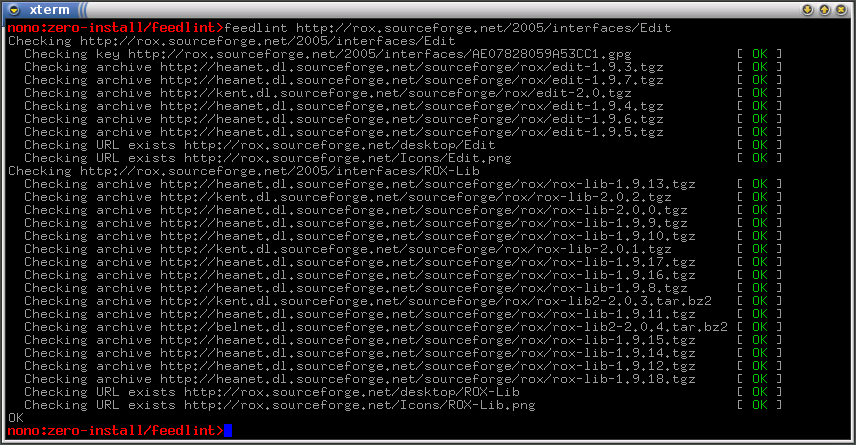

# FeedLint

**Name:** FeedLint  
**Maintainer:** Thomas Leonard  
**License:** GNU General Public License  
**Source:** [Git repository](http://repo.or.cz/w/FeedLint.git)  
**Zero Install feed:** <http://0install.net/2007/interfaces/FeedLint.xml>

If you maintain a number of feeds, each with several versions of your programs, how do you know that all the download links are still OK? Run FeedLint on your feeds from time-to-time to check.

To use it, pass the URLs of the feeds to check as arguments, e.g.:

```shell
$ 0install add feedlint http://0install.net/2007/interfaces/FeedLint.xml
$ feedlint http://my/feed.xml
```

You can pass multiple feeds as arguments and it will check all of them. For each feed, it will:

- Download the feed and check it can be read by 0install.
- Check that all signatures are correct and by keys on your keyring.
- Check that each signature's GPG key can be downloaded.
- Check that the homepage and icon URLs work.
- Get the size of each implementation archive and check that it matches the size in the feed.
- Warn about releases marked as Testing which are more than one week old.
- Recursively check any sub-feeds and dependencies listed in the feed (if run with `-d`)

Tip: to check all feeds in your domain (e.g. `example.com`):

```shell
$ 0install list example.com | xargs feedlint
```

## Sample output

Here we ask it to check Edit's feed (and it also checks ROX-Lib, on which Edit depends; note that this mode now requires the `-d` option to be used):


